# Build Plan: Bookingtimes Content Emulator V2.1 Rebuild

## 1. Executive Summary

This plan decomposes 42 PRD requirements (REQ-BCE2-001 through REQ-BCE2-042) and 52 eval cases into **56 concrete work items** across **8 phases**, mapping each to an assigned agent, eval trace, and dependency chain. The build follows the 5-stage pipeline architecture (Audit → Research → Gap Analysis → Design → Build) with the UI and testing layers wrapped around it.

**Key planning decisions:**

1. **Foundation first.** SvelteKit scaffold with Svelte 5 runes, SQLite schema (25+ tables), and V1 module ports are built before any pipeline stage work begins.
2. **Pipeline stages are build phases.** Phases 1-5 map directly to the 5-stage pipeline, ensuring each stage is independently testable before the next begins.
3. **Homepage-first strategy is reflected in the build order.** The generation phase (Phase 5) enforces DEC-031: homepage is generated first per site, service pages next, location pages last.
4. **V1 reuse is front-loaded.** CSS scraper, iframe preview, and Claude CLI modules are ported in Phase 0 to reduce Phase 1 risk.
5. **Sentry verification gates at every phase boundary.** No phase begins until the previous phase passes its eval gate.
6. **No cloud agent needed.** All infrastructure is local (better-sqlite3 + filesystem + adapter-node). Forge handles all backend services.
7. **Per-site pilot strategy (ADR-031).** Phase 7 runs the full pipeline on a single site before scaling to all 5.

**Scale comparison with V1:**
- V1: 42 work items, 7 phases, 32 requirements, Cloudflare deployment
- V2.1: 56 work items, 8 phases, 42 requirements, local deployment, 5-stage pipeline, 25+ table schema

---

## 2. Phase Structure

| Phase | Name | Work Items | Focus | Integration Milestone |
|-------|------|-----------|-------|----------------------|
| 0 | Foundation & Reuse | WRK-BCE2-001 to 008 | SvelteKit scaffold, SQLite schema, V1 module ports, dev environment | App runs locally, DB initialized, V1 modules ported and tested |
| 1 | Stage 1 — Site Audit & Inventory | WRK-BCE2-009 to 016 | Sitemap crawl, CSS scraping, content extraction, brand voice inference, schema detection | One site fully audited, brand profile inferred and confirmed |
| 2 | Stage 2 — Research & Benchmark | WRK-BCE2-017 to 021 | SEO/GEO/Schema benchmarks, page taxonomy, silo strategy | Benchmark standards defined, taxonomy stored, silo rules codified |
| 3 | Stage 3 — Gap Analysis | WRK-BCE2-022 to 027 | Multi-dimensional scoring, missing page detection, link graph construction, work backlog | Prioritized backlog with link graph for one site |
| 4 | Stage 4 — Design & Architecture | WRK-BCE2-028 to 033 | Page blueprints, section specs, CSS decisions, JSON-LD specs, link assignments | Blueprints with section specs reviewed and approved for top-priority pages |
| 5 | Stage 5 — Build & Learn | WRK-BCE2-034 to 043 | Section generation, CSS generation, JS interactivity, JSON-LD, export, feedback loop, freshness | Homepage + service + location pages generated, reviewed, exported |
| 6 | UI & Integration | WRK-BCE2-044 to 049 | Dashboard, pipeline tracking, preview, homepage-first workflow, sidebar handling | Full UI with pipeline navigation, preview, and export workflow |
| 7 | Testing & Pilot | WRK-BCE2-050 to 056 | Eval harness, integration testing, single-site pilot, local verification | Single-site pilot complete, all P0 evals passing |

---

## 3. Work Breakdown Structure

### Phase 0: Foundation & Reuse

| ID | Title | Description | Agent | REQ Trace | EVAL Trace | Dependencies | Complexity |
|----|-------|-------------|-------|-----------|------------|--------------|------------|
| WRK-BCE2-001 | SvelteKit project scaffold | Initialize SvelteKit with Svelte 5 runes syntax, adapter-node for local deployment. Configure TypeScript, project structure (`src/routes`, `src/lib`, `src/lib/server`, `src/lib/db`). Base layout with Bootstrap 5.0.2 for the app's own UI. No auth (DEC-030). | forge | -- | -- | None | S |
| WRK-BCE2-002 | SQLite schema: 25+ tables | Implement the full relational schema in better-sqlite3 using versioned migration files (numbered SQL). All 5 table groups: Core (sites, pages, page_versions, ai_sessions, ai_turns), Brand Intelligence (brand_profiles, brand_rules, brand_examples, brand_profile_history), Audit & Benchmark (site_structure_map, content_audit, schema_audit, css_audit, benchmark_standards, page_taxonomy), Planning (gap_analysis, work_backlog, page_blueprints, section_specs, silo_definitions, internal_link_graph, anchor_text_bank, css_patterns, css_decisions), Operations (gsc_metrics, scribe_checkpoints, content_freshness). PRAGMA foreign_keys = ON. Indexes on (site_id, status) for work_backlog, (site_id, class_name) for css_audit, (site_id, target_url, anchor_text) for anchor_text_bank. CHECK constraints on pipeline_stage and section_specs.status. | sigma | REQ-BCE2-025 | EVAL-BCE2-003 | WRK-BCE2-001 | L |
| WRK-BCE2-003 | Seed data: 5 driving school sites | Insert site records for all 5 driving school sites with name, URL, slug, bootstrap_version=5.0.2, pipeline_stage=not_started. | sigma | -- | -- | WRK-BCE2-002 | S |
| WRK-BCE2-004 | Pipeline stage gate enforcement | Implement stage transition logic as a server-side service. Validate: Stage 3 requires Stage 1 (per site) AND Stage 2 (global). Stages 3→4→5 sequential per site. Sites progress independently. Invalid transitions rejected with error messages. Scribe checkpoint fires on every valid transition. | forge | REQ-BCE2-026 | EVAL-BCE2-004, EVAL-BCE2-055 | WRK-BCE2-002 | M |
| WRK-BCE2-005 | Port V1 CSS scraper module | Port the existing CSS scraper from V1 codebase. Adapt for better-sqlite3 storage instead of D1. Scraper fetches all `<link rel="stylesheet">` and inline `<style>` blocks from target site pages. Retains existing functionality: site CSS capture, custom CSS file identification. | forge | REQ-BCE2-001 | EVAL-BCE2-001 | WRK-BCE2-001 | M |
| WRK-BCE2-006 | Port V1 iframe preview module | Port the sandboxed iframe preview component from V1. Adapt for Svelte 5 runes syntax. Update to load Bootstrap 5.0.2 (not 5.3.3). Support srcdoc injection with site CSS. Cache CSS files locally on filesystem for offline preview. | pixel | REQ-BCE2-031 | EVAL-BCE2-054 | WRK-BCE2-001 | M |
| WRK-BCE2-007 | Port V1 Claude CLI module | Port the Claude CLI subprocess integration from V1. Implement `child_process.spawn("claude", ["-p", ...])` with prompt piped via stdin (Windows cmd length safety). Strip ANTHROPIC_AUTH_TOKEN and ANTHROPIC_API_KEY from subprocess env. Timeout: 120s configurable. Retry: 3 attempts with exponential backoff (2s, 4s, 8s). Parse stdout, capture stderr. | forge | REQ-BCE2-029 | EVAL-BCE2-005 | WRK-BCE2-001 | M |
| WRK-BCE2-008 | Bootstrap 5.0.2 class catalogue | Parse the official Bootstrap 5.0.2 source CSS into a validated class catalogue (JSON). Include all utility classes present in 5.0.2. Explicitly exclude 5.1+ additions (text-bg-primary, z-* utilities, CSS custom properties). Bundle Font Awesome 6 Pro icon class list as a companion catalogue. Both catalogues serve as Tier 1 reference for CSS validation. | forge | REQ-BCE2-019 | EVAL-BCE2-007 | None | M |

**Phase 0 Gate:** App runs locally via `npm run dev`. Database initializes with all 25+ tables. 5 sites seeded. Stage gate logic rejects invalid transitions. V1 modules (CSS scraper, iframe preview, Claude CLI) functional in new codebase. BS 5.0.2 catalogue accurate.

**Sentry Verification:** EVAL-BCE2-003 (schema integrity), EVAL-BCE2-004 (stage gates), EVAL-BCE2-005 (CLI subprocess), EVAL-BCE2-007 (BS catalogue accuracy).

---

### Phase 1: Stage 1 — Site Audit & Inventory

| ID | Title | Description | Agent | REQ Trace | EVAL Trace | Dependencies | Complexity |
|----|-------|-------------|-------|-----------|------------|--------------|------------|
| WRK-BCE2-009 | Sitemap-based page inventory | Fetch and parse XML sitemap (or sitemap index / HTML sitemap) for a target site. Record every URL in site_structure_map. Detect URL patterns. Classify pages by type (homepage, service, location, about, FAQ, other). Count totals per type. | forge | REQ-BCE2-005 | EVAL-BCE2-051 | WRK-BCE2-002 | M |
| WRK-BCE2-010 | CSS scraping and three-tier classification | Extend the ported CSS scraper to classify scraped stylesheets into three tiers: Tier 1 (Bootstrap 5.0.2 base — match against known CDN URLs), Tier 2 (site-specific custom CSS — LoadCSS?k= patterns and remaining custom files), Tier 3 (platform/third-party CSS — Font Awesome 6 Pro, platform CSS). Store per-class records in css_audit with tier, properties, and usage count. Validate against BS 5.0.2 catalogue. | forge | REQ-BCE2-001 | EVAL-BCE2-001 | WRK-BCE2-005, WRK-BCE2-008 | L |
| WRK-BCE2-011 | Content scraping and extraction | Scrape 5-10 representative pages per site (homepage + service pages + 2-3 location pages). Extract main content area (exclude nav, sidebar, footer). Preserve heading hierarchy (H1-H6). Capture images, lists, CTAs with markup. Identify sidebar content separately. Store in content_audit. | forge | REQ-BCE2-002 | EVAL-BCE2-002 | WRK-BCE2-009 | L |
| WRK-BCE2-012 | Brand voice inference engine | Use scraped content from WRK-BCE2-011 to infer brand voice via Claude CLI call. Produce structured brand profile: voice_description, tone_keywords, terminology_patterns, sentence_style, recurring_phrases, anti_patterns. Store in brand_profiles with inference_confidence (0.0-1.0) based on source_page_count. Low-confidence profiles (<0.5) trigger warning. Present profile for operator review and confirmation. | forge | REQ-BCE2-003 | EVAL-BCE2-019, EVAL-BCE2-057 | WRK-BCE2-007, WRK-BCE2-011 | L |
| WRK-BCE2-013 | Existing schema and structured data detection | Inspect every audited page for existing structured data. Detect JSON-LD, Microdata, RDFa. Catalogue existing schema types per page. Validate JSON-LD syntax. Check for required properties. Assess @graph/@id patterns and sameAs disambiguation. Store results in schema_audit. | schema | REQ-BCE2-004 | EVAL-BCE2-033, EVAL-BCE2-034 | WRK-BCE2-011 | M |
| WRK-BCE2-014 | SEO audit per page | Assess title tags, meta descriptions, heading hierarchy, canonical tags, internal link structure, content uniqueness, E-E-A-T signals, image optimization, and mobile-first compliance across audited pages. Store per-page SEO scores and deficiency lists in content_audit. | seo | REQ-BCE2-010 | EVAL-BCE2-051 | WRK-BCE2-011 | M |
| WRK-BCE2-015 | GEO readiness audit per page | Assess citation-worthiness, direct answer block presence, TLDR-first structure, FAQ content quality, statistics density, freshness signals, and named authorship across audited pages. Store per-page GEO scores in content_audit. | geo | REQ-BCE2-010 | EVAL-BCE2-051 | WRK-BCE2-011 | M |
| WRK-BCE2-016 | Scribe checkpoint: Stage 1 complete | Fire Scribe checkpoint documenting Stage 1 deliverables (site brief, brand profile, page inventory, audit scores), decisions made, state for next session. Store in scribe_checkpoints. Update sites.pipeline_stage to stage_1. | forge | REQ-BCE2-032 | EVAL-BCE2-006 | WRK-BCE2-009 to 015 | S |

**Phase 1 Gate:** At least one site fully audited. Brand profile inferred and reviewed. Page inventory complete. Audit scores stored. Scribe checkpoint recorded.

**Sentry Verification:** EVAL-BCE2-001 (CSS scraping), EVAL-BCE2-002 (content extraction), EVAL-BCE2-019 (brand voice baseline), EVAL-BCE2-051 (page inventory).

---

### Phase 2: Stage 2 — Research & Benchmark

| ID | Title | Description | Agent | REQ Trace | EVAL Trace | Dependencies | Complexity |
|----|-------|-------------|-------|-----------|------------|--------------|------------|
| WRK-BCE2-017 | SEO benchmark standards | Codify SEO benchmark rules in benchmark_standards: title tag formulas per page type (under 60 chars, keyword-first), meta description templates (150-160 chars, CTA + USP + location), header hierarchy templates (one H1, no skipped levels), content uniqueness thresholds (40-50% per suburb page), canonical tag rules, E-E-A-T signal requirements per page type, image optimization standards, mobile-first requirements. | seo | REQ-BCE2-006 | EVAL-BCE2-022, EVAL-BCE2-023, EVAL-BCE2-024, EVAL-BCE2-025, EVAL-BCE2-026 | WRK-BCE2-002 | M |
| WRK-BCE2-018 | GEO optimization benchmarks | Codify GEO benchmark patterns in benchmark_standards: direct answer block format (40-60 words, self-contained), TLDR-first rule (first 200 words answer primary query), FAQ format (3-5 questions phrased as AI assistant queries, answers 40-80 words with facts), statistics frequency (>= 1 per 200 words), freshness signal requirements (visible last-updated date, current year references), named authorship requirements. | geo | REQ-BCE2-007 | EVAL-BCE2-028, EVAL-BCE2-029, EVAL-BCE2-030, EVAL-BCE2-031 | WRK-BCE2-002 | M |
| WRK-BCE2-019 | Schema.org best practices for automotive businesses | Define per-page-type schema requirements using @graph/@id pattern. AutomotiveBusiness (NOT DrivingSchool) as primary type. Multi-typing allowed. Mandatory baseline per page (Organization, WebSite, BreadcrumbList). Page-type-specific schemas: Homepage (full AutomotiveBusiness + WebSite with SearchAction), Service (Service + Offer + FAQPage), Location (AutomotiveBusiness with areaServed + FAQPage). sameAs disambiguation. Store in benchmark_standards. | schema | REQ-BCE2-008 | EVAL-BCE2-032, EVAL-BCE2-033, EVAL-BCE2-034 | WRK-BCE2-002 | M |
| WRK-BCE2-020 | Page taxonomy and silo strategy | Define the Hybrid Two-Page Model taxonomy: Service Pages (3-6, root-level) and Location Pages (50+, flat under /areas/). Three silos: Services, Locations, Trust. URL rules within platform-enforced patterns. Max 3 levels deep. Store in page_taxonomy and silo_definitions. No service x location matrix. Generation ordering: hubs before children, services before locations. | seo | REQ-BCE2-009 | EVAL-BCE2-048 | WRK-BCE2-017 | M |
| WRK-BCE2-021 | Scribe checkpoint: Stage 2 complete | Fire Scribe checkpoint documenting Stage 2 deliverables (benchmark standards, page taxonomy, silo definitions), decisions. Stage 2 is global — no site_id. Marks Stage 2 complete, unlocking Stage 3 for all sites that have completed Stage 1. | forge | REQ-BCE2-032 | EVAL-BCE2-006 | WRK-BCE2-017 to 020 | S |

**Phase 2 Gate:** All benchmark standards stored. Page taxonomy defined. Silo strategy codified. Scribe checkpoint recorded. Stage 3 unlocked for audited sites.

**Sentry Verification:** Benchmark standards cover all dimensions (SEO, GEO, Schema, Design). Page taxonomy has entries for all page types.

---

### Phase 3: Stage 3 — Gap Analysis

| ID | Title | Description | Agent | REQ Trace | EVAL Trace | Dependencies | Complexity |
|----|-------|-------------|-------|-----------|------------|--------------|------------|
| WRK-BCE2-022 | Audit vs. benchmark comparison engine | For each existing page, score across all dimensions against Stage 2 benchmarks: SEO, GEO, Schema, Design, Voice. Compute weighted composite score. Classify pages as Missing/Weak/Adequate/Strong. Identify strong pages as exemplars. Store in gap_analysis. | forge | REQ-BCE2-010 | EVAL-BCE2-051 | WRK-BCE2-016, WRK-BCE2-021 | L |
| WRK-BCE2-023 | Missing page identification | Cross-reference page_taxonomy against site_structure_map. Identify page types that should exist but do not. Identify missing suburb/location pages. Insert missing pages into work_backlog with status=pending and recommended priority. | forge | REQ-BCE2-011 | EVAL-BCE2-051 | WRK-BCE2-022 | M |
| WRK-BCE2-024 | Content quality gap scoring and prioritized backlog | Build prioritized work_backlog by hierarchy: Homepage (always first, DEC-031) > Core service pages > Hub pages > Location pages > Long-tail. Within a level: Missing > Weak > Adequate. Integrate GSC traffic data if available (traffic_potential weight = 0.2). Operator reviews, reprioritizes, and approves backlog. | forge | REQ-BCE2-012, REQ-BCE2-027 | EVAL-BCE2-051, EVAL-BCE2-053 | WRK-BCE2-022, WRK-BCE2-023 | M |
| WRK-BCE2-025 | Link graph construction | Map existing pages into silo structure. Identify orphan pages (< 2 incoming links). Build full link graph: existing + planned pages with directed edges. Link types: Service→Location, Location→Service, Location→Adjacent (3-5 nearest), Contextual (first mention), Breadcrumb, Orphan prevention. Validate: every page >= 2 incoming links, max 3 clicks from homepage. Store in internal_link_graph. | seo | REQ-BCE2-013 | EVAL-BCE2-047, EVAL-BCE2-048 | WRK-BCE2-020, WRK-BCE2-023 | L |
| WRK-BCE2-026 | Anchor text bank generation | Generate anchor text variants per target page. Distribution targets: exact match 10-20%, partial match 30-40%, branded 10-15%, natural/contextual 30-40%, generic <5%. Hard constraint: no exact anchor text > 3 times site-wide per target. Length: 2-5 words. Store in anchor_text_bank with usage_count=0. | seo | REQ-BCE2-016 | EVAL-BCE2-048b | WRK-BCE2-025 | M |
| WRK-BCE2-027 | Scribe checkpoint: Stage 3 complete | Fire Scribe checkpoint documenting Stage 3 deliverables (gap analysis, work backlog, link graph, anchor text bank), decisions. Update sites.pipeline_stage to stage_3. | forge | REQ-BCE2-032 | EVAL-BCE2-006 | WRK-BCE2-022 to 026 | S |

**Phase 3 Gate:** Gap analysis complete for pilot site. Prioritized backlog with homepage first. Link graph with zero orphan pages. Anchor text bank populated. Scribe checkpoint recorded.

**Sentry Verification:** EVAL-BCE2-047 (link graph integrity), EVAL-BCE2-048 (silo structure), EVAL-BCE2-053 (homepage-first ordering).

---

### Phase 4: Stage 4 — Design & Architecture

| ID | Title | Description | Agent | REQ Trace | EVAL Trace | Dependencies | Complexity |
|----|-------|-------------|-------|-----------|------------|--------------|------------|
| WRK-BCE2-028 | Page blueprint generator | For each work_backlog item, generate a page_blueprint with page-level rules (SEO targets, GEO requirements, schema spec, linking rules, voice constraints, CSS tier preference). Dynamic section count per page (DEC-026) — section count varies by page type, site brand, and content requirements. Store in page_blueprints. | forge | REQ-BCE2-014 | EVAL-BCE2-048c | WRK-BCE2-024 | L |
| WRK-BCE2-029 | Section specification generator | For each blueprint, generate section_specs with: section_type, section_order, heading_text, target_word_count_min/max, content_requirements (JSON), links_required (from link graph), css_classes (from CSS catalogue), design_pattern, direct_answer_block_required, faq_questions. At least 2 distinct section orderings across same-type pages. | forge | REQ-BCE2-014 | EVAL-BCE2-048c | WRK-BCE2-028 | L |
| WRK-BCE2-030 | CSS tier decision per section | For each section_spec, determine CSS tier: Tier 1 (Bootstrap 5.0.2) + Tier 2 (existing custom), or Tier 3 (new custom CSS needed). If Tier 3, draft CSS rules and queue for operator approval. Sidebar-aware layouts for long-tail pages (DEC-032). All classes validated against BS 5.0.2 catalogue (not 5.1+). Store in css_decisions. | pixel | REQ-BCE2-017 | EVAL-BCE2-018, EVAL-BCE2-054 | WRK-BCE2-010, WRK-BCE2-029 | M |
| WRK-BCE2-031 | JSON-LD specification per page | Specify exact JSON-LD per page using @graph/@id pattern. Page-type-specific: Homepage (AutomotiveBusiness full + WebSite + SearchAction + BreadcrumbList), Service (Service + Offer + FAQPage + BreadcrumbList), Location (AutomotiveBusiness with areaServed + FAQPage + BreadcrumbList). Include sameAs disambiguation. Store as schema_spec JSON in page_blueprints. | schema | REQ-BCE2-021 | EVAL-BCE2-032, EVAL-BCE2-033, EVAL-BCE2-034 | WRK-BCE2-019, WRK-BCE2-028 | M |
| WRK-BCE2-032 | Blueprint review UI | Operator-facing UI to review and approve page blueprints before generation. Display page-level rules, section list with specs, CSS decisions, link assignments, schema specs. Allow adjustments. Batch review capability. | pixel | REQ-BCE2-014 | -- | WRK-BCE2-028 to 031 | M |
| WRK-BCE2-033 | Scribe checkpoint: Stage 4 complete | Fire Scribe checkpoint documenting Stage 4 deliverables (blueprints, section specs, CSS decisions, schema specs), decisions. Update sites.pipeline_stage to stage_4. | forge | REQ-BCE2-032 | EVAL-BCE2-006 | WRK-BCE2-028 to 032 | S |

**Phase 4 Gate:** Blueprints with section specs generated for top-priority pages (homepage + services + initial locations). CSS decisions made. JSON-LD specs complete. Operator has reviewed and approved blueprints. Scribe checkpoint recorded.

**Sentry Verification:** EVAL-BCE2-048c (dynamic section count variation), blueprint coverage of all backlog items.

---

### Phase 5: Stage 5 — Build & Learn

| ID | Title | Description | Agent | REQ Trace | EVAL Trace | Dependencies | Complexity |
|----|-------|-------------|-------|-----------|------------|--------------|------------|
| WRK-BCE2-034 | 12-layer context prompt assembler | Build the prompt assembly module that constructs per-section Claude CLI prompts from 12 layers: (1) Platform constraints, (2) Brand profile, (3) Brand rules filtered by scope, (4) Section specification, (5) Page-level SEO context, (6) Internal linking targets, (7) GEO requirements, (8) CSS class palette (tiered, filtered), (9) Previously generated sections, (10) Approved examples (few-shot), (11) Suburb/location data, (12) Output format instructions. Token budget: ~3,000-8,500 per call. Query brand_profiles, brand_rules, section_specs, css_audit, internal_link_graph, anchor_text_bank, brand_examples. | forge | REQ-BCE2-018 | EVAL-BCE2-019, EVAL-BCE2-020, EVAL-BCE2-042 | WRK-BCE2-007, WRK-BCE2-010, WRK-BCE2-012, WRK-BCE2-025, WRK-BCE2-029 | L |
| WRK-BCE2-035 | Section-based content generation | Generate content section by section via Claude CLI calls. Sequential within a page (each section needs previous sections as context). Configurable delay between calls (default: 2s). 8 sections per page = 8 calls + 1 coherence pass. Store generated HTML in section_specs.generated_html. Update section status (pending → generated). | forge | REQ-BCE2-018 | EVAL-BCE2-019, EVAL-BCE2-020 | WRK-BCE2-034 | L |
| WRK-BCE2-036 | AI output validation layer | Post-process generated HTML: parse, extract all class names, validate against site's three-tier CSS catalogue. Check HTML well-formedness. Reject head-only elements (<meta>, <title>). Reject placeholder tokens ({{...}}, [TBD], TODO, INSERT_). Flag unknown classes. Validate heading hierarchy. Check internal links against link graph. Return validation report with section. | forge | REQ-BCE2-034, REQ-BCE2-019 | EVAL-BCE2-017, EVAL-BCE2-018, EVAL-BCE2-022 | WRK-BCE2-008, WRK-BCE2-010, WRK-BCE2-035 | M |
| WRK-BCE2-037 | Three-tier CSS generation | Ensure generated HTML uses only validated CSS classes. Tier 1: Bootstrap 5.0.2 (use freely). Tier 2: site custom (use where appropriate). Tier 3: system-generated (create when needed, operator-approved). Exclude BS 5.1+ classes. Validate FA6 Pro icons. Zero cross-site CSS contamination. | forge | REQ-BCE2-019 | EVAL-BCE2-018, EVAL-BCE2-045 | WRK-BCE2-010, WRK-BCE2-036 | M |
| WRK-BCE2-038 | Three-tier JavaScript interactivity | Implement tiered interactivity: Tier 1 (CSS-only: details/summary, checkbox hack, :target, scroll-snap — guaranteed). Tier 2 (Head injection: JS added via Analytics & Tracking, content uses data-bce-* attributes and .bce-interactive-* classes as hooks, jQuery available). Tier 3 (Inline JS — unconfirmed, needs manual test). All interactive elements have Tier 1 CSS-only fallback. Generated JS self-contained (jQuery + BS 5.0.2 only). IIFE scope. Keyboard navigable + ARIA attributes. | forge | REQ-BCE2-020 | EVAL-BCE2-035, EVAL-BCE2-036, EVAL-BCE2-037, EVAL-BCE2-038 | WRK-BCE2-036 | L |
| WRK-BCE2-039 | JSON-LD structured data generation | Generate valid JSON-LD per page using @graph/@id pattern. Page-type-specific schemas per WRK-BCE2-031 specs. AutomotiveBusiness (NOT DrivingSchool). All required properties present. FAQ JSON-LD must exactly match visible FAQ HTML content. sameAs links included. JSON-LD placed in body as <script type="application/ld+json">. Validate parseable by JSON.parse(). | schema | REQ-BCE2-021 | EVAL-BCE2-032, EVAL-BCE2-033, EVAL-BCE2-034, EVAL-BCE2-034b | WRK-BCE2-031, WRK-BCE2-035 | M |
| WRK-BCE2-040 | Multi-artifact export pipeline | Assemble three artifacts per page: (1) Page HTML — all sections assembled + JSON-LD appended, body-level fragment only. (2) Schema JSON-LD — included in Page HTML. (3) Head JS — separate script for <head> injection (only if Tier 2 interactive elements). Run automated validation checklist before copy-to-clipboard: CSS classes, HTML well-formedness, internal links resolve, JSON-LD valid, required sections present, word count in range, no placeholders. Block export on critical failures. | forge | REQ-BCE2-022 | EVAL-BCE2-017, EVAL-BCE2-043, EVAL-BCE2-044, EVAL-BCE2-046 | WRK-BCE2-036, WRK-BCE2-039 | L |
| WRK-BCE2-041 | Human feedback loop and brand refinement | On approval: store full approved HTML as brand_example (section_type, page_type, quality_rating). Analyze voice patterns, record CSS patterns. On refinement: store feedback verbatim, classify by category and scope, create brand_rules entries. On rejection: flag with rejection reason, create anti-pattern rules. Track brand profile evolution via brand_profile_history snapshots. inference_confidence increases with approvals. Per-site isolation: voice NEVER transfers between sites. | forge | REQ-BCE2-023, REQ-BCE2-028 | EVAL-BCE2-039, EVAL-BCE2-040, EVAL-BCE2-041 | WRK-BCE2-035, WRK-BCE2-012 | L |
| WRK-BCE2-042 | Content freshness detection and alerts | Track three timestamps per page: last_generated_at (auto), last_approved_at (auto), last_deployed_at (manually marked by operator). Compute freshness: Fresh (<6 weeks), Aging (6-10 weeks, warning), Stale (>10 weeks, alert), Unknown (never deployed). Surface alerts in dashboard. "Mark as Deployed" button after copy-to-clipboard. Actionable recommendations per stale page (page-type-specific, prioritized by importance). Store in content_freshness. | forge | REQ-BCE2-024 | EVAL-BCE2-049, EVAL-BCE2-050 | WRK-BCE2-002, WRK-BCE2-040 | M |
| WRK-BCE2-043 | Version history and non-destructive rollback | Every save creates a new page_versions record with full HTML snapshot, sequential version number, source type (ai_generate, ai_refine, manual_edit, rollback, assembly, link_cascade), and change summary. Rollback creates version N+1 with content from version M. Section-level tracking via section_specs.generated_html and status. Full history preserved. | forge | REQ-BCE2-041 | EVAL-BCE2-003 | WRK-BCE2-002, WRK-BCE2-035 | M |

**Phase 5 Gate:** Homepage + at least 1 service page + at least 1 location page generated, validated, and exported for pilot site. Feedback loop captures at least one approval cycle. Brand profile enriched. Export artifacts paste-ready.

**Sentry Verification:** EVAL-BCE2-017 (HTML validity), EVAL-BCE2-018 (CSS correctness), EVAL-BCE2-019 (brand voice), EVAL-BCE2-022 (heading hierarchy), EVAL-BCE2-032 (JSON-LD validity), EVAL-BCE2-039 (feedback persistence), EVAL-BCE2-043 (multi-artifact export), EVAL-BCE2-044 (export validation), EVAL-BCE2-045 (CSS isolation).

---

### Phase 6: UI & Integration

| ID | Title | Description | Agent | REQ Trace | EVAL Trace | Dependencies | Complexity |
|----|-------|-------------|-------|-----------|------------|--------------|------------|
| WRK-BCE2-044 | Dashboard and site overview | Build the main dashboard: all 5 sites with pipeline_stage indicators, pages per site, freshness summary, recent activity. Per-site drill-down showing audit scores, backlog status, generation progress. | pixel | REQ-BCE2-042 | EVAL-BCE2-051 | WRK-BCE2-004, WRK-BCE2-009 | L |
| WRK-BCE2-045 | Pipeline progress tracking UI | Visual pipeline progress per site: 5 stages with status (not_started, in_progress, complete). Show what was completed per stage. Resume-from-checkpoint capability: read latest scribe_checkpoint and display next action. | pixel | REQ-BCE2-032 | EVAL-BCE2-006, EVAL-BCE2-056 | WRK-BCE2-004, WRK-BCE2-016 | M |
| WRK-BCE2-046 | Preview iframe with full CSS injection | Enhance ported preview to load all 4 CSS tiers (BS 5.0.2, FA6 Pro, Tier 2 custom, Tier 3 generated). Responsive breakpoints at 576px, 768px, 992px, 1200px. Wrap content in simulated parent structure matching site's content area. Long-tail page previews include simulated sidebar element. Load Tier 2 interactive JS for accurate preview of interactive elements. | pixel | REQ-BCE2-031, REQ-BCE2-030 | EVAL-BCE2-054 | WRK-BCE2-006, WRK-BCE2-010, WRK-BCE2-038 | L |
| WRK-BCE2-047 | Homepage-first workflow UI | Enforce DEC-031 in the UI: homepage is always first in generation queue per site. Non-homepage pages cannot be generated before homepage is approved. Visual hierarchy in backlog view: Homepage > Services > Locations > Long-tail. Batch suburb generation unlocked only after 3-5 individually approved suburb pages. | pixel | REQ-BCE2-027 | EVAL-BCE2-053 | WRK-BCE2-024, WRK-BCE2-035 | M |
| WRK-BCE2-048 | Export UI with copy-to-clipboard | Export panel: show validation report, "Copy HTML" button (copies page HTML + JSON-LD), "Copy Head JS" button (separate, for Analytics & Tracking). Record export as page_version event. Surface "Mark as Deployed" button after copy. Display edit distance if prior version exists. | pixel | REQ-BCE2-022 | EVAL-BCE2-043, EVAL-BCE2-046 | WRK-BCE2-040 | M |
| WRK-BCE2-049 | Brand rule management UI | UI for viewing, editing, deactivating, and prioritizing brand_rules per site. Filter by scope (global, brand, page_type, section_type). Show source (inferred, research, feedback, manual). Confirm/unconfirm rules. Display brand_profile_history timeline. | pixel | REQ-BCE2-028 | EVAL-BCE2-041 | WRK-BCE2-041 | M |

**Phase 6 Gate:** Full UI navigable. Dashboard shows all 5 sites. Pipeline progress visible. Preview renders with site CSS. Export workflow functional end-to-end. Homepage-first enforced in UI.

**Sentry Verification:** EVAL-BCE2-054 (preview rendering), EVAL-BCE2-053 (homepage-first enforcement), EVAL-BCE2-056 (session resumption).

---

### Phase 7: Testing & Pilot

| ID | Title | Description | Agent | REQ Trace | EVAL Trace | Dependencies | Complexity |
|----|-------|-------------|-------|-----------|------------|--------------|------------|
| WRK-BCE2-050 | Eval harness: algorithmic test suite | Implement automated eval harness covering all algorithmic eval cases: CSS class validation (EVAL-BCE2-001, 007, 018, 045), HTML validity (EVAL-BCE2-017), heading hierarchy (EVAL-BCE2-022), keyword placement (EVAL-BCE2-023), title/meta format (EVAL-BCE2-024), JSON-LD validation (EVAL-BCE2-032, 033, 034), link graph integrity (EVAL-BCE2-047), anchor text rotation (EVAL-BCE2-048b), stage gate enforcement (EVAL-BCE2-004), freshness classification (EVAL-BCE2-049), site isolation (EVAL-BCE2-052), homepage-first ordering (EVAL-BCE2-053). | eval | REQ-BCE2-042 | All algorithmic eval cases | WRK-BCE2-040 | L |
| WRK-BCE2-051 | Eval harness: AI-rubric test suite | Implement AI-rubric eval cases using Claude CLI: brand voice match (EVAL-BCE2-019), section coherence (EVAL-BCE2-020), direct answer block quality (EVAL-BCE2-028), FAQ quality (EVAL-BCE2-029), freshness recommendation specificity (EVAL-BCE2-050), feedback reflection (EVAL-BCE2-040). | eval | REQ-BCE2-042 | All AI-rubric eval cases | WRK-BCE2-007, WRK-BCE2-050 | L |
| WRK-BCE2-052 | Integration testing: cross-layer | Test cross-layer integration: database ↔ services ↔ UI. Verify: stage gate transitions update UI correctly, feedback creates rules visible in management UI, export validation blocks broken content, preview renders with correct CSS for correct site, multi-site isolation holds under concurrent operations. | sentry | REQ-BCE2-042 | EVAL-BCE2-051, EVAL-BCE2-052 | WRK-BCE2-044 to 049 | L |
| WRK-BCE2-053 | Single-site pilot: Stage 1-5 end-to-end | Run the full 5-stage pipeline on a single pilot site. Stage 1: audit, brand inference, inventory. Stage 2: benchmarks (if not already done). Stage 3: gap analysis, link graph, backlog. Stage 4: blueprints for homepage + 1 service + 1 location. Stage 5: generate, review, approve, export. All Scribe checkpoints fire. Exported HTML passes all validation checks. | sentry | REQ-BCE2-042 | EVAL-BCE2-051 | WRK-BCE2-050, WRK-BCE2-051 | L |
| WRK-BCE2-054 | WYSIWYG paste acceptance test | Manual test: paste exported HTML into BookingTimes WYSIWYG code view editor. Verify class attributes preserved, Bootstrap grid preserved, JSON-LD script tags survive (DEC-035 confirmation), data-bce-* attributes preserved, content renders correctly. Document results. | sentry | REQ-BCE2-039 | EVAL-BCE2-046 | WRK-BCE2-053 | M |
| WRK-BCE2-055 | Edit distance tracking validation | After pilot generates 3+ pages with feedback cycles, compute and store edit distance between generated and approved HTML. Verify the trend tracking mechanism works. Validate dashboard display of edit distance per site. | eval | REQ-BCE2-040 | EVAL-BCE2-021 | WRK-BCE2-053 | M |
| WRK-BCE2-056 | Platform update resilience: CSS change detection | On re-scrape, compare new CSS catalogue against previous. Generate diff report (added, removed, changed classes). Flag previously generated content using deprecated classes. New classes available for future generation. | forge | REQ-BCE2-038 | EVAL-BCE2-058 | WRK-BCE2-010 | M |

**Phase 7 Gate:** All P0 eval cases passing. Single-site pilot complete with 3+ exported pages. WYSIWYG paste confirmed. Edit distance tracking functional. CSS change detection operational.

**Sentry Verification:** EVAL-BCE2-051 (end-to-end pipeline), EVAL-BCE2-046 (paste acceptance), EVAL-BCE2-021 (edit distance). Full eval report generated.

---

## 4. Dependency Graph

```mermaid
graph TD
    subgraph P0["Phase 0: Foundation & Reuse"]
        W001["WRK-BCE2-001<br/>SvelteKit Scaffold"]
        W002["WRK-BCE2-002<br/>SQLite Schema<br/>(25+ tables)"]
        W003["WRK-BCE2-003<br/>Seed Sites"]
        W004["WRK-BCE2-004<br/>Stage Gates"]
        W005["WRK-BCE2-005<br/>Port CSS Scraper"]
        W006["WRK-BCE2-006<br/>Port Iframe Preview"]
        W007["WRK-BCE2-007<br/>Port Claude CLI"]
        W008["WRK-BCE2-008<br/>BS 5.0.2 Catalogue"]
    end

    subgraph P1["Phase 1: Stage 1 — Audit"]
        W009["WRK-BCE2-009<br/>Sitemap Inventory"]
        W010["WRK-BCE2-010<br/>CSS 3-Tier Classification"]
        W011["WRK-BCE2-011<br/>Content Scraping"]
        W012["WRK-BCE2-012<br/>Brand Voice Inference"]
        W013["WRK-BCE2-013<br/>Schema Detection"]
        W014["WRK-BCE2-014<br/>SEO Audit"]
        W015["WRK-BCE2-015<br/>GEO Audit"]
        W016["WRK-BCE2-016<br/>Scribe: Stage 1"]
    end

    subgraph P2["Phase 2: Stage 2 — Benchmark"]
        W017["WRK-BCE2-017<br/>SEO Benchmarks"]
        W018["WRK-BCE2-018<br/>GEO Benchmarks"]
        W019["WRK-BCE2-019<br/>Schema Standards"]
        W020["WRK-BCE2-020<br/>Taxonomy & Silos"]
        W021["WRK-BCE2-021<br/>Scribe: Stage 2"]
    end

    subgraph P3["Phase 3: Stage 3 — Gap Analysis"]
        W022["WRK-BCE2-022<br/>Gap Scoring"]
        W023["WRK-BCE2-023<br/>Missing Pages"]
        W024["WRK-BCE2-024<br/>Prioritized Backlog"]
        W025["WRK-BCE2-025<br/>Link Graph"]
        W026["WRK-BCE2-026<br/>Anchor Text Bank"]
        W027["WRK-BCE2-027<br/>Scribe: Stage 3"]
    end

    subgraph P4["Phase 4: Stage 4 — Design"]
        W028["WRK-BCE2-028<br/>Page Blueprints"]
        W029["WRK-BCE2-029<br/>Section Specs"]
        W030["WRK-BCE2-030<br/>CSS Decisions"]
        W031["WRK-BCE2-031<br/>JSON-LD Specs"]
        W032["WRK-BCE2-032<br/>Blueprint Review UI"]
        W033["WRK-BCE2-033<br/>Scribe: Stage 4"]
    end

    subgraph P5["Phase 5: Stage 5 — Build"]
        W034["WRK-BCE2-034<br/>12-Layer Prompt<br/>Assembler"]
        W035["WRK-BCE2-035<br/>Section Generation"]
        W036["WRK-BCE2-036<br/>Output Validation"]
        W037["WRK-BCE2-037<br/>CSS Generation"]
        W038["WRK-BCE2-038<br/>JS Interactivity"]
        W039["WRK-BCE2-039<br/>JSON-LD Generation"]
        W040["WRK-BCE2-040<br/>Export Pipeline"]
        W041["WRK-BCE2-041<br/>Feedback Loop"]
        W042["WRK-BCE2-042<br/>Freshness Tracking"]
        W043["WRK-BCE2-043<br/>Version History"]
    end

    subgraph P6["Phase 6: UI & Integration"]
        W044["WRK-BCE2-044<br/>Dashboard"]
        W045["WRK-BCE2-045<br/>Pipeline Progress"]
        W046["WRK-BCE2-046<br/>Full Preview"]
        W047["WRK-BCE2-047<br/>Homepage-First UI"]
        W048["WRK-BCE2-048<br/>Export UI"]
        W049["WRK-BCE2-049<br/>Rule Mgmt UI"]
    end

    subgraph P7["Phase 7: Testing & Pilot"]
        W050["WRK-BCE2-050<br/>Algorithmic Evals"]
        W051["WRK-BCE2-051<br/>AI-Rubric Evals"]
        W052["WRK-BCE2-052<br/>Integration Tests"]
        W053["WRK-BCE2-053<br/>Single-Site Pilot"]
        W054["WRK-BCE2-054<br/>WYSIWYG Paste Test"]
        W055["WRK-BCE2-055<br/>Edit Distance"]
        W056["WRK-BCE2-056<br/>CSS Change Detection"]
    end

    %% Phase 0 internal
    W001 --> W002
    W001 --> W005
    W001 --> W006
    W001 --> W007
    W002 --> W003
    W002 --> W004

    %% Phase 0 → Phase 1
    W002 --> W009
    W005 --> W010
    W008 --> W010
    W009 --> W011
    W007 --> W012
    W011 --> W012
    W011 --> W013
    W011 --> W014
    W011 --> W015

    %% Phase 1 internal
    W009 --> W016
    W010 --> W016
    W011 --> W016
    W012 --> W016
    W013 --> W016
    W014 --> W016
    W015 --> W016

    %% Phase 0/1 → Phase 2
    W002 --> W017
    W002 --> W018
    W002 --> W019
    W017 --> W020
    W017 --> W021
    W018 --> W021
    W019 --> W021
    W020 --> W021

    %% Phase 1+2 → Phase 3
    W016 --> W022
    W021 --> W022
    W022 --> W023
    W022 --> W024
    W023 --> W024
    W020 --> W025
    W023 --> W025
    W025 --> W026
    W024 --> W027
    W025 --> W027
    W026 --> W027

    %% Phase 3 → Phase 4
    W024 --> W028
    W028 --> W029
    W010 --> W030
    W029 --> W030
    W019 --> W031
    W028 --> W031
    W028 --> W032
    W029 --> W032
    W030 --> W032
    W031 --> W032
    W032 --> W033

    %% Phase 4 → Phase 5
    W007 --> W034
    W010 --> W034
    W012 --> W034
    W025 --> W034
    W029 --> W034
    W034 --> W035
    W008 --> W036
    W010 --> W036
    W035 --> W036
    W010 --> W037
    W036 --> W037
    W036 --> W038
    W031 --> W039
    W035 --> W039
    W036 --> W040
    W039 --> W040
    W035 --> W041
    W012 --> W041
    W002 --> W042
    W040 --> W042
    W002 --> W043
    W035 --> W043

    %% Phase 5 → Phase 6
    W004 --> W044
    W009 --> W044
    W004 --> W045
    W016 --> W045
    W006 --> W046
    W010 --> W046
    W038 --> W046
    W024 --> W047
    W035 --> W047
    W040 --> W048
    W041 --> W049

    %% Phase 6 → Phase 7
    W040 --> W050
    W007 --> W051
    W050 --> W051
    W044 --> W052
    W050 --> W053
    W051 --> W053
    W053 --> W054
    W053 --> W055
    W010 --> W056

    %% Critical path highlight
    classDef critical fill:#E74C3C,stroke:#C0392B,color:#fff
    class W001,W002,W009,W011,W012,W022,W024,W028,W029,W034,W035,W040,W053 critical

    classDef p0 fill:#3498DB,stroke:#2471A3,color:#fff
    classDef p1 fill:#8E44AD,stroke:#6C3483,color:#fff
    classDef p2 fill:#27AE60,stroke:#1E8449,color:#fff
    classDef p3 fill:#E67E22,stroke:#CA6F1E,color:#fff
    classDef p4 fill:#F39C12,stroke:#D68910,color:#000
    classDef p5 fill:#E74C3C,stroke:#CB4335,color:#fff
    classDef p6 fill:#1ABC9C,stroke:#148F77,color:#fff
    classDef p7 fill:#9B59B6,stroke:#7D3C98,color:#fff
```

### Critical Path

The critical path runs through:

**WRK-BCE2-001** (scaffold) → **002** (schema) → **009** (sitemap) → **011** (content scraping) → **012** (brand inference) → **016** (Stage 1 gate) → **022** (gap analysis) → **024** (backlog) → **028** (blueprints) → **029** (section specs) → **034** (prompt assembler) → **035** (section generation) → **036** (output validation) → **040** (export pipeline) → **050** (eval harness) → **053** (single-site pilot)

Any delay on this path delays the entire project.

---

## 5. Validation Plan

### 5.1 Eval-to-Work-Item Mapping

| Eval Case | Work Item(s) | Phase | When to Run |
|-----------|-------------|-------|-------------|
| EVAL-BCE2-001 | WRK-BCE2-005, 010 | P0/P1 end | After CSS scraper classifies tiers for one site |
| EVAL-BCE2-002 | WRK-BCE2-011 | P1 end | After content extraction from 5 representative pages |
| EVAL-BCE2-003 | WRK-BCE2-002, 043 | P0/P5 end | After schema init + after version history built |
| EVAL-BCE2-004 | WRK-BCE2-004 | P0 end | After stage gate logic implemented |
| EVAL-BCE2-005 | WRK-BCE2-007 | P0 end | After Claude CLI module ported |
| EVAL-BCE2-006 | WRK-BCE2-016, 021, 027, 033 | P1-P4 | After each Scribe checkpoint fires |
| EVAL-BCE2-007 | WRK-BCE2-008 | P0 end | After BS 5.0.2 catalogue built |
| EVAL-BCE2-017 | WRK-BCE2-036, 040 | P5 end | After first page exported |
| EVAL-BCE2-018 | WRK-BCE2-036, 037 | P5 end | After CSS validation on generated content |
| EVAL-BCE2-019 | WRK-BCE2-012, 034, 035 | P1/P5 | After brand inference + after first section generated |
| EVAL-BCE2-020 | WRK-BCE2-035 | P5 end | After full page assembled from sections |
| EVAL-BCE2-021 | WRK-BCE2-055 | P7 | After 3+ pages with feedback cycles |
| EVAL-BCE2-022 | WRK-BCE2-036 | P5 end | After heading hierarchy validated |
| EVAL-BCE2-023 | WRK-BCE2-034, 036 | P5 end | After keyword placement validated |
| EVAL-BCE2-024 | WRK-BCE2-034 | P5 end | After title/meta recommendations generated |
| EVAL-BCE2-025 | WRK-BCE2-035 | P5/P7 | After 5+ suburb pages generated |
| EVAL-BCE2-026 | WRK-BCE2-036 | P5 end | After E-E-A-T signal check |
| EVAL-BCE2-027 | WRK-BCE2-036 | P5 end | After link compliance validated |
| EVAL-BCE2-028 | WRK-BCE2-034, 036 | P5 end | After direct answer blocks validated |
| EVAL-BCE2-029 | WRK-BCE2-034, 039 | P5 end | After FAQ + JSON-LD FAQ match validated |
| EVAL-BCE2-030 | WRK-BCE2-036 | P5 end | After statistics density checked |
| EVAL-BCE2-031 | WRK-BCE2-036 | P5 end | After freshness signals checked |
| EVAL-BCE2-032 | WRK-BCE2-039 | P5 end | After JSON-LD generated and validated |
| EVAL-BCE2-033 | WRK-BCE2-013, 039 | P1/P5 | After schema detection + JSON-LD generation |
| EVAL-BCE2-034 | WRK-BCE2-039 | P5 end | After required schema properties checked |
| EVAL-BCE2-034b | WRK-BCE2-039 | P5 end | After JSON-LD content matches HTML |
| EVAL-BCE2-035 | WRK-BCE2-038 | P5 end | After JS self-containment validated |
| EVAL-BCE2-036 | WRK-BCE2-038 | P5/P7 | After head JS tested on live page (manual) |
| EVAL-BCE2-037 | WRK-BCE2-038 | P5 end | After accessibility of interactive elements |
| EVAL-BCE2-038 | WRK-BCE2-038 | P5 end | After CSS-only fallback verified |
| EVAL-BCE2-039 | WRK-BCE2-041 | P5 end | After feedback persisted and tool restarted |
| EVAL-BCE2-040 | WRK-BCE2-041 | P5/P7 | After subsequent generations reflect feedback |
| EVAL-BCE2-041 | WRK-BCE2-041 | P5 end | After brand profile update history verified |
| EVAL-BCE2-042 | WRK-BCE2-034 | P5 end | After token budget management validated |
| EVAL-BCE2-043 | WRK-BCE2-040 | P5 end | After all 3 export artifacts produced |
| EVAL-BCE2-044 | WRK-BCE2-040 | P5 end | After validation checklist runs before export |
| EVAL-BCE2-045 | WRK-BCE2-037 | P5 end | After CSS isolation per site verified |
| EVAL-BCE2-046 | WRK-BCE2-054 | P7 | After manual WYSIWYG paste test |
| EVAL-BCE2-047 | WRK-BCE2-025 | P3 end | After link graph built |
| EVAL-BCE2-048 | WRK-BCE2-020, 025 | P2/P3 | After silo structure + link graph |
| EVAL-BCE2-048b | WRK-BCE2-026 | P3 end | After anchor text bank generated |
| EVAL-BCE2-048c | WRK-BCE2-029 | P4 end | After section specs show variation |
| EVAL-BCE2-049 | WRK-BCE2-042 | P5 end | After freshness classification tested |
| EVAL-BCE2-050 | WRK-BCE2-042 | P5/P7 | After stale alert recommendations verified |
| EVAL-BCE2-051 | WRK-BCE2-053 | P7 | After single-site pilot completes all 5 stages |
| EVAL-BCE2-052 | WRK-BCE2-052 | P7 | After multi-site isolation tested |
| EVAL-BCE2-053 | WRK-BCE2-024, 047 | P3/P6 | After homepage-first ordering enforced |
| EVAL-BCE2-054 | WRK-BCE2-046 | P6 end | After full preview with sidebar simulation |
| EVAL-BCE2-055 | WRK-BCE2-004 | P0 end | After stage gate tested with multi-site scenarios |
| EVAL-BCE2-056 | WRK-BCE2-045 | P6 end | After session resumption from checkpoint tested |
| EVAL-BCE2-057 | WRK-BCE2-012 | P1 end | After brand inference confidence scoring validated |
| EVAL-BCE2-058 | WRK-BCE2-056 | P7 | After CSS change detection on re-scrape |

### 5.2 Phase Gate Criteria

| Gate | Required Evals | STOP Condition |
|------|---------------|----------------|
| P0 → P1 | EVAL-BCE2-003, 004, 005, 007 | Schema integrity failure or CLI non-functional blocks all downstream work |
| P1 → P2 | EVAL-BCE2-001, 002, 019 (baseline) | CSS scraper missing files or content extraction <80% blocks audit reliability |
| P2 → P3 | Benchmark standards cover all dimensions | Missing benchmark dimension blocks gap analysis for that dimension |
| P3 → P4 | EVAL-BCE2-047, 048, 053 | Orphan pages in link graph or backlog not homepage-first blocks blueprinting |
| P4 → P5 | EVAL-BCE2-048c | Zero section variation indicates blueprint logic failure |
| P5 → P6 | EVAL-BCE2-017, 018, 019, 032, 039, 043, 044, 045 | Export validation failures or CSS contamination blocks UI integration |
| P6 → P7 | EVAL-BCE2-054, 053, 056 | Preview rendering failures or homepage-first not enforced blocks pilot |
| P7 complete | EVAL-BCE2-051 | Single-site pilot must complete all 5 stages with 3+ exported pages |

---

## 6. Risk Register

| # | Risk | Likelihood | Impact | Mitigation |
|---|------|-----------|--------|------------|
| R-1 | BookingTimes WYSIWYG strips critical HTML elements (script tags, specific classes, data attributes) on paste | Medium | Critical | DEC-035 confirms JSON-LD survives. WRK-BCE2-054 front-loads paste testing in P7. If critical elements stripped, pivot export strategy before scaling to all 5 sites. |
| R-2 | Bootstrap 5.0.2 lacks features assumed by prompt assembler or Claude output | Medium | High | WRK-BCE2-008 builds validated 5.0.2 catalogue. Layer 8 in prompt assembler only offers validated classes. ADR-016 identifies specific 5.1-5.3 gaps to avoid. |
| R-3 | Claude CLI subprocess rate limits throttle section-based generation | Low | High | Configurable delay between calls (default 2s). Retry with exponential backoff. Monitor throughput during pilot. Section-based = more calls per page than V1. |
| R-4 | Brand voice inference produces inaccurate profiles for sites with limited content | Medium | Medium | inference_confidence scoring flags thin sites (<0.5). Operator review and override capability. Learning loop enriches profile over time even if initial inference is weak. |
| R-5 | Learning loop does not compound meaningfully (feedback too sparse) | Medium | Medium | System designed to produce acceptable quality from inference alone. Feedback loop is enhancement, not dependency for baseline quality. |
| R-6 | Prompt assembler token budget (3k-8.5k) insufficient for complex sections with accumulated learning | Low | Medium | Token budget management in WRK-BCE2-034: relevance filtering selects most important rules/examples. Priority ordering: confirmed > high-confidence > matching scope. |
| R-7 | 25+ table schema is complex to evolve during development | Medium | Medium | Versioned migration system with numbered SQL files. Schema designed upfront from comprehensive ADR-011 spec. sigma agent owns all schema changes. |
| R-8 | Section-based generation produces incoherent assembled pages | Medium | High | Layer 9 (previously generated sections) provides continuity context. Coherence validation pass after all sections generated. EVAL-BCE2-020 catches issues. |
| R-9 | Link graph regeneration cascade on new page addition is expensive | Low | Medium | Cascade limited to "Available In" sections on service pages, "Nearby Areas" on adjacent locations, and hub pages. Tracked via link_cascade version source. |
| R-10 | Single-user local deployment has no backup mechanism for database | Low | High | better-sqlite3 is a file. Standard filesystem backup applies. Scribe checkpoints provide semantic backup. Low-priority enhancement: scheduled JSON export of critical tables. |

---

## 7. Reuse Assessment

### From V1 — Reusable (Port with Adaptation)

| Module | V1 State | V2.1 Adaptation | Work Item |
|--------|----------|-----------------|-----------|
| **CSS Scraper** | Functional, fetches all stylesheets from target site | Add three-tier classification (BS base vs. site custom vs. platform). Change storage from D1 to better-sqlite3. | WRK-BCE2-005, WRK-BCE2-010 |
| **Iframe Preview** | Sandboxed iframe with site CSS injection | Update to Svelte 5 runes. Change BS version from 5.3.3 to 5.0.2. Add Tier 2 JS loading. Add sidebar simulation. | WRK-BCE2-006, WRK-BCE2-046 |
| **Claude CLI Module** | claude -p subprocess integration | Minimal changes. Already uses spawn + stdin. Add retry/backoff if not present in V1. | WRK-BCE2-007 |

### From V1 — Not Reusable (Rebuild)

| Module | Why Not Reusable |
|--------|------------------|
| **Database schema** | V1 had 7 tables for template-based batch generation. V2.1 has 25+ tables for 5-stage pipeline. Completely different data model. |
| **Template system** | V2.1 replaces templates with dynamic page blueprints + section specs. Fundamentally different approach. |
| **Batch generation** | V1 used templates + suburb data for batch generation. V2.1 uses section-based generation with 12-layer context. |
| **Cloudflare infrastructure** | V1 used D1/R2/KV/Workers. V2.1 is local-only with better-sqlite3 + filesystem. |
| **AI integration** | V1 used Claude API proxy Worker with streaming SSE. V2.1 uses Claude CLI subprocess (already ported in V1, but context assembly is completely new). |
| **Export pipeline** | V1 exported template-generated HTML. V2.1 exports multi-artifact (HTML + JSON-LD + Head JS) with automated validation checklist. |

### New in V2.1

| Capability | Description |
|-----------|-------------|
| 5-stage pipeline with stage gates | Audit → Research → Gap Analysis → Design → Build |
| Brand voice inference | Automated extraction from existing content |
| 12-layer context assembly | Structured prompt construction per section |
| Link graph as first-class data | Directed graph with anchor text rotation |
| SEO/GEO/Schema integration | First-class concerns at every pipeline stage |
| Content freshness tracking | Three-timestamp model with operator-marked deployment |
| Three-tier JavaScript interactivity | CSS-only → Head injection → Inline (tiered fallback) |
| Learning loop persistence | brand_rules + brand_examples + brand_profile_history |
| Dynamic section count | Varies by page type, site, and content requirements |
| Homepage-first workflow | Enforced generation ordering per DEC-031 |

---

## 8. Agent Assignment Summary

| Agent | Work Items | Count | Specialty Applied |
|-------|-----------|-------|-------------------|
| **forge** | WRK-BCE2-001, 004, 005, 007, 008, 009, 010, 011, 012, 016, 021, 022, 023, 024, 027, 028, 029, 033, 034, 035, 036, 037, 038, 040, 041, 042, 043, 056 | 28 | SvelteKit routes, services, data transformers, pipeline logic, prompt assembly, export |
| **pixel** | WRK-BCE2-006, 030, 032, 044, 045, 046, 047, 048, 049 | 9 | Frontend UI/UX, SvelteKit components, preview rendering, responsive design |
| **sigma** | WRK-BCE2-002, 003 | 2 | SQLite schema design, migrations, seed data |
| **seo** | WRK-BCE2-014, 017, 020, 025, 026 | 5 | SEO auditing, benchmarks, taxonomy, siloing, link graph, anchor text |
| **geo** | WRK-BCE2-015, 018 | 2 | GEO auditing, AI citation benchmarks |
| **schema** | WRK-BCE2-013, 019, 031, 039 | 4 | Structured data detection, JSON-LD generation, schema.org standards |
| **eval** | WRK-BCE2-050, 051, 055 | 3 | Python eval harness, AI-rubric testing, metrics tracking |
| **sentry** | WRK-BCE2-052, 053, 054 | 3 | QA, integration testing, pilot execution, paste acceptance |

**Total: 56 work items across 8 agents.**

Note: **cloud** agent is NOT assigned (local deployment only). All backend services handled by forge.
