# Build Plan: Bookingtimes.com Content Creation Emulator

## 1. Executive Summary

This plan decomposes 32 PRD requirements into 42 concrete work items across 7 phases, mapping each to an assigned agent, eval trace, and dependency chain. The build prioritizes early validation of the highest-risk assumption (WYSIWYG paste behavior, A-2) and establishes the Cloudflare foundation before layering feature modules.

**Key planning decisions:**

1. **WYSIWYG paste validation (WRK-008) is front-loaded to Phase 2** rather than waiting for Phase 5. If paste strips classes, the export strategy must pivot to inline styles before significant downstream work is built.
2. **CSS scraping and catalogue are built before preview or AI**, since both depend on the catalogue as input.
3. **Template system is built alongside AI integration** (Phase 4-5) because the prompt builder needs template rules and the template validator needs AI output.
4. **Batch generation is the last major feature phase** because it depends on templates, AI, and export all working.
5. **No auth layer** -- internal tool constraint eliminates an entire subsystem.

---

## 2. Phase Structure

| Phase | Name | Work Items | Focus | Integration Milestone |
|-------|------|-----------|-------|----------------------|
| 1 | Foundation | WRK-001 to WRK-006 | Scaffolding, DB, dev environment, deployment pipeline | App deploys to Cloudflare Pages, D1 seeded, wrangler local dev works |
| 2 | CSS Scraping & Catalogue | WRK-007 to WRK-013 | Scraper, parser, catalogue storage, paste validation | All 5 sites scraped, catalogues in D1, paste behavior documented |
| 3 | Preview / Emulator | WRK-014 to WRK-018 | Sandboxed iframe, stylesheet injection, responsive breakpoints | Preview renders content with site CSS, SSIM baseline captured |
| 4 | AI Content Generation | WRK-019 to WRK-024 | Claude proxy Worker, prompt builder, streaming, validation | AI generates valid HTML for a single page, refinement loop works |
| 5 | Templates & Export | WRK-025 to WRK-032 | Template CRUD, section rules, variant pools, export pipeline | Template-driven generation produces export-ready HTML |
| 6 | Batch Generation | WRK-033 to WRK-038 | Job queue, suburb data, sequential processing, review gate | 50 suburbs generated, validated, and exportable |
| 7 | Version History & Polish | WRK-039 to WRK-042 | Version tracking, rollback, persistence, edge cases | Full version history with non-destructive rollback, edge cases handled |

---

## 3. Work Breakdown Structure

### Phase 1: Foundation

| ID | Description | Agent | REQ Trace | EVAL Trace | Dependencies | Complexity |
|----|-------------|-------|-----------|------------|--------------|------------|
| WRK-001 | **SvelteKit project scaffolding.** Initialize SvelteKit with `@sveltejs/adapter-cloudflare`. Configure TypeScript, project structure (`src/routes`, `src/lib`, `src/routes/api`), and base layout. | forge | -- | -- | None | S |
| WRK-002 | **Wrangler local dev environment.** Configure `wrangler.toml` with D1 binding, R2 binding, KV namespace. Set up `wrangler dev` for local development with D1 local persistence. Document dev setup in README. | cloud | -- | -- | WRK-001 | S |
| WRK-003 | **D1 schema: core tables.** Create migration for all 11 tables: `sites`, `css_catalogues`, `catalogue_classes`, `templates`, `template_sections`, `pages`, `page_versions`, `ai_sessions`, `ai_turns`, `batch_jobs`, `suburb_data`. Include indexes on `(catalogue_id, class_name)` and `(page_id, version_number)`. | sigma | -- | -- | WRK-002 | M |
| WRK-004 | **Seed data: 5 driving school sites.** Insert site records for all 5 driving school sites with name, URL, and theme (light/dark). | sigma | -- | -- | WRK-003 | S |
| WRK-005 | **Cloudflare Pages deployment pipeline.** Configure GitHub-to-Pages auto-deploy on main branch. Set up D1 migration runner as part of deploy. Verify preview deployments work on PRs. | cloud | -- | -- | WRK-001, WRK-003 | M |
| WRK-006 | **Base UI shell.** Create the application layout: sidebar navigation (Sites, Templates, Pages, Batch, Settings), main content area, Bootstrap 5 CDN loaded for the app's own UI. | pixel | -- | -- | WRK-001 | M |

**Phase 1 Milestone:** Application deploys to Cloudflare Pages. Local dev runs via `wrangler dev` with D1. All tables created. 5 sites seeded. Base navigation shell renders.

---

### Phase 2: CSS Scraping & Catalogue

| ID | Description | Agent | REQ Trace | EVAL Trace | Dependencies | Complexity |
|----|-------------|-------|-----------|------------|--------------|------------|
| WRK-007 | **CSS scraper Worker endpoint.** Build `POST /api/scrape` endpoint. Fetches target site HTML (3-5 representative pages), extracts all `<link rel="stylesheet">` and `<style>` tags, filters out known CDN URLs (Bootstrap, Font Awesome). Returns list of custom stylesheet URLs. | cloud | REQ-001 | EVAL-BCE-001 | WRK-002 | M |
| WRK-008 | **WYSIWYG paste acceptance test harness.** Build a test page that generates sample HTML with various class-styled elements. Provide a procedure and checklist for manually pasting into the bookingtimes.com editor and recording what survives. **This is the highest-risk validation -- execute before Phase 3.** If classes are stripped, raise a STOP gate and pivot export to inline styles (ADR-6 fallback). | forge | REQ-008 | EVAL-BCE-008 | WRK-001 | M |
| WRK-009 | **CSS parser module.** Parse custom stylesheets using `css-tree` (or `postcss`). Extract class selectors and their property maps. Handle malformed CSS gracefully (log warnings, skip invalid rules, continue). | forge | REQ-002, REQ-030 | EVAL-BCE-002, EVAL-BCE-030 | WRK-007 | M |
| WRK-010 | **Bootstrap 5 baseline catalogue.** Bundle the full Bootstrap 5 class catalogue as a static JSON asset, parsed from the official BS5 source CSS. Mark all classes as `source: "bootstrap"`, `verified: false`. | forge | REQ-001 | EVAL-BCE-001 | None | S |
| WRK-011 | **Font Awesome 6 icon class catalogue.** Bundle Font Awesome 6 Pro icon class list as a static JSON asset. Mark as `source: "fontawesome"`, `verified: false`. | forge | REQ-001 | EVAL-BCE-001 | None | S |
| WRK-012 | **Catalogue assembly and storage.** Merge BS5 baseline + FA6 icons + per-site custom classes into a unified per-site catalogue. Store in D1 (`css_catalogues` + `catalogue_classes`). Mark classes found in actual page HTML as `verified: true`. Cache frequently queried class lookups in KV. | cloud | REQ-001, REQ-002 | EVAL-BCE-001, EVAL-BCE-002 | WRK-007, WRK-009, WRK-010, WRK-011 | L |
| WRK-013 | **Cross-site overlap report.** Compute intersection and difference of class catalogues across all 5 sites. Generate a report showing shared vs. site-specific classes. Store report in D1. Expose via API (`GET /api/catalogues/overlap`). | forge | REQ-003 | EVAL-BCE-003 | WRK-012 | S |

**Phase 2 Milestone:** All 5 sites scraped and catalogued. BS5 + FA6 baselines merged. Overlap report generated. WYSIWYG paste behavior documented (STOP gate if classes stripped). KV cache populated.

---

### Phase 3: Preview / Emulator

| ID | Description | Agent | REQ Trace | EVAL Trace | Dependencies | Complexity |
|----|-------------|-------|-----------|------------|--------------|------------|
| WRK-014 | **Stylesheet caching in R2.** Fetch each site's custom stylesheets server-side and cache in R2. Serve from same origin to avoid CORS issues in the iframe. Set up cache invalidation on re-scrape. | cloud | REQ-009 | EVAL-BCE-009 | WRK-007 | M |
| WRK-015 | **Sandboxed iframe preview component.** Build a Svelte component with a sandboxed `<iframe>` (`sandbox="allow-same-origin"`). Iframe document loads BS5 CDN + FA6 CDN + site custom CSS (from R2). Inject generated HTML into iframe body wrapped in the site's content-area wrapper structure. Live-update on content change (debounced). | pixel | REQ-009 | EVAL-BCE-009 | WRK-014 | L |
| WRK-016 | **Content-area wrapper discovery.** During scraping, capture the DOM structure of the content-area wrapper on each site (typically 2-3 ancestor divs with specific classes). Store wrapper HTML per site. Use in iframe to replicate ancestor context. | cloud | REQ-009, REQ-010, REQ-011 | EVAL-BCE-009, EVAL-BCE-010, EVAL-BCE-011 | WRK-007 | M |
| WRK-017 | **Responsive preview breakpoints.** Add resize controls to the preview component for 767px, 991px, and 1200px breakpoints. Show current breakpoint label. | pixel | REQ-009 | EVAL-BCE-009 | WRK-015 | S |
| WRK-018 | **Preview fidelity baseline capture.** Take screenshots of the preview and the live site at 1280x800. Compute initial SSIM score. Document any fidelity gaps and plan mitigations (font proxying, wrapper adjustments). This is validation, not feature code. | sentry | REQ-009, REQ-010, REQ-011 | EVAL-BCE-009, EVAL-BCE-010, EVAL-BCE-011 | WRK-015, WRK-016 | M |

**Phase 3 Milestone:** Preview iframe renders content with real site CSS. Responsive breakpoints work. SSIM baseline captured against live site. Font loading and wrapper structure verified.

---

### Phase 4: AI Content Generation

| ID | Description | Agent | REQ Trace | EVAL Trace | Dependencies | Complexity |
|----|-------------|-------|-----------|------------|--------------|------------|
| WRK-019 | **Claude proxy Worker endpoint.** Build `POST /api/ai/generate` Worker endpoint. Accepts structured content requests (`{action, section, suburb, site_id}`). Manages OAuth token for Claude API. Streams SSE responses back to frontend. | cloud | REQ-021 | EVAL-BCE-021 | WRK-002 | L |
| WRK-020 | **Prompt builder module.** Construct system prompts from: template section rules, CSS catalogue (relevant subset), platform constraints (body-level HTML, no bare selectors, no script/style tags), conversation history, and user request. Implement context-window management (summarize old turns, subset catalogue). | forge | REQ-021, REQ-023 | EVAL-BCE-021, EVAL-BCE-023 | WRK-012, WRK-019 | L |
| WRK-021 | **AI output validation layer.** Post-process AI-generated HTML: parse, extract all class names, validate against site CSS catalogue. Flag unknown classes as warnings (do not strip). Check HTML well-formedness, disallowed tags (`<script>`, `<style>`, `<iframe>`, `<form>`), and bare element selectors. Return validation report alongside content. | forge | REQ-023 | EVAL-BCE-023 | WRK-012, WRK-019 | M |
| WRK-022 | **AI session management.** Store conversation sessions in D1 (`ai_sessions` + `ai_turns`). Support replay of full conversation history on revision requests. Implement session listing and cleanup. | cloud | REQ-022 | EVAL-BCE-022 | WRK-003, WRK-019 | M |
| WRK-023 | **AI chat UI.** Build the content generation interface: site selector, content brief input, streaming response display, feedback/revision input, validation warnings display. Wire to `/api/ai/generate`. | pixel | REQ-021, REQ-022 | EVAL-BCE-021, EVAL-BCE-022 | WRK-019, WRK-015 | L |
| WRK-024 | **Iterative refinement loop.** Enable the user to provide feedback on generated content and request revisions. System replays full conversation history to Claude. Validate revised output does not regress (template compliance, class validation). | forge | REQ-022 | EVAL-BCE-022 | WRK-020, WRK-021, WRK-022 | M |

**Phase 4 Milestone:** AI generates HTML content for a single page. Streaming works. Output is validated against CSS catalogue. Refinement loop produces improved content. Sessions persist in D1.

---

### Phase 5: Templates & Export

| ID | Description | Agent | REQ Trace | EVAL Trace | Dependencies | Complexity |
|----|-------------|-------|-----------|------------|--------------|------------|
| WRK-025 | **Template CRUD API.** Build API endpoints for template management: `POST/GET/PUT/DELETE /api/templates`. Templates stored as JSON in D1 with sections array. Support `site_ids` for multi-site reuse. | cloud | REQ-017, REQ-020 | EVAL-BCE-017, EVAL-BCE-020 | WRK-003 | M |
| WRK-026 | **Template editor UI.** Build a form-based template editor: name, description, site assignment, ordered section list. Each section: ID, order, required flag, HTML structure skeleton, required classes, content rules (word count, tone), variant pool. | pixel | REQ-017 | EVAL-BCE-017 | WRK-025 | L |
| WRK-027 | **Template section validation.** Validate that all `required_classes` in a template exist in the CSS catalogue(s) of the assigned site(s). Flag orphan classes on save. | forge | REQ-019 | EVAL-BCE-019 | WRK-012, WRK-025 | S |
| WRK-028 | **Variant pool and deterministic selection.** Implement deterministic variant selection using suburb name hash as seed. Ensure reproducible builds and even distribution across variants. Validate distribution is not pathologically skewed (no variant > 40%). | forge | REQ-018 | EVAL-BCE-018 | WRK-025 | M |
| WRK-029 | **Template-aware prompt builder integration.** Extend the prompt builder (WRK-020) to extract template section rules, required classes, content constraints, and selected variant brief. Feed all to Claude as structured context. | forge | REQ-017, REQ-019, REQ-021 | EVAL-BCE-017, EVAL-BCE-019, EVAL-BCE-021 | WRK-020, WRK-025 | M |
| WRK-030 | **Export validation pipeline.** Build the full export validation chain: (1) parse HTML, (2) extract classes, (3) validate against target site catalogue, (4) check HTML well-formedness, (5) check for disallowed elements, (6) check for bare element selectors, (7) produce validation report. Block export on errors, allow override on warnings. | forge | REQ-005, REQ-006, REQ-007 | EVAL-BCE-005, EVAL-BCE-006, EVAL-BCE-007 | WRK-012, WRK-021 | M |
| WRK-031 | **Export UI with copy-to-clipboard.** Build export panel: show validation report, copy-to-clipboard button (copies validated HTML fragment), download button. Record export as a version event in D1. | pixel | REQ-005, REQ-006 | EVAL-BCE-005, EVAL-BCE-006 | WRK-030 | M |
| WRK-032 | **Multi-site export class isolation.** Ensure export validation uses ONLY the target site's catalogue. Prevent cross-site class leakage. Test by exporting the same template content for 2 different sites and verifying class isolation. | forge | REQ-007 | EVAL-BCE-007 | WRK-030, WRK-025 | S |

**Phase 5 Milestone:** Templates definable with sections, rules, and variants. Export produces clean, validated HTML fragments. Copy-to-clipboard works. Multi-site class isolation verified.

---

### Phase 6: Batch Generation

| ID | Description | Agent | REQ Trace | EVAL Trace | Dependencies | Complexity |
|----|-------------|-------|-----------|------------|--------------|------------|
| WRK-033 | **Suburb data module.** Build suburb data management: D1 table + API (`/api/suburbs`). Bundle a static QLD suburb dataset (JSON) with name, postcode, region, distance to CBD, landmarks. Support user-provided supplementary data and CSV/JSON upload. | forge | REQ-014 | EVAL-BCE-014 | WRK-003 | M |
| WRK-034 | **Batch job queue.** Build D1-backed job queue: `POST /api/batch` creates one job record per suburb (status: `pending`). Worker processes jobs sequentially. Status tracking: pending, processing, complete, failed, needs_review. Retry up to 3 times with adjusted prompts. | cloud | REQ-016 | EVAL-BCE-016 | WRK-003, WRK-019 | L |
| WRK-035 | **Batch generation pipeline.** Integrate template rules + suburb data + CSS catalogue + variant selection into per-suburb prompt construction. Process each suburb: generate, validate (no placeholders, correct suburb data, section structure, class validity, well-formedness), store result, update status. | forge | REQ-013, REQ-014, REQ-015 | EVAL-BCE-013, EVAL-BCE-014, EVAL-BCE-015 | WRK-020, WRK-021, WRK-028, WRK-033, WRK-034 | L |
| WRK-036 | **Empty suburb data handling.** When suburb data has missing/null fields (landmarks, distance), generate content without the missing data. No placeholders, no crash, no empty strings. Log a warning about missing data. | forge | REQ-029 | EVAL-BCE-029 | WRK-035 | S |
| WRK-037 | **Batch review dashboard UI.** Build the review gate: list all generated pages with status indicators (complete, failed, needs_review). Preview each page in iframe. Approve, edit/refine, or regenerate individual pages. Batch export (zip or individual). | pixel | REQ-016 | EVAL-BCE-016 | WRK-034, WRK-015, WRK-031 | L |
| WRK-038 | **Batch progress and monitoring.** Real-time progress display during batch processing. Show: jobs completed/total, current suburb, success/failure counts, estimated time remaining. | pixel | REQ-016 | EVAL-BCE-016 | WRK-034 | M |

**Phase 6 Milestone:** 50 suburbs processed through the pipeline. All pages pass placeholder, data accuracy, and structural validation. Review gate allows approval/edit/regenerate. Batch export works.

---

### Phase 7: Version History & Polish

| ID | Description | Agent | REQ Trace | EVAL Trace | Dependencies | Complexity |
|----|-------------|-------|-----------|------------|--------------|------------|
| WRK-039 | **Version history system.** Implement append-only version records: every save (manual, AI, batch) creates a new `page_versions` record with full HTML snapshot, sequential version number, timestamp, source, and change summary. Version list API and UI panel. | forge | REQ-025, REQ-027 | EVAL-BCE-025, EVAL-BCE-027 | WRK-003 | M |
| WRK-040 | **Non-destructive rollback.** Rolling back to version M creates version N+1 with content from M. `source` field records "rollback", `parent_version` links to source. Full history preserved. Rollback button in version history panel. | forge | REQ-026 | EVAL-BCE-026 | WRK-039 | M |
| WRK-041 | **Version persistence and backup.** Verify D1 persistence across restarts and deployments. Implement scheduled R2 backup of critical data (templates, version history) as JSON exports. | cloud | REQ-028 | EVAL-BCE-028 | WRK-039, WRK-014 | M |
| WRK-042 | **CSS change detection and re-scrape.** On re-scrape, compare new catalogue against previous baseline. Generate diff report (added, removed, renamed classes). Optional: Cloudflare Cron Trigger for scheduled re-scrape. Update preview stylesheets from R2 cache after re-scrape. | forge | REQ-004, REQ-012 | EVAL-BCE-004, EVAL-BCE-012 | WRK-012, WRK-014 | M |

**Phase 7 Milestone:** Version history tracks all changes. Rollback is non-destructive. Data persists across restarts. CSS change detection works. All edge cases handled.

---

## 4. Remaining REQ Coverage

The following requirements are covered by edge case handling integrated into the work items above:

| REQ | Description | Covered By |
|-----|-------------|------------|
| REQ-024 | AI content uniqueness across suburbs | WRK-020 (prompt builder includes suburb-specific context), WRK-035 (batch pipeline) |
| REQ-030 | Malformed CSS handling | WRK-009 (CSS parser graceful degradation) |
| REQ-031 | Network failure during scrape | WRK-007 (scraper error handling, no silent partial commits) |
| REQ-032 | Very long content page | WRK-015 (preview), WRK-030 (export), WRK-035 (batch) -- tested via EVAL-BCE-032 |

---

## 5. Dependency Graph

```mermaid
graph TD
    subgraph P1["Phase 1: Foundation"]
        WRK001["WRK-001<br/>SvelteKit Scaffold"]
        WRK002["WRK-002<br/>Wrangler Dev Env"]
        WRK003["WRK-003<br/>D1 Schema"]
        WRK004["WRK-004<br/>Seed Sites"]
        WRK005["WRK-005<br/>CF Pages Deploy"]
        WRK006["WRK-006<br/>Base UI Shell"]
    end

    subgraph P2["Phase 2: CSS Scraping"]
        WRK007["WRK-007<br/>CSS Scraper"]
        WRK008["WRK-008<br/>WYSIWYG Paste Test"]
        WRK009["WRK-009<br/>CSS Parser"]
        WRK010["WRK-010<br/>BS5 Baseline"]
        WRK011["WRK-011<br/>FA6 Catalogue"]
        WRK012["WRK-012<br/>Catalogue Assembly"]
        WRK013["WRK-013<br/>Overlap Report"]
    end

    subgraph P3["Phase 3: Preview"]
        WRK014["WRK-014<br/>R2 CSS Cache"]
        WRK015["WRK-015<br/>Iframe Preview"]
        WRK016["WRK-016<br/>Wrapper Discovery"]
        WRK017["WRK-017<br/>Responsive BPs"]
        WRK018["WRK-018<br/>Fidelity Baseline"]
    end

    subgraph P4["Phase 4: AI Generation"]
        WRK019["WRK-019<br/>Claude Proxy"]
        WRK020["WRK-020<br/>Prompt Builder"]
        WRK021["WRK-021<br/>Output Validation"]
        WRK022["WRK-022<br/>Session Mgmt"]
        WRK023["WRK-023<br/>AI Chat UI"]
        WRK024["WRK-024<br/>Refinement Loop"]
    end

    subgraph P5["Phase 5: Templates & Export"]
        WRK025["WRK-025<br/>Template CRUD"]
        WRK026["WRK-026<br/>Template Editor"]
        WRK027["WRK-027<br/>Section Validation"]
        WRK028["WRK-028<br/>Variant Selection"]
        WRK029["WRK-029<br/>Template Prompt"]
        WRK030["WRK-030<br/>Export Pipeline"]
        WRK031["WRK-031<br/>Export UI"]
        WRK032["WRK-032<br/>Class Isolation"]
    end

    subgraph P6["Phase 6: Batch"]
        WRK033["WRK-033<br/>Suburb Data"]
        WRK034["WRK-034<br/>Job Queue"]
        WRK035["WRK-035<br/>Batch Pipeline"]
        WRK036["WRK-036<br/>Empty Data"]
        WRK037["WRK-037<br/>Review Dashboard"]
        WRK038["WRK-038<br/>Progress Monitor"]
    end

    subgraph P7["Phase 7: Versioning"]
        WRK039["WRK-039<br/>Version History"]
        WRK040["WRK-040<br/>Rollback"]
        WRK041["WRK-041<br/>Persistence"]
        WRK042["WRK-042<br/>Change Detection"]
    end

    %% Phase 1 internal
    WRK001 --> WRK002
    WRK001 --> WRK006
    WRK002 --> WRK003
    WRK003 --> WRK004
    WRK001 --> WRK005
    WRK003 --> WRK005

    %% Phase 1 to Phase 2
    WRK002 --> WRK007
    WRK001 --> WRK008

    %% Phase 2 internal
    WRK007 --> WRK009
    WRK007 --> WRK012
    WRK009 --> WRK012
    WRK010 --> WRK012
    WRK011 --> WRK012
    WRK012 --> WRK013

    %% Phase 2 to Phase 3
    WRK007 --> WRK014
    WRK007 --> WRK016
    WRK014 --> WRK015
    WRK016 --> WRK015

    %% Phase 3 internal
    WRK015 --> WRK017
    WRK015 --> WRK018
    WRK016 --> WRK018

    %% Phase 2/3 to Phase 4
    WRK002 --> WRK019
    WRK012 --> WRK020
    WRK019 --> WRK020
    WRK012 --> WRK021
    WRK019 --> WRK021
    WRK003 --> WRK022
    WRK019 --> WRK022
    WRK019 --> WRK023
    WRK015 --> WRK023
    WRK020 --> WRK024
    WRK021 --> WRK024
    WRK022 --> WRK024

    %% Phase 4/2 to Phase 5
    WRK003 --> WRK025
    WRK025 --> WRK026
    WRK012 --> WRK027
    WRK025 --> WRK027
    WRK025 --> WRK028
    WRK020 --> WRK029
    WRK025 --> WRK029
    WRK012 --> WRK030
    WRK021 --> WRK030
    WRK030 --> WRK031
    WRK030 --> WRK032
    WRK025 --> WRK032

    %% Phase 5 to Phase 6
    WRK003 --> WRK033
    WRK003 --> WRK034
    WRK019 --> WRK034
    WRK020 --> WRK035
    WRK021 --> WRK035
    WRK028 --> WRK035
    WRK033 --> WRK035
    WRK034 --> WRK035
    WRK035 --> WRK036
    WRK034 --> WRK037
    WRK015 --> WRK037
    WRK031 --> WRK037
    WRK034 --> WRK038

    %% Phase 7
    WRK003 --> WRK039
    WRK039 --> WRK040
    WRK039 --> WRK041
    WRK014 --> WRK041
    WRK012 --> WRK042
    WRK014 --> WRK042

    %% STOP gate
    WRK008 -.->|"STOP if classes stripped"| WRK030

    classDef p1 fill:#3498DB,stroke:#2471A3,color:#fff
    classDef p2 fill:#8E44AD,stroke:#6C3483,color:#fff
    classDef p3 fill:#27AE60,stroke:#1E8449,color:#fff
    classDef p4 fill:#E67E22,stroke:#CA6F1E,color:#fff
    classDef p5 fill:#E74C3C,stroke:#CB4335,color:#fff
    classDef p6 fill:#F39C12,stroke:#D68910,color:#000
    classDef p7 fill:#1ABC9C,stroke:#148F77,color:#fff

    class WRK001,WRK002,WRK003,WRK004,WRK005,WRK006 p1
    class WRK007,WRK008,WRK009,WRK010,WRK011,WRK012,WRK013 p2
    class WRK014,WRK015,WRK016,WRK017,WRK018 p3
    class WRK019,WRK020,WRK021,WRK022,WRK023,WRK024 p4
    class WRK025,WRK026,WRK027,WRK028,WRK029,WRK030,WRK031,WRK032 p5
    class WRK033,WRK034,WRK035,WRK036,WRK037,WRK038 p6
    class WRK039,WRK040,WRK041,WRK042 p7
```

---

## 6. Validation Plan

### 6.1 Eval-to-Work-Item Mapping

| Eval Case | Work Item(s) | Phase | When to Run |
|-----------|-------------|-------|-------------|
| EVAL-BCE-001 | WRK-007, WRK-010, WRK-011, WRK-012 | P2 end | After all 5 sites scraped |
| EVAL-BCE-002 | WRK-009, WRK-012 | P2 end | After catalogue assembly |
| EVAL-BCE-003 | WRK-013 | P2 end | After overlap report generated |
| EVAL-BCE-004 | WRK-042 | P7 | After change detection built |
| EVAL-BCE-005 | WRK-030 | P5 end | After export pipeline complete |
| EVAL-BCE-006 | WRK-030 | P5 end | After export pipeline complete |
| EVAL-BCE-007 | WRK-032 | P5 end | After class isolation verified |
| EVAL-BCE-008 | WRK-008 | P2 (early!) | **Before Phase 3 starts** |
| EVAL-BCE-009 | WRK-015, WRK-016, WRK-018 | P3 end | After preview baseline captured |
| EVAL-BCE-010 | WRK-015, WRK-016 | P3 end | After preview built |
| EVAL-BCE-011 | WRK-015, WRK-016 | P3 end | After preview built |
| EVAL-BCE-012 | WRK-042 | P7 | After re-scrape + preview refresh |
| EVAL-BCE-013 | WRK-035 | P6 end | After batch pipeline runs |
| EVAL-BCE-014 | WRK-033, WRK-035 | P6 end | After batch with suburb data |
| EVAL-BCE-015 | WRK-035 | P6 end | After batch structural validation |
| EVAL-BCE-016 | WRK-034, WRK-035 | P6 end | After 50-suburb batch |
| EVAL-BCE-017 | WRK-025, WRK-029 | P5 end | After template-driven generation |
| EVAL-BCE-018 | WRK-028 | P5 end | After variant selection tested |
| EVAL-BCE-019 | WRK-027, WRK-029 | P5 end | After section rule enforcement |
| EVAL-BCE-020 | WRK-025, WRK-032 | P5 end | After multi-site template test |
| EVAL-BCE-021 | WRK-019, WRK-020 | P4 end | After first AI generation |
| EVAL-BCE-022 | WRK-024 | P4 end | After refinement loop works |
| EVAL-BCE-023 | WRK-021 | P4 end | After output validation |
| EVAL-BCE-024 | WRK-020, WRK-035 | P6 end | After 10+ suburb pages generated |
| EVAL-BCE-025 | WRK-039 | P7 end | After version history built |
| EVAL-BCE-026 | WRK-040 | P7 end | After rollback built |
| EVAL-BCE-027 | WRK-039 | P7 end | After version metadata verified |
| EVAL-BCE-028 | WRK-041 | P7 end | After persistence test |
| EVAL-BCE-029 | WRK-036 | P6 end | After empty data handling |
| EVAL-BCE-030 | WRK-009 | P2 end | After CSS parser tested |
| EVAL-BCE-031 | WRK-007 | P2 end | After scraper error handling |
| EVAL-BCE-032 | WRK-015, WRK-030, WRK-035 | P7 | After long content test |

### 6.2 Phase Gate Criteria

Each phase must pass its eval cases before the next phase begins:

| Gate | Required Evals | STOP Condition |
|------|---------------|----------------|
| P2 -> P3 | EVAL-BCE-001, 002, 008 | EVAL-BCE-008 FAIL triggers export pivot to inline styles |
| P3 -> P4 | EVAL-BCE-009 (SSIM >= 0.85 or documented exceptions) | SSIM < 0.70 triggers architecture review |
| P4 -> P5 | EVAL-BCE-021, 023 | AI unable to produce valid HTML triggers prompt engineering sprint |
| P5 -> P6 | EVAL-BCE-005, 006, 017, 019 | Export or template validation failures block batch |
| P6 -> P7 | EVAL-BCE-013, 014, 015 | Batch quality failures require pipeline rework |

---

## 7. Agent Assignment Summary

| Agent | Work Items | Specialty Applied |
|-------|-----------|-------------------|
| **forge** | WRK-008, WRK-009, WRK-010, WRK-011, WRK-013, WRK-020, WRK-021, WRK-024, WRK-027, WRK-028, WRK-029, WRK-030, WRK-032, WRK-033, WRK-035, WRK-036, WRK-039, WRK-040, WRK-042 | TypeScript/SvelteKit implementation, data transformers, validation logic |
| **pixel** | WRK-006, WRK-015, WRK-017, WRK-023, WRK-026, WRK-031, WRK-037, WRK-038 | Frontend UI components, preview rendering, UX |
| **cloud** | WRK-002, WRK-005, WRK-007, WRK-012, WRK-014, WRK-016, WRK-019, WRK-022, WRK-025, WRK-034, WRK-041 | Cloudflare Workers, D1/R2/KV bindings, edge runtime |
| **sigma** | WRK-003, WRK-004 | D1 schema design, migrations, seed data |
| **sentry** | WRK-018 | QA validation, fidelity testing |
| **eval** | (Phase gate validation) | Eval harness implementation for automated checks |
| **auditor** | (Cross-phase audits) | Cross-layer integration audits between phases |

---

## 8. Risk Register

| # | Risk | Likelihood | Impact | Mitigation | Phase |
|---|------|-----------|--------|------------|-------|
| R-1 | **WYSIWYG editor strips class attributes on paste.** This invalidates the entire class-based export strategy (Assumption A-2). | Medium | Critical | Front-load WRK-008 (paste test) in Phase 2. If classes are stripped, pivot to inline-style export per ADR-6 fallback. This adds ~1 week to Phase 5 but is architecturally contained. | P2 |
| R-2 | **Preview SSIM falls below 0.85 threshold.** The iframe may not replicate site rendering if significant styles depend on ancestor elements or fonts not available. | Medium | High | WRK-016 captures content-area wrapper structure. WRK-014 proxies fonts via R2. WRK-018 captures baseline early. If SSIM < 0.70, escalate to architecture review. | P3 |
| R-3 | **Claude API rate limits during 50-suburb batch.** Sequential processing at scale may hit rate limits. | Low | Medium | WRK-034 implements exponential backoff. Sequential processing with < 5 min/page gives ample headroom. Start with 1 concurrent request. | P6 |
| R-4 | **AI-generated HTML repeatedly fails class validation.** If Claude hallucinates CSS classes despite catalogue context, batch pipeline stalls with retries. | Medium | High | WRK-020 provides catalogue as explicit allowlist in prompt. WRK-021 flags unknown classes. WRK-035 retries up to 3 times with stricter prompts. If > 20% failure rate, investigate prompt engineering. | P4-P6 |
| R-5 | **D1 beta instability causes data loss.** D1 is in open beta and may have availability issues. | Low | High | WRK-041 implements scheduled R2 backup of critical data. All data is reproducible (can re-scrape, re-generate). Templates and version history are backed up. | P7 |
| R-6 | **CSS scraping blocked by CORS or server-side protections.** bookingtimes.com may block automated requests. | Low | Medium | WRK-007 uses server-side Worker fetch (not browser-side), avoiding CORS. Add User-Agent header. If blocked, fall back to manual CSS download + upload. | P2 |
| R-7 | **Worker 30-second CPU time limit exceeded.** Batch processing that calls Claude may exceed per-request limits. | Medium | Medium | WRK-034 uses queue pattern where each job is a separate Worker invocation, not a single long-running request. Each suburb is its own request. | P6 |
| R-8 | **Suburb data quality is poor or incomplete.** QLD suburb dataset may lack landmarks or distances for all target suburbs. | Medium | Low | WRK-033 supports user-provided supplementary data. WRK-036 handles missing data gracefully. Core batch pipeline works without optional fields. | P6 |

---

## 9. Complexity Estimates

| Complexity | Count | Typical Effort | Total Range |
|-----------|-------|---------------|-------------|
| S (Small) | 9 | 2-4 hours | 18-36 hours |
| M (Medium) | 22 | 4-8 hours | 88-176 hours |
| L (Large) | 11 | 8-16 hours | 88-176 hours |
| **Total** | **42** | | **194-388 hours** |

Given no deadline pressure, a sustainable pace targets the lower end of each range with generous time for testing and iteration.

---

## 10. Open Items for Alpha

1. **WYSIWYG paste test (WRK-008) requires manual access** to the bookingtimes.com editor. The human must participate in this validation.
2. **Suburb data sourcing (WRK-033)** needs confirmation of what QLD suburb data is already available vs. what must be compiled.
3. **Claude API OAuth credentials** must be configured in Cloudflare Worker secrets before Phase 4.
4. **5 site URLs** must be confirmed for seed data (WRK-004) and scraping (WRK-007).
5. **eval agent** should build automated test harnesses for the algorithmic eval cases in parallel with feature development, targeting readiness by Phase 2 end.
