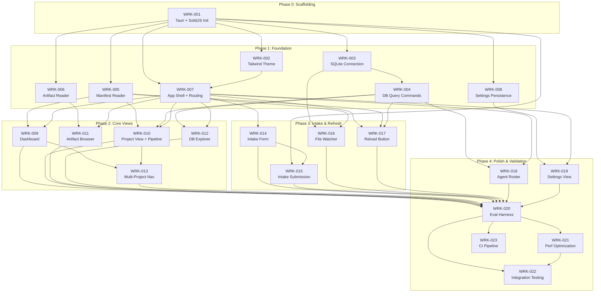

# Wolf Pack Mission Control V1 - Build Plan

## 1. Execution Phases

### Phase 0: Project Scaffolding
**Goal:** Initialize the Tauri v2 + SolidJS project, install all dependencies, and verify a clean build on Windows 11.
**Diagram Reference:** DGM-mission-control-001 (system context), DGM-mission-control-002 (container architecture)

### Phase 1: Foundation
**Goal:** Build the Rust backend commands (SQLite access, file system operations, manifest reading) and the frontend application shell with sidebar navigation and routing.
**Diagram Reference:** DGM-mission-control-002 (container), DGM-mission-control-003 (data flow)

### Phase 2: Core Views
**Goal:** Implement the three most critical views: Dashboard (project list), Project View (pipeline + artifacts), and DB Explorer. These cover all P0 requirements except intake.
**Diagram Reference:** DGM-mission-control-004 (view navigation), DGM-mission-control-005 (pipeline stages)

### Phase 3: Intake & Data Refresh
**Goal:** Implement the Intake form with validation, file system watching for live updates, and the manual reload button. Covers remaining P0 and all P1 requirements.
**Diagram Reference:** DGM-mission-control-006 (intake flow), DGM-mission-control-003 (data flow)

### Phase 4: Polish & Validation
**Goal:** Implement P2 features (Agent Roster, Settings), build the eval test harness, run all eval cases, and fix any failures. Integration testing and performance validation.

---

## 2. Work Items

### Phase 0: Project Scaffolding

#### WRK-mission-control-001 — Initialize Tauri v2 + SolidJS project

| Field | Value |
|-------|-------|
| **Description** | Create the Tauri v2 project with SolidJS frontend using `create-tauri-app`. Configure Vite, TypeScript, Tailwind CSS v4 (with custom dark theme from app-architecture.md Section 1.3). Set up the `src-tauri/` Rust backend with `Cargo.toml` including `rusqlite`, `serde`, `serde_json`, `notify`, and `open` crate dependencies. Verify `cargo tauri dev` produces a running window on Windows 11. |
| **Assigned Agent** | **Anvil** (Rust/Tauri setup) + **Forge** (frontend scaffold) |
| **Requirement Trace** | REQ-mission-control-018, REQ-mission-control-019 |
| **Dependencies** | None (first work item) |
| **Complexity** | M |

#### WRK-mission-control-002 — Tailwind CSS v4 theme configuration

| Field | Value |
|-------|-------|
| **Description** | Configure Tailwind CSS v4 with the custom dark theme palette (bg: #0d1117, surface: #161b22, border: #30363d, text: #e6edf3, accent: #f97316, etc.) from app-architecture.md Section 1.3. Verify utility classes render correctly in the SolidJS dev build. |
| **Assigned Agent** | **Forge** |
| **Requirement Trace** | REQ-mission-control-018 (platform runs correctly) |
| **Dependencies** | WRK-mission-control-001 |
| **Complexity** | S |

---

### Phase 1: Foundation

#### WRK-mission-control-003 — Rust SQLite connection manager with WAL mode

| Field | Value |
|-------|-------|
| **Description** | Implement the `DbState` struct holding a `Mutex<rusqlite::Connection>` in Tauri managed state. Open `wolfpack.db` at the configured path on app startup in WAL mode. Handle the case where the DB file does not exist (return error, do not create). Handle empty DB (zero rows, correct schema) without error. Verify schema is never modified (read-only access pattern). |
| **Assigned Agent** | **Anvil** |
| **Requirement Trace** | REQ-mission-control-016, REQ-mission-control-017 |
| **Dependencies** | WRK-mission-control-001 |
| **Complexity** | M |

#### WRK-mission-control-004 — Rust SQLite query commands (reports, tasks, sessions, agents)

| Field | Value |
|-------|-------|
| **Description** | Implement four Tauri commands: `query_reports`, `query_tasks`, `query_sessions`, `query_agents`. Each supports optional filters (search text, agent, status, date range), sorting, and pagination. Returns `QueryResult` with columns, rows, and total_count. All queries use parameterized SQL. No schema modification. |
| **Assigned Agent** | **Anvil** |
| **Requirement Trace** | REQ-mission-control-010, REQ-mission-control-011 |
| **Dependencies** | WRK-mission-control-003 |
| **Complexity** | L |

#### WRK-mission-control-005 — Rust manifest reader and project lister

| Field | Value |
|-------|-------|
| **Description** | Implement `list_projects()` Tauri command: scans `artifacts/*/manifest.json`, parses each manifest, returns a list of `Project` structs with slug, title, mode, priority, status, current_stage, and full manifest JSON. Also implement `get_project(slug)` returning a single project's full state. Directories without valid `manifest.json` are silently skipped. |
| **Assigned Agent** | **Anvil** |
| **Requirement Trace** | REQ-mission-control-002, REQ-mission-control-014 |
| **Dependencies** | WRK-mission-control-001 |
| **Complexity** | M |

#### WRK-mission-control-006 — Rust artifact file reader

| Field | Value |
|-------|-------|
| **Description** | Implement `read_artifact(path)` and `list_directory(path)` Tauri commands. `read_artifact` returns file content, parsed YAML frontmatter (for .md files), file size, and last-modified timestamp. `list_directory` returns all entries in a directory recursively. Handle `.md`, `.mmd`, `.gv`, `.json`, `.yaml` file types. |
| **Assigned Agent** | **Anvil** |
| **Requirement Trace** | REQ-mission-control-007, REQ-mission-control-008, REQ-mission-control-009 |
| **Dependencies** | WRK-mission-control-001 |
| **Complexity** | M |

#### WRK-mission-control-007 — Frontend application shell with sidebar navigation and routing

| Field | Value |
|-------|-------|
| **Description** | Build the SolidJS application shell: sidebar with navigation links for Dashboard, Project View, Intake, Pipeline, DB Explorer, Agent Roster, and Settings. Use Solid Router for view switching. Implement the `ProjectContext` (active project signal), `DbContext` (Tauri IPC wrapper), and `SettingsContext` (app configuration). Shell must support project switching without full page reload. |
| **Assigned Agent** | **Forge** |
| **Requirement Trace** | REQ-mission-control-012, REQ-mission-control-013 |
| **Dependencies** | WRK-mission-control-001, WRK-mission-control-002 |
| **Complexity** | L |

#### WRK-mission-control-008 — Settings persistence (config file read/write)

| Field | Value |
|-------|-------|
| **Description** | Implement Rust commands `get_settings()` and `update_settings()` that read/write a JSON config file in the Tauri app data directory. Settings include: db_path, project_root, artifacts_dir, file_watcher_enabled. Settings load automatically on app startup, providing defaults if config file is absent. This ensures session persistence (REQ-001). |
| **Assigned Agent** | **Anvil** |
| **Requirement Trace** | REQ-mission-control-001, REQ-mission-control-024 |
| **Dependencies** | WRK-mission-control-001 |
| **Complexity** | S |

---

### Phase 2: Core Views

#### WRK-mission-control-009 — Dashboard view (project list with metadata)

| Field | Value |
|-------|-------|
| **Description** | Implement the Dashboard view displaying project cards. Each card shows: name, current pipeline stage (1-5), stage status, and priority. All values sourced from `list_projects()` command. Cards are clickable to navigate to Project View. Include summary statistics (total projects, active, awaiting gate review) from `get_summary_stats()`. Show recent activity feed from `get_recent_activity()`. |
| **Assigned Agent** | **Forge** |
| **Requirement Trace** | REQ-mission-control-002, REQ-mission-control-001 |
| **Dependencies** | WRK-mission-control-005, WRK-mission-control-007 |
| **Complexity** | L |

#### WRK-mission-control-010 — Project View with pipeline visualization

| Field | Value |
|-------|-------|
| **Description** | Implement the Project View showing a single project's full state. Display the five-stage pipeline (Problem, Eval Spec, PRD, Diagrams, Build Plan) with gate status (pending/passed/failed), attempt count, assigned agent, and artifact existence per stage. Show project header with title, slug, priority, status. Include discrepancy detection: compare manifest.json values against wolfpack.db and display a visible warning when conflicts exist. |
| **Assigned Agent** | **Forge** |
| **Requirement Trace** | REQ-mission-control-003, REQ-mission-control-014, REQ-mission-control-015 |
| **Dependencies** | WRK-mission-control-005, WRK-mission-control-004, WRK-mission-control-007 |
| **Complexity** | L |

#### WRK-mission-control-011 — Artifact browser with Markdown rendering

| Field | Value |
|-------|-------|
| **Description** | Implement the artifact browser panel within the Project View. List all artifact files for the selected project using `list_directory()`. On file selection, display content using `read_artifact()`. Render Markdown files as formatted HTML (headings, lists, tables, code blocks). Parse and display YAML frontmatter as a metadata header, not raw text. Display `.mmd` and `.gv` files as source code in a monospaced code block. |
| **Assigned Agent** | **Forge** |
| **Requirement Trace** | REQ-mission-control-007, REQ-mission-control-008, REQ-mission-control-009 |
| **Dependencies** | WRK-mission-control-006, WRK-mission-control-007 |
| **Complexity** | M |

#### WRK-mission-control-012 — DB Explorer view with filtering

| Field | Value |
|-------|-------|
| **Description** | Implement the DB Explorer view with four tabs: Reports, Tasks, Session Log, Agents. Each tab renders a data table from the corresponding `query_*` Tauri command. Implement filter controls: search text input, agent dropdown, status dropdown. Filtering by project and by agent must return exact correct subsets with zero false positives. Show row count. Handle empty tables gracefully (empty state message, not error). |
| **Assigned Agent** | **Forge** |
| **Requirement Trace** | REQ-mission-control-010, REQ-mission-control-011, REQ-mission-control-017 |
| **Dependencies** | WRK-mission-control-004, WRK-mission-control-007 |
| **Complexity** | L |

#### WRK-mission-control-013 — Multi-project navigation and context switching

| Field | Value |
|-------|-------|
| **Description** | Implement project switching: clicking a project in the Dashboard updates `ProjectContext`, navigates to Project View, and loads the target project's data. Verify zero data carryover from the previous project. Ensure all data (pipeline, gates, artifacts) matches the target project after switch. Target: switch completes within 2000ms. |
| **Assigned Agent** | **Forge** |
| **Requirement Trace** | REQ-mission-control-012, REQ-mission-control-013 |
| **Dependencies** | WRK-mission-control-009, WRK-mission-control-010 |
| **Complexity** | M |

---

### Phase 3: Intake & Data Refresh

#### WRK-mission-control-014 — Intake form with six fields and validation

| Field | Value |
|-------|-------|
| **Description** | Implement the Intake View with a form capturing six fields: Problem (textarea), Users (textarea), Scope In/Out (multi-line), Constraints (textarea), Success Criteria (multi-line), Prior Art (textarea). Plus project title and slug fields. Implement client-side validation: Problem field is required, form blocks submission when empty, validation error is displayed. No fast-track option (standard intake only per REQ-006). |
| **Assigned Agent** | **Forge** |
| **Requirement Trace** | REQ-mission-control-004, REQ-mission-control-005, REQ-mission-control-006 |
| **Dependencies** | WRK-mission-control-007 |
| **Complexity** | M |

#### WRK-mission-control-015 — Intake form submission and intake.json creation

| Field | Value |
|-------|-------|
| **Description** | Implement the Rust `scaffold_project(intake)` Tauri command: on form submission, create `artifacts/{slug}/` directory and write `intake.json` containing all six fields in valid JSON conforming to the schema `{problem: string, users: string[], scope_in: string[], scope_out: string[], constraints: string[], success_criteria: string[], prior_art: string[]}`. Empty optional fields are represented as empty arrays/strings, not absent keys. Also create `manifest.json` with initial project state. |
| **Assigned Agent** | **Anvil** |
| **Requirement Trace** | REQ-mission-control-004, REQ-mission-control-005 |
| **Dependencies** | WRK-mission-control-001, WRK-mission-control-014 |
| **Complexity** | M |

#### WRK-mission-control-016 — File system watcher for live data refresh

| Field | Value |
|-------|-------|
| **Description** | Implement Rust `watch_directory(path)` and `unwatch_directory(path)` Tauri commands using the `notify` crate. Watch `artifacts/` directory and `wolfpack.db` for changes. Emit `file-changed` events to the frontend via Tauri's event system. Frontend subscribes to these events and triggers data re-fetch. Changes must be reflected within 5 seconds. |
| **Assigned Agent** | **Anvil** |
| **Requirement Trace** | REQ-mission-control-020 |
| **Dependencies** | WRK-mission-control-003, WRK-mission-control-005 |
| **Complexity** | M |

#### WRK-mission-control-017 — Manual reload button

| Field | Value |
|-------|-------|
| **Description** | Add a reload button to the application shell (header/toolbar). On click, re-invoke `list_projects()` and all active queries to refresh displayed data from manifest.json files and wolfpack.db. Reload must complete within 3 seconds for up to 5 projects. |
| **Assigned Agent** | **Forge** |
| **Requirement Trace** | REQ-mission-control-021 |
| **Dependencies** | WRK-mission-control-007, WRK-mission-control-005, WRK-mission-control-004 |
| **Complexity** | S |

---

### Phase 4: Polish & Validation

#### WRK-mission-control-018 — Agent Roster view

| Field | Value |
|-------|-------|
| **Description** | Implement the Agent Roster view: display all agents from `registry.json` merged with activity data from wolfpack.db (task count, report count, last activity date). Show agent cards in a grid layout with name, role, status, and description. Filter by active/inactive status. |
| **Assigned Agent** | **Forge** |
| **Requirement Trace** | REQ-mission-control-023 |
| **Dependencies** | WRK-mission-control-004, WRK-mission-control-007 |
| **Complexity** | M |

#### WRK-mission-control-019 — Settings view

| Field | Value |
|-------|-------|
| **Description** | Implement the Settings view: editable fields for database file path, project root path, and artifacts directory path. Use native file/directory picker dialogs via Tauri commands. Settings persist across sessions via the config file (WRK-008). Changing the database path reloads the DB connection. |
| **Assigned Agent** | **Forge** |
| **Requirement Trace** | REQ-mission-control-024 |
| **Dependencies** | WRK-mission-control-008, WRK-mission-control-007 |
| **Complexity** | S |

#### WRK-mission-control-020 — Eval test harness and fixture generation

| Field | Value |
|-------|-------|
| **Description** | Build the Python eval test harness that validates all 27 eval cases from EVL-mission-control-001. Generate synthetic fixture data (DS-mission-control-001: 5 projects, DS-mission-control-002: intake scenarios, DS-mission-control-003: discrepancy cases). Implement scorers SCR-001 (data match), SCR-002 (completeness), SCR-003 (performance timer), SCR-004 (intake conformance), SCR-005 (session persistence), SCR-006 (platform checker). |
| **Assigned Agent** | **Eval** |
| **Requirement Trace** | All REQ-mission-control-001 through REQ-mission-control-024 (transitive via eval cases) |
| **Dependencies** | WRK-mission-control-009 through WRK-mission-control-019 (requires built app to test) |
| **Complexity** | L |

#### WRK-mission-control-021 — Performance optimization for 20-project scale

| Field | Value |
|-------|-------|
| **Description** | Load-test with 20 concurrent projects and 800+ DB rows per table. Verify: project list loads within 3s, project switch within 2s, DB table load within 2s. Profile and optimize any bottlenecks (Rust query performance, frontend rendering). Ensure no UI freezes. |
| **Assigned Agent** | **Forge** + **Anvil** |
| **Requirement Trace** | REQ-mission-control-022, REQ-mission-control-013 |
| **Dependencies** | WRK-mission-control-020 (needs 20-project fixture set) |
| **Complexity** | M |

#### WRK-mission-control-022 — Integration testing and bug fixing

| Field | Value |
|-------|-------|
| **Description** | Run the full eval harness (WRK-020). Triage failures. Fix bugs identified by eval cases. Re-run until all 27 eval cases pass. Verify Windows 11 standard-user launch (no UAC), verify no WSL dependency. Verify DB schema is unchanged after app use. |
| **Assigned Agent** | **Forge** + **Anvil** + **Eval** |
| **Requirement Trace** | All REQ-mission-control-001 through REQ-mission-control-024 |
| **Dependencies** | WRK-mission-control-020, WRK-mission-control-021 |
| **Complexity** | L |

#### WRK-mission-control-023 — CI pipeline for build and eval

| Field | Value |
|-------|-------|
| **Description** | Create a GitHub Actions workflow that: (1) installs Rust toolchain and Node.js LTS, (2) runs `cargo tauri build` to produce the Windows binary, (3) runs the Python eval harness against the built app, (4) reports pass/fail for all eval cases. Workflow triggers on push to main and on PR. |
| **Assigned Agent** | **Pipeline** |
| **Requirement Trace** | REQ-mission-control-019 (dependency verification) |
| **Dependencies** | WRK-mission-control-020 |
| **Complexity** | M |

---

## 3. Dependency Graph

Work items must be executed in an order that respects these dependencies. The graph is acyclic.

```
Phase 0:
  WRK-001 (no deps)

Phase 0 -> Phase 1:
  WRK-002 depends on WRK-001
  WRK-003 depends on WRK-001
  WRK-005 depends on WRK-001
  WRK-006 depends on WRK-001
  WRK-008 depends on WRK-001
  WRK-007 depends on WRK-001, WRK-002

Phase 1 -> Phase 2:
  WRK-004 depends on WRK-003
  WRK-009 depends on WRK-005, WRK-007
  WRK-010 depends on WRK-005, WRK-004, WRK-007
  WRK-011 depends on WRK-006, WRK-007
  WRK-012 depends on WRK-004, WRK-007
  WRK-013 depends on WRK-009, WRK-010

Phase 2 -> Phase 3:
  WRK-014 depends on WRK-007
  WRK-015 depends on WRK-001, WRK-014
  WRK-016 depends on WRK-003, WRK-005
  WRK-017 depends on WRK-007, WRK-005, WRK-004

Phase 3 -> Phase 4:
  WRK-018 depends on WRK-004, WRK-007
  WRK-019 depends on WRK-008, WRK-007
  WRK-020 depends on WRK-009 through WRK-019
  WRK-021 depends on WRK-020
  WRK-022 depends on WRK-020, WRK-021
  WRK-023 depends on WRK-020
```

### Mermaid Dependency Diagram



---

## 4. Risk Register

| ID | Risk | Likelihood | Impact | Mitigation |
|----|------|-----------|--------|------------|
| RISK-001 | **Forge unfamiliar with SolidJS.** The frontend developer may not know SolidJS, causing slower velocity in Phase 1-2. | Medium | Medium | SolidJS API surface is small (~10 core primitives). JSX syntax is near-identical to React. Provide SolidJS quick-start reference in the task brief. Fallback: swap to Svelte (half-day migration per app-architecture.md). |
| RISK-002 | **Tauri v2 build issues on Windows 11.** Tauri requires the Rust toolchain and WebView2. Build failures could block Phase 0. | Low | High | WebView2 is pre-installed on Windows 11. Test `cargo tauri dev` in WRK-001 before any other work proceeds. Anvil is a Rust specialist and can troubleshoot. |
| RISK-003 | **rusqlite WAL mode conflicts with agent writes.** If agents write to wolfpack.db while the app has it open in WAL mode, lock contention could occur. | Medium | Medium | WAL mode supports concurrent readers and a single writer. The app is read-only for wolfpack.db (per PRD constraint). Verify with a concurrent-write test in WRK-003. |
| RISK-004 | **manifest.json schema instability.** If the manifest schema changes during development, manifest parsing breaks. | Low | High | manifest.json schema is declared stable in PRB-mission-control-001 Assumption 1. Pin the parser to the current schema. If schema changes, manifest reader (WRK-005) is a single point of change. |
| RISK-005 | **File watcher reliability on Windows.** The `notify` crate may miss events or produce duplicates on NTFS. | Medium | Low | Implement debouncing (500ms window) in the file watcher. The manual reload button (WRK-017) serves as a fallback. File watcher is P1, not P0. |
| RISK-006 | **Performance at 20-project scale.** Loading 20 manifests + 800 DB rows could exceed the 3-second threshold. | Low | Medium | Manifest reading is parallel-capable in Rust. DB queries use indexed columns. WRK-021 specifically load-tests at scale. Pagination is available for DB tables if needed. |
| RISK-007 | **intake.json schema not confirmed by Alpha.** The exact schema Alpha consumes for intake is listed as OQ-PRD-03 (open). | Medium | Medium | Use the schema from EVL-CASE-mission-control-008 as the working contract: `{problem, users, scope_in, scope_out, constraints, success_criteria, prior_art}`. Flag for Alpha confirmation before Phase 3 begins. |
| RISK-008 | **Eval harness requires running Tauri app programmatically.** Automated testing of a desktop GUI is non-trivial. | Medium | High | Use Tauri's WebDriver support (WebView2 supports Chrome DevTools Protocol). Eval agent builds the harness using Playwright or a similar tool targeting the WebView. Fallback: semi-automated eval with manual launch + automated DOM inspection. |

---

## 5. Validation Plan

The validation plan maps each work item to the eval cases that verify it. All eval cases are from EVL-mission-control-001.

| Work Item | Eval Cases | Validation Method |
|-----------|-----------|-------------------|
| WRK-001 | EVL-CASE-023, EVL-CASE-024 | Build verification: `cargo tauri dev` succeeds on Windows 11 standard user. Dependency audit confirms no WSL requirement. |
| WRK-002 | (Visual verification) | Manual inspection: theme colors match spec. Automated: CSS computed-style check in eval harness. |
| WRK-003 | EVL-CASE-021, EVL-CASE-022 | SCR-001: Open unmodified wolfpack.db, verify data displays. Open empty DB, verify no error. Compare schema before/after. |
| WRK-004 | EVL-CASE-014, EVL-CASE-015, EVL-CASE-016 | SCR-001 + SCR-002: Query each table, compare row counts and content against known fixture data. Filter by project/agent, verify exact subsets. |
| WRK-005 | EVL-CASE-003, EVL-CASE-004 | SCR-002: Load 5 fixture projects, verify all appear. Add directory without manifest, verify it is excluded. |
| WRK-006 | EVL-CASE-011, EVL-CASE-012, EVL-CASE-013 | SCR-002: List artifacts for alpha-project, verify 100% completeness. SCR-001: Open .md file, verify rendered HTML. Open .mmd file, verify source code display. |
| WRK-007 | EVL-CASE-017, EVL-CASE-018 | SCR-003: Navigate between views, measure time. Verify routing works without full page reload. |
| WRK-008 | EVL-CASE-001, EVL-CASE-002 | SCR-005: Close and reopen app, verify settings persist. Verify no file-loading prompts on reopen. |
| WRK-009 | EVL-CASE-003, EVL-CASE-004 | SCR-001 + SCR-002: Verify all projects listed with correct metadata. Verify missing-manifest project excluded. |
| WRK-010 | EVL-CASE-005, EVL-CASE-006, EVL-CASE-007, EVL-CASE-019, EVL-CASE-020 | SCR-001: Verify pipeline stages, gate statuses, attempt counts match manifest. Verify discrepancy warning for DISC-001 fixture. |
| WRK-011 | EVL-CASE-011, EVL-CASE-012, EVL-CASE-013 | SCR-001 + SCR-002: All artifacts listed. Markdown rendered. Diagram source displayed as code. |
| WRK-012 | EVL-CASE-014, EVL-CASE-015, EVL-CASE-016, EVL-CASE-022 | SCR-001 + SCR-002: All four tables browsable. Filters return exact subsets. Empty DB shows empty state. |
| WRK-013 | EVL-CASE-017, EVL-CASE-018 | SCR-001 + SCR-003: Switch projects, verify correct data loads with zero carryover within 2000ms. |
| WRK-014 | EVL-CASE-010 | SCR-004: Submit with empty problem field, verify form blocks and displays error. Verify no intake.json created. |
| WRK-015 | EVL-CASE-008, EVL-CASE-009 | SCR-004: Submit complete intake, verify valid JSON output with all fields. Submit minimal intake, verify empty fields present as empty arrays/strings. |
| WRK-016 | EVL-CASE-025 | SCR-003: Modify manifest.json externally, verify UI updates within 5 seconds. |
| WRK-017 | EVL-CASE-026 | SCR-003: Modify data externally, click reload, verify all data refreshes within 3 seconds. |
| WRK-018 | EVL-CASE-014, EVL-CASE-016 | SCR-001: Verify all agents listed with correct activity counts. |
| WRK-019 | EVL-CASE-001, EVL-CASE-021 | SCR-005: Change DB path in settings, verify new DB loads. Close/reopen, verify settings persist. |
| WRK-020 | All 27 eval cases | Full eval harness execution. All scorers (SCR-001 through SCR-006) run against all applicable eval cases. |
| WRK-021 | EVL-CASE-027 | SCR-003: Load 20 projects, verify all performance thresholds. No UI freezes. |
| WRK-022 | All 27 eval cases | Re-run full harness after bug fixes. All cases must pass. |
| WRK-023 | EVL-CASE-024 | CI build succeeds. Eval harness runs in CI. All cases pass. |

### Agent-to-Phase Assignment Summary

| Agent | Phase 0 | Phase 1 | Phase 2 | Phase 3 | Phase 4 |
|-------|---------|---------|---------|---------|---------|
| **Anvil** | WRK-001 | WRK-003, WRK-005, WRK-006, WRK-008 | — | WRK-015, WRK-016 | WRK-021, WRK-022 |
| **Forge** | WRK-001, WRK-002 | WRK-007 | WRK-009, WRK-010, WRK-011, WRK-012, WRK-013 | WRK-014, WRK-017 | WRK-018, WRK-019, WRK-021, WRK-022 |
| **Eval** | — | — | — | — | WRK-020, WRK-022 |
| **Pipeline** | — | — | — | — | WRK-023 |
