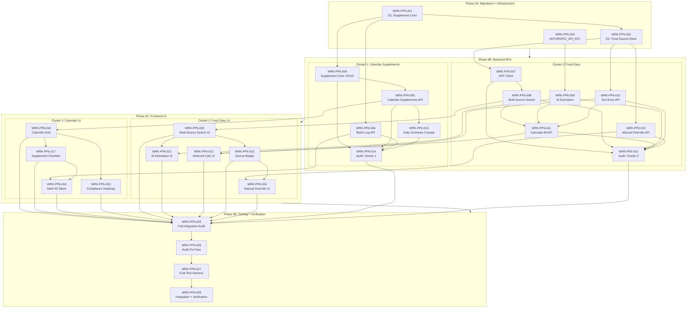

# Build Plan: PeakProtocol Phase 6 --- Calendar Supplement Visibility + Multi-Source Food Diary

## 1. Executive Summary

This build plan decomposes the 13 PRD requirements (7 P0, 6 P1) into 28 concrete work items across 4 execution phases. The plan covers two feature clusters: (1) calendar supplement dot visibility with compliance heatmap, and (2) multi-source food diary with OpenFoodFacts, AI macro estimation, and deferred calculation. Each work item includes agent assignment, dependency mapping, complexity estimation, and eval case traceability covering all 32 eval cases.

**Key sequencing principle:** D1 migrations first, then backend APIs, then frontend UI. This is enforced by the pack protocol (frontend reads backend route files before writing types) and by the data dependency chain (new columns must exist before APIs can read/write them, APIs must exist before frontend can consume them).

---

## 2. Agent Assignment Strategy

### Available Agents (from registry.json)

| Agent | Role | Phase 6 Domain |
|-------|------|----------------|
| **Sigma** | SQLite Database Specialist | D1 migrations (new columns on 3 tables) |
| **Forge** | TypeScript/Node.js Developer | Backend API endpoints (Hono routes, services) |
| **Pixel** | Frontend UI/UX Specialist | SolidJS components, calendar extensions |
| **Cloud** | Cloudflare Workers Specialist | Wrangler secrets, worker bindings, edge config |
| **Eval** | Eval Engineer | Test harness for 32 Phase 6 eval cases |
| **Auditor** | Cross-Layer Code Auditor | Cross-layer audit passes after each cluster |
| **Sentry** | QA & Integration Testing | Integration testing + local verification gate |

### Agent Capability Matching

| Stack Component | Required Skills | Agent | Confirmed? |
|-----------------|-----------------|-------|------------|
| D1 ALTER TABLE + fallback recreation | SQL, migrations, D1 | Sigma | Yes --- SQLite specialist, did WRK-003/004/022 |
| Hono route handlers + services | TypeScript, Hono, D1 queries | Forge | Yes --- built all 18 Phase 1-5 backend items |
| External API clients (OFF, Anthropic) | TypeScript, fetch, error handling | Forge | Yes --- built USDA client (WRK-021) |
| SolidJS components, calendar ext | SolidJS, UnoCSS, reactive signals | Pixel | Yes --- built all 14 Phase 1-5 UI items |
| Wrangler secrets configuration | Cloudflare Workers, wrangler.toml | Cloud | Yes --- configured VAPID/USDA/APP_PASSCODE secrets |
| Vitest test harness | TypeScript, testing | Eval | Yes --- built WRK-047 (24 test cases) |

---

## 3. Work Item Decomposition

### Phase 6A: Migrations + Infrastructure (Gate: all new columns exist, secret configured)

#### WRK-PP6-001: D1 Migration --- Supplement Color Column

| Attribute | Value |
|-----------|-------|
| **ID** | WRK-PP6-001 |
| **Description** | Create migration `003_phase6_calendar_food.sql`. Add `color` TEXT column to `supplements` table. Use ALTER TABLE with table-recreation fallback per DEC-phase6-001. Verify zero data loss on existing supplement records. |
| **Agent** | Sigma |
| **Traceability** | REQ-P6-DI-01 -> EVL-P6-DI-01 |
| **Dependencies** | None (existing schema from WRK-003/004) |
| **Complexity** | S |
| **Deliverables** | `peakprotocol/packages/api/migrations/003_phase6_calendar_food.sql` (supplement portion) |

#### WRK-PP6-002: D1 Migration --- Food Entry Source + Description Columns

| Attribute | Value |
|-----------|-------|
| **ID** | WRK-PP6-002 |
| **Description** | In the same migration file, add `source` TEXT and `description` TEXT columns to `food_entries` table, and `source` TEXT column (DEFAULT 'usda') to `food_cache` table. Use ALTER TABLE with table-recreation fallback. Verify zero data loss on existing food entries and cache records. |
| **Agent** | Sigma |
| **Traceability** | REQ-P6-DI-02 -> EVL-P6-DI-02 |
| **Dependencies** | WRK-PP6-001 (same migration file) |
| **Complexity** | S |
| **Deliverables** | `peakprotocol/packages/api/migrations/003_phase6_calendar_food.sql` (food portion) |

#### WRK-PP6-003: ANTHROPIC_API_KEY Wrangler Secret

| Attribute | Value |
|-----------|-------|
| **ID** | WRK-PP6-003 |
| **Description** | Configure `ANTHROPIC_API_KEY` as a Wrangler secret for both local dev and production environments. Update `wrangler.toml` bindings if needed. Document the secret setup in project context. |
| **Agent** | Cloud |
| **Traceability** | REQ-P6-07 -> EVL-P6-08b (missing key handling) |
| **Dependencies** | None |
| **Complexity** | S |
| **Deliverables** | Secret configured via `wrangler secret put`, binding documented |

---

### Phase 6B: Backend APIs (Gate: all 6 new endpoints operational, existing endpoints updated)

#### WRK-PP6-004: Supplement CRUD --- Color Field Extension

| Attribute | Value |
|-----------|-------|
| **ID** | WRK-PP6-004 |
| **Description** | Extend existing supplement CRUD endpoints (GET/POST/PUT) to accept and return the `color` field. On POST (create), auto-assign the next unused palette color from the 16-color palette defined in DEC-phase6-001. On GET, return color alongside existing fields. Ensure backward compatibility: existing clients that do not send `color` still work. |
| **Agent** | Forge |
| **Traceability** | REQ-P6-02 -> EVL-P6-02, EVL-P6-02a, EVL-P6-02b |
| **Dependencies** | WRK-PP6-001 (color column must exist) |
| **Complexity** | S |
| **Deliverables** | Updated supplement routes + palette constant module |

#### WRK-PP6-005: Calendar Supplements Monthly API

| Attribute | Value |
|-----------|-------|
| **ID** | WRK-PP6-005 |
| **Description** | New endpoint: `GET /api/calendar-supplements/:month` (format YYYY-MM). Returns per-day supplement status data for the full month in a single call. For each day: array of `{supplementId, name, color, status}` objects (status: taken/skipped/pending). Also returns per-day compliance: full/partial/none/null. Uses scheduling engine for "due" computation, supplement_logs for "taken" status. Historical dots derive from logs per DEC-phase6-009. Compliance computed per DEC-phase6-008 (all scheduled count regardless of time). |
| **Agent** | Forge |
| **Traceability** | REQ-P6-01 -> EVL-P6-01, EVL-P6-01a; REQ-P6-05 -> EVL-P6-05, EVL-P6-05a |
| **Dependencies** | WRK-PP6-001 (color column), WRK-PP6-004 (color auto-assignment) |
| **Complexity** | L |
| **Deliverables** | `peakprotocol/packages/api/src/routes/calendar-supplements.ts`, service module |

#### WRK-PP6-006: Batch Supplement Log API

| Attribute | Value |
|-----------|-------|
| **ID** | WRK-PP6-006 |
| **Description** | New endpoint: `POST /api/supplements/batch-log`. Accepts `{date, supplementIds}`. Uses D1 `batch()` for atomic multi-insert. Skips supplements already logged as taken (no duplicates). Returns created log count. Must complete within Workers 30s CPU limit for up to 10 supplements. |
| **Agent** | Forge |
| **Traceability** | REQ-P6-04 -> EVL-P6-04, EVL-P6-04a, EVL-P6-04b, EVL-P6-DI-04 |
| **Dependencies** | WRK-PP6-001 (supplements table accessible) |
| **Complexity** | M |
| **Deliverables** | `peakprotocol/packages/api/src/routes/supplement-batch.ts` |

#### WRK-PP6-007: OpenFoodFacts API Client

| Attribute | Value |
|-----------|-------|
| **ID** | WRK-PP6-007 |
| **Description** | Create OpenFoodFacts API client module. Implements `GET /cgi/search.pl?search_terms={query}&json=1&page_size={limit}` with `User-Agent: PeakProtocol/1.0`. Normalize OFF response to same schema as USDA results (map barcode, nutrient fields to calories/protein/carbs/fat/fiber). Handle API failures gracefully (timeout after 3s, return empty on failure). |
| **Agent** | Forge |
| **Traceability** | REQ-P6-06 -> EVL-P6-06, EVL-P6-06b |
| **Dependencies** | WRK-PP6-002 (food_cache source column for caching OFF results) |
| **Complexity** | M |
| **Deliverables** | `peakprotocol/packages/api/src/services/openfoodfacts.ts` |

#### WRK-PP6-008: Multi-Source Food Search Integration

| Attribute | Value |
|-----------|-------|
| **ID** | WRK-PP6-008 |
| **Description** | Extend existing food search service to query both USDA and OpenFoodFacts in parallel. Cache-first for both sources (shared `food_cache` table with `source` discriminator). Merge results: USDA first, then OFF, deduplicate by name similarity. Each result includes `source` field. Graceful degradation: OFF failure does not block USDA results. |
| **Agent** | Forge |
| **Traceability** | REQ-P6-06 -> EVL-P6-06, EVL-P6-06a, EVL-P6-06b, EVL-P6-07 |
| **Dependencies** | WRK-PP6-002 (source column on food_cache), WRK-PP6-007 (OFF client) |
| **Complexity** | M |
| **Deliverables** | Updated `peakprotocol/packages/api/src/services/food-search.ts` |

#### WRK-PP6-009: AI Macro Estimation Endpoint

| Attribute | Value |
|-----------|-------|
| **ID** | WRK-PP6-009 |
| **Description** | New endpoint: `POST /api/foods/estimate`. Accepts `{description}`. Calls Anthropic Claude (Haiku-class) with structured estimation prompt per DEC-phase6-004. Returns `{calories, protein, carbs, fat, fiber, source: "ai"}`. Error handling: missing key = 503 "AI estimation not configured", API failure = retry once then 502, invalid JSON = retry once then 502. Respects Workers 128MB memory and 30s CPU limits. |
| **Agent** | Forge |
| **Traceability** | REQ-P6-07 -> EVL-P6-08, EVL-P6-08a, EVL-P6-08b |
| **Dependencies** | WRK-PP6-003 (ANTHROPIC_API_KEY secret must be configured) |
| **Complexity** | M |
| **Deliverables** | `peakprotocol/packages/api/src/services/ai-estimation.ts`, route handler |

#### WRK-PP6-010: Text-Only Food Entry Endpoint

| Attribute | Value |
|-----------|-------|
| **ID** | WRK-PP6-010 |
| **Description** | New endpoint: `POST /api/food-entries/text`. Accepts `{date, meal, description}`. Creates food_entries row with `food_name = description`, all macro columns NULL, `source = NULL`, `description = raw text`. Entry appears in daily food list with 0 contribution to totals. |
| **Agent** | Forge |
| **Traceability** | REQ-P6-08 -> EVL-P6-09b |
| **Dependencies** | WRK-PP6-002 (source + description columns on food_entries) |
| **Complexity** | S |
| **Deliverables** | Route handler added to food-entries routes |

#### WRK-PP6-011: Calculate All Batch Endpoint

| Attribute | Value |
|-----------|-------|
| **ID** | WRK-PP6-011 |
| **Description** | New endpoint: `POST /api/food-entries/calculate-all`. Accepts `{date}`. Finds all food_entries for date with NULL calories. For each entry (sequential processing per DEC-phase6-007): try USDA cache/API, then OFF, then AI estimation. Update each resolved entry with macros + source. Return `{resolved: [...], failed: [...]}`. Partial success: individual failures do not block resolved items. Processing 3-5 items within 3-8s, well within 30s CPU limit. |
| **Agent** | Forge |
| **Traceability** | REQ-P6-08 -> EVL-P6-09, EVL-P6-09a |
| **Dependencies** | WRK-PP6-008 (multi-source search), WRK-PP6-009 (AI estimation), WRK-PP6-010 (text entries exist) |
| **Complexity** | L |
| **Deliverables** | Route handler + batch resolution service |

#### WRK-PP6-012: Food Entry Manual Override Endpoint

| Attribute | Value |
|-----------|-------|
| **ID** | WRK-PP6-012 |
| **Description** | New/updated endpoint: `PUT /api/food-entries/:id`. Accepts `{calories?, protein?, carbs?, fat?, fiber?}`. Updates specified macro fields and sets `source = "manual"`. Preserves unspecified fields. Returns updated entry. |
| **Agent** | Forge |
| **Traceability** | REQ-P6-10 -> EVL-P6-11, EVL-P6-11a |
| **Dependencies** | WRK-PP6-002 (source column on food_entries) |
| **Complexity** | S |
| **Deliverables** | Updated food-entries route handler |

#### WRK-PP6-013: Daily Summary API Backward Compatibility

| Attribute | Value |
|-----------|-------|
| **ID** | WRK-PP6-013 |
| **Description** | Verify and update `GET /api/daily-summary/:date` to include Phase 6 supplement dot data as an additive field. Response shape must be a strict superset of Phase 5 shape: no existing fields renamed or removed. New fields include supplement status array and source field on food entries. |
| **Agent** | Forge |
| **Traceability** | REQ-P6-DI-03 -> EVL-P6-DI-03 |
| **Dependencies** | WRK-PP6-005 (calendar supplements data available) |
| **Complexity** | S |
| **Deliverables** | Updated daily-summary route handler |

**--- Cluster 1 Audit Gate ---**

#### WRK-PP6-014: Audit Pass --- Cluster 1 (Calendar Supplement Backend)

| Attribute | Value |
|-----------|-------|
| **ID** | WRK-PP6-014 |
| **Description** | Cross-layer audit of Cluster 1 backend: migration integrity, calendar-supplements endpoint response shape, batch-log atomicity, supplement CRUD color field, daily summary backward compatibility. Check for field name mismatches, null handling, type safety between migration schema and route handlers. |
| **Agent** | Auditor |
| **Traceability** | REQ-P6-DI-01, REQ-P6-DI-03 |
| **Dependencies** | WRK-PP6-004, WRK-PP6-005, WRK-PP6-006, WRK-PP6-013 |
| **Complexity** | M |
| **Deliverables** | Audit report with findings |

**--- Cluster 2 Audit Gate ---**

#### WRK-PP6-015: Audit Pass --- Cluster 2 (Food Diary Backend)

| Attribute | Value |
|-----------|-------|
| **ID** | WRK-PP6-015 |
| **Description** | Cross-layer audit of Cluster 2 backend: food_cache source column usage, OFF client error handling, AI estimation error paths (missing key, bad JSON, timeout), text-entry NULL macro handling, calculate-all partial failure handling, manual override source change. Check for field name mismatches between food search service and route responses. |
| **Agent** | Auditor |
| **Traceability** | REQ-P6-DI-02, REQ-P6-06, REQ-P6-07, REQ-P6-08 |
| **Dependencies** | WRK-PP6-007, WRK-PP6-008, WRK-PP6-009, WRK-PP6-010, WRK-PP6-011, WRK-PP6-012 |
| **Complexity** | M |
| **Deliverables** | Audit report with findings |

---

### Phase 6C: Frontend UI (Gate: all UI features render correctly, interact with backend)

#### WRK-PP6-016: Calendar Dot Rendering Component

| Attribute | Value |
|-----------|-------|
| **ID** | WRK-PP6-016 |
| **Description** | Extend Calendar component to accept a `supplementDays` prop alongside existing `activeDates` prop. Render colored dots in calendar day cells: dot color from supplement's palette color, status indicated by overlay (green=taken, amber=skipped, gray=pending). Dot layout: max 6 dots on mobile (<640px), max 8 on desktop, with "+N" overflow indicator per DEC-phase6-006. Dot size: 6px mobile, 8px desktop. **Must read backend route file** (`calendar-supplements.ts`) before writing types. |
| **Agent** | Pixel |
| **Traceability** | REQ-P6-01 -> EVL-P6-01, EVL-P6-01a, EVL-P6-01b |
| **Dependencies** | WRK-PP6-005 (backend API must exist for type reading) |
| **Complexity** | L |
| **Deliverables** | Updated `Calendar.tsx` with dot rendering, `SupplementDots.tsx` component |

#### WRK-PP6-017: Calendar Day Detail Supplement Checklist

| Attribute | Value |
|-----------|-------|
| **ID** | WRK-PP6-017 |
| **Description** | Add supplement checklist section to the day detail view. Each row: checkbox, supplement name (colored), dose, time-of-day label. Checking a box: POST to supplement log API with `taken_at` timestamp, optimistic UI update. Unchecking: DELETE log record, revert checkbox. Integrate with existing day detail layout without disrupting food/training sections. **Must read backend route files** before writing types. |
| **Agent** | Pixel |
| **Traceability** | REQ-P6-03 -> EVL-P6-03 |
| **Dependencies** | WRK-PP6-005 (calendar supplements API), WRK-PP6-016 (calendar dot component for visual consistency) |
| **Complexity** | M |
| **Deliverables** | `SupplementChecklist.tsx` component |

#### WRK-PP6-018: Batch "Mark All Taken" UI

| Attribute | Value |
|-----------|-------|
| **ID** | WRK-PP6-018 |
| **Description** | Add "Mark All Taken" button to the day detail supplement checklist. Calls `POST /api/supplements/batch-log`. Updates all pending checkboxes to checked with optimistic UI. Handles partial state (some already taken). After batch action, individual unchecking still works. Loading state while batch processes. **Must read backend route file** before writing types. |
| **Agent** | Pixel |
| **Traceability** | REQ-P6-04 -> EVL-P6-04, EVL-P6-04a, EVL-P6-04b |
| **Dependencies** | WRK-PP6-006 (batch-log API), WRK-PP6-017 (checklist component) |
| **Complexity** | S |
| **Deliverables** | Button integrated into `SupplementChecklist.tsx` |

#### WRK-PP6-019: Compliance Heatmap Tinting

| Attribute | Value |
|-----------|-------|
| **ID** | WRK-PP6-019 |
| **Description** | Add background tint to calendar day cells based on compliance data from the calendar-supplements API. Green tint for full compliance (all taken), amber for partial, no tint for none/n/a. Tinting must coexist with existing calendar features (food logging dots, training dots, day selection, navigation). Per DEC-phase6-008: all scheduled supplements count regardless of time-of-day. |
| **Agent** | Pixel |
| **Traceability** | REQ-P6-05 -> EVL-P6-05, EVL-P6-05a, EVL-P6-05b |
| **Dependencies** | WRK-PP6-016 (calendar dot component already consuming supplementDays data) |
| **Complexity** | S |
| **Deliverables** | Updated `Calendar.tsx` with compliance tint logic |

#### WRK-PP6-020: Multi-Source Food Search UI

| Attribute | Value |
|-----------|-------|
| **ID** | WRK-PP6-020 |
| **Description** | Extend Quick-Add / FoodLogger search UI to display results from both USDA and OpenFoodFacts. Each result shows a source badge ("USDA" or "OFF"). USDA results appear first. Search debouncing and loading states preserved. **Must read backend route files** (food search service) before writing types. |
| **Agent** | Pixel |
| **Traceability** | REQ-P6-06 -> EVL-P6-06, EVL-P6-06a |
| **Dependencies** | WRK-PP6-008 (multi-source search API) |
| **Complexity** | M |
| **Deliverables** | Updated food search components with source badges |

#### WRK-PP6-021: AI Estimation Trigger UI

| Attribute | Value |
|-----------|-------|
| **ID** | WRK-PP6-021 |
| **Description** | When food search returns no results, show a "Describe your food" text input with a "Calculate" button that calls `POST /api/foods/estimate`. Display returned macros with "AI" source badge. Handle loading state (LLM call can take 2-5s). Handle errors: "AI estimation not configured" (503) and "AI estimation temporarily unavailable" (502) shown as user-friendly messages. Manual entry fallback always available. **Must read backend route file** before writing types. |
| **Agent** | Pixel |
| **Traceability** | REQ-P6-07 -> EVL-P6-08, EVL-P6-08a, EVL-P6-08b |
| **Dependencies** | WRK-PP6-009 (AI estimation API), WRK-PP6-020 (search UI context) |
| **Complexity** | M |
| **Deliverables** | `AIEstimation.tsx` component integrated into food search flow |

#### WRK-PP6-022: Deferred Calculation UI (Text-Only + Calculate All)

| Attribute | Value |
|-----------|-------|
| **ID** | WRK-PP6-022 |
| **Description** | Add ability to add text-only food entries via `POST /api/food-entries/text`. Text-only entries appear in daily food list with visual distinction (dashed border or grayed text), contributing 0 to daily totals. "Calculate All" button triggers `POST /api/food-entries/calculate-all`. Show per-entry progress/status during batch resolution. Display resolved entries with their source badges. Handle partial failures: show error indicator on failed entries, success on resolved. **Must read backend route files** before writing types. |
| **Agent** | Pixel |
| **Traceability** | REQ-P6-08 -> EVL-P6-09, EVL-P6-09a, EVL-P6-09b |
| **Dependencies** | WRK-PP6-010 (text-entry API), WRK-PP6-011 (calculate-all API) |
| **Complexity** | L |
| **Deliverables** | Text entry input, Calculate All button, unresolved entry styling |

#### WRK-PP6-023: Food Source Badge Component

| Attribute | Value |
|-----------|-------|
| **ID** | WRK-PP6-023 |
| **Description** | Create a reusable `SourceBadge` component that displays "USDA", "OFF", "AI", or "Manual" based on the `source` field. Badges visible without tap/hover. Pre-Phase-6 entries with null `source` default to "USDA" badge per assumption A8. Integrate into all food entry display locations (daily food list, day detail, search results). |
| **Agent** | Pixel |
| **Traceability** | REQ-P6-09 -> EVL-P6-10, EVL-P6-10a |
| **Dependencies** | WRK-PP6-020 (search UI already needs badges) |
| **Complexity** | S |
| **Deliverables** | `SourceBadge.tsx` component |

#### WRK-PP6-024: Manual Macro Override UI

| Attribute | Value |
|-----------|-------|
| **ID** | WRK-PP6-024 |
| **Description** | Enable tap-to-edit on any food entry. Open edit form with pre-filled macro fields (calories, protein, carbs, fat, fiber). On save, call `PUT /api/food-entries/:id`. Source badge changes to "Manual" after save. Daily totals recalculate. Editing only one field preserves others. **Must read backend route file** before writing types. |
| **Agent** | Pixel |
| **Traceability** | REQ-P6-10 -> EVL-P6-11, EVL-P6-11a |
| **Dependencies** | WRK-PP6-012 (manual override API), WRK-PP6-023 (source badge component) |
| **Complexity** | M |
| **Deliverables** | `FoodEntryEditForm.tsx` component |

---

### Phase 6D: Testing, Audit + Verification (Gate: all 32 eval cases accounted for, local verification passes)

#### WRK-PP6-025: Audit Pass --- Full Frontend-Backend Integration

| Attribute | Value |
|-----------|-------|
| **ID** | WRK-PP6-025 |
| **Description** | Full cross-layer audit of frontend-backend integration: verify all Pixel components use correct field names from Forge routes, check null/undefined handling for source/color/description columns, verify optimistic UI revert paths, check offline queue compatibility with new API calls, verify calendar backward compatibility (existing activeDates + new supplementDays). |
| **Agent** | Auditor |
| **Traceability** | All REQ-P6-xx (cross-cutting) |
| **Dependencies** | WRK-PP6-016 through WRK-PP6-024 (all frontend work) |
| **Complexity** | L |
| **Deliverables** | Audit report with findings + fix assignments |

#### WRK-PP6-026: Audit Fix Pass

| Attribute | Value |
|-----------|-------|
| **ID** | WRK-PP6-026 |
| **Description** | Fix all findings from WRK-PP6-014, WRK-PP6-015, and WRK-PP6-025 audit passes. Agents fix findings in their domains: Forge (backend), Pixel (frontend), Sigma (migration). Re-audit until clean. Based on Phase 1-5 patterns, expect 1-2 fix iterations. |
| **Agent** | Forge + Pixel + Sigma (as needed) |
| **Traceability** | All audit findings |
| **Dependencies** | WRK-PP6-025 (audit report) |
| **Complexity** | M |
| **Deliverables** | All audit findings resolved |

#### WRK-PP6-027: Phase 6 Eval Test Harness

| Attribute | Value |
|-----------|-------|
| **ID** | WRK-PP6-027 |
| **Description** | Extend the existing Vitest test harness (WRK-047) with 32 new test cases covering all Phase 6 eval cases. Include: API tests for all 6 new endpoints, migration integrity tests, source badge rendering tests, calendar dot logic tests, AI estimation plausibility tests, batch operation atomicity tests. Mock OpenFoodFacts and Anthropic APIs for deterministic testing. |
| **Agent** | Eval |
| **Traceability** | All EVL-P6-xx cases (32 total) |
| **Dependencies** | WRK-PP6-026 (audit fixes complete) |
| **Complexity** | L |
| **Deliverables** | Extended test suite in `peakprotocol/packages/tests/` |

#### WRK-PP6-028: Integration Test + Local Verification Gate

| Attribute | Value |
|-----------|-------|
| **ID** | WRK-PP6-028 |
| **Description** | Full integration test and local verification per pack protocol: (1) frontend starts, (2) backend starts, (3) they communicate, (4) auth works, (5) core Phase 1-5 workflows still work (regression), (6) all Phase 6 features work end-to-end: calendar dots render, checklist check/uncheck persists, batch mark works, heatmap tints correctly, multi-source search returns results, AI estimation returns macros, text entries resolve via Calculate All, source badges display, manual override works. |
| **Agent** | Sentry |
| **Traceability** | All EVL-P6-xx + regression on Phase 1-5 |
| **Dependencies** | WRK-PP6-026 (audit fixes), WRK-PP6-027 (test harness) |
| **Complexity** | L |
| **Deliverables** | Integration test report, local verification signoff |

---

## 4. Dependency Graph

---

## 5. Phase Breakdown with Milestones

### Phase 6A: Migrations + Infrastructure
**3 work items | 2 agents (Sigma, Cloud)**

| Milestone | Work Items | Success Gate |
|-----------|------------|--------------|
| M6A.1: Schema ready | WRK-PP6-001, WRK-PP6-002 | Migration applied, zero data loss, `color`/`source`/`description` columns exist |
| M6A.2: Secret configured | WRK-PP6-003 | `ANTHROPIC_API_KEY` accessible in Workers env |

**Parallelism:** WRK-PP6-001/002 (Sigma) and WRK-PP6-003 (Cloud) can run in parallel --- no dependency between them.

### Phase 6B: Backend APIs
**12 work items | 2 agents (Forge, Auditor)**

| Milestone | Work Items | Success Gate |
|-----------|------------|--------------|
| M6B.1: Cluster 1 APIs | WRK-PP6-004, WRK-PP6-005, WRK-PP6-006, WRK-PP6-013 | Calendar supplements API returns dot+compliance data, batch-log creates records atomically, daily summary backward compatible |
| M6B.2: Cluster 2 APIs | WRK-PP6-007, WRK-PP6-008, WRK-PP6-009, WRK-PP6-010, WRK-PP6-011, WRK-PP6-012 | Multi-source search returns USDA+OFF results, AI estimation returns plausible macros, text entries create/resolve, manual override persists |
| M6B.3: Backend audits | WRK-PP6-014, WRK-PP6-015 | Both audit passes complete, findings documented |

**Parallelism:** Cluster 1 and Cluster 2 backend work can run in parallel after migrations complete. Within Cluster 2, WRK-PP6-007 (OFF client) and WRK-PP6-009 (AI estimation) can parallel. Audits run after their respective clusters complete.

### Phase 6C: Frontend UI
**9 work items | 1 agent (Pixel)**

| Milestone | Work Items | Success Gate |
|-----------|------------|--------------|
| M6C.1: Calendar supplements UI | WRK-PP6-016, WRK-PP6-017, WRK-PP6-018, WRK-PP6-019 | Dots render with colors+status, checklist works, batch mark works, heatmap tints correctly |
| M6C.2: Food diary UI | WRK-PP6-020, WRK-PP6-021, WRK-PP6-022, WRK-PP6-023, WRK-PP6-024 | Multi-source search with badges, AI estimation UI, deferred calc with Calculate All, source badges everywhere, manual override form |

**Parallelism:** Cluster 1 UI (WRK-PP6-016-019) and Cluster 2 UI (WRK-PP6-020-024) can run in parallel if Pixel has capacity, since they touch different components. In practice, Pixel will likely serialize within each cluster but can interleave between clusters.

### Phase 6D: Testing + Verification
**4 work items | 4 agents (Auditor, Forge+Pixel+Sigma, Eval, Sentry)**

| Milestone | Work Items | Success Gate |
|-----------|------------|--------------|
| M6D.1: Clean audit | WRK-PP6-025, WRK-PP6-026 | Full integration audit clean, all findings fixed |
| M6D.2: Test harness | WRK-PP6-027 | 32 eval cases implemented in Vitest |
| M6D.3: Local verification | WRK-PP6-028 | Frontend + backend + auth + all Phase 6 features working end-to-end |

---

## 6. Validation Plan

### Eval Case to Work Item Mapping

| Eval Case | Work Item(s) | Phase | Priority |
|-----------|--------------|-------|----------|
| EVL-P6-01 | WRK-PP6-005, WRK-PP6-016 | 6B, 6C | Critical |
| EVL-P6-01a | WRK-PP6-005, WRK-PP6-016 | 6B, 6C | Medium |
| EVL-P6-01b | WRK-PP6-016 | 6C | High |
| EVL-P6-02 | WRK-PP6-004, WRK-PP6-016 | 6B, 6C | High |
| EVL-P6-02a | WRK-PP6-004 | 6B | Medium |
| EVL-P6-02b | WRK-PP6-004 | 6B | Medium |
| EVL-P6-03 | WRK-PP6-017 | 6C | Critical |
| EVL-P6-04 | WRK-PP6-006, WRK-PP6-018 | 6B, 6C | High |
| EVL-P6-04a | WRK-PP6-006, WRK-PP6-018 | 6B, 6C | High |
| EVL-P6-04b | WRK-PP6-017, WRK-PP6-018 | 6C | Medium |
| EVL-P6-05 | WRK-PP6-005, WRK-PP6-019 | 6B, 6C | High |
| EVL-P6-05a | WRK-PP6-005, WRK-PP6-019 | 6B, 6C | Medium |
| EVL-P6-05b | WRK-PP6-016, WRK-PP6-019 | 6C | High |
| EVL-P6-06 | WRK-PP6-007, WRK-PP6-008, WRK-PP6-020 | 6B, 6C | Critical |
| EVL-P6-06a | WRK-PP6-008, WRK-PP6-020 | 6B, 6C | Medium |
| EVL-P6-06b | WRK-PP6-007, WRK-PP6-008 | 6B | High |
| EVL-P6-07 | WRK-PP6-008 | 6B | High |
| EVL-P6-08 | WRK-PP6-009, WRK-PP6-021 | 6B, 6C | Critical |
| EVL-P6-08a | WRK-PP6-009 | 6B | Medium |
| EVL-P6-08b | WRK-PP6-009 | 6B | High |
| EVL-P6-09 | WRK-PP6-011, WRK-PP6-022 | 6B, 6C | Critical |
| EVL-P6-09a | WRK-PP6-011, WRK-PP6-022 | 6B, 6C | High |
| EVL-P6-09b | WRK-PP6-010, WRK-PP6-022 | 6B, 6C | Medium |
| EVL-P6-10 | WRK-PP6-023 | 6C | High |
| EVL-P6-10a | WRK-PP6-023 | 6C | High |
| EVL-P6-11 | WRK-PP6-012, WRK-PP6-024 | 6B, 6C | High |
| EVL-P6-11a | WRK-PP6-012, WRK-PP6-024 | 6B, 6C | Medium |
| EVL-P6-DI-01 | WRK-PP6-001 | 6A | Critical |
| EVL-P6-DI-02 | WRK-PP6-002 | 6A | Critical |
| EVL-P6-DI-03 | WRK-PP6-013 | 6B | High |
| EVL-P6-DI-04 | WRK-PP6-006 | 6B | High |

**Coverage check:** All 32 eval cases mapped. All 13 requirements have at least one work item. No orphan work items (every WRK traces to at least one REQ).

### Validation Checkpoints

| Checkpoint | Phase | Eval Cases Required | Pass Criteria |
|------------|-------|---------------------|---------------|
| CP-6A: Migration integrity | 6A | EVL-P6-DI-01, EVL-P6-DI-02 | Zero data loss, columns exist, existing APIs work |
| CP-6B.1: Cluster 1 backend | 6B | EVL-P6-02b, EVL-P6-DI-03, EVL-P6-DI-04 | Color auto-assign, daily summary compat, batch atomicity |
| CP-6B.2: Cluster 2 backend | 6B | EVL-P6-06b, EVL-P6-07, EVL-P6-08b | OFF graceful degradation, caching, missing key handling |
| CP-6C.1: Calendar UI | 6C | EVL-P6-01, EVL-P6-03, EVL-P6-05 | Dots render, checklist works, heatmap tints |
| CP-6C.2: Food UI | 6C | EVL-P6-06, EVL-P6-08, EVL-P6-09, EVL-P6-10 | Multi-source search, AI estimation, batch resolve, badges |
| CP-6D: Launch ready | 6D | All 32 cases | All critical/high pass, local verification complete |

---

## 7. Risk Register

### Technical Risks

| Risk | Likelihood | Impact | Mitigation | Work Items Affected |
|------|------------|--------|------------|---------------------|
| D1 ALTER TABLE fails on production | Medium | High | Table-recreation fallback pattern already specified in DEC-phase6-001 migration SQL. Test migration on staging D1 first. | WRK-PP6-001, WRK-PP6-002 |
| OpenFoodFacts API rate limiting or downtime | Medium | Medium | 3s timeout + graceful degradation (USDA results still returned). Cache aggressively to minimize API calls. No user-facing error on OFF failure. | WRK-PP6-007, WRK-PP6-008 |
| Anthropic API latency spikes beyond 10s | Low | Medium | Retry once, then return 502 with friendly message. Manual entry always available as fallback. User sees loading state during wait. | WRK-PP6-009, WRK-PP6-011 |
| Calculate All exceeds 30s CPU limit for 5+ entries | Low | High | Sequential processing keeps CPU predictable. 3-5 items = 3-8s typical. For >5 items, consider chunking or warning user. Monitor in production. | WRK-PP6-011 |
| Frontend type contract mismatch (recurring issue) | High | High | **MANDATORY:** Pixel must read backend route files before writing types. This was a systemic issue in Phase 2 (5 CRITICAL findings). Auditor validates in WRK-PP6-025. | WRK-PP6-016 through WRK-PP6-024 |
| Calendar dot overflow breaks mobile layout | Medium | Medium | DEC-phase6-006 specifies max dot limits + "+N" overflow. Test on 375px viewport with 12 supplements. | WRK-PP6-016 |
| Compliance heatmap tinting conflicts with existing calendar styling | Low | Medium | Tinting uses subtle background opacity. Test coexistence with food/training activity dots. EVL-P6-05b specifically tests backward compatibility. | WRK-PP6-019 |

### Process Risks

| Risk | Likelihood | Impact | Mitigation | Work Items Affected |
|------|------------|--------|------------|---------------------|
| Audit-fix loop takes >2 iterations | Low | Medium | Phase 1-5 trend shows convergence: 22->14->2->1->5. Two mid-phase audits (WRK-PP6-014, 015) catch issues early before full integration audit. | WRK-PP6-025, WRK-PP6-026 |
| Pixel bottleneck (9 frontend items, 1 agent) | Medium | High | Cluster 1 and Cluster 2 frontend work is independent and can overlap. Pixel demonstrated throughput of 14 items across Phase 1-5. Forge can assist with simple frontend items if blocked. | WRK-PP6-016 through WRK-PP6-024 |
| ANTHROPIC_API_KEY not available at time of testing | Low | Low | WRK-PP6-003 (Cloud) runs in Phase 6A. AI estimation endpoint handles missing key gracefully (503). Test harness mocks the API. | WRK-PP6-003, WRK-PP6-009 |

---

## 8. Complexity Summary

| Complexity | Count | Work Items |
|------------|-------|------------|
| **Small (S)** | 8 | WRK-PP6-001, WRK-PP6-002, WRK-PP6-003, WRK-PP6-004, WRK-PP6-010, WRK-PP6-012, WRK-PP6-013, WRK-PP6-018, WRK-PP6-019, WRK-PP6-023 |
| **Medium (M)** | 12 | WRK-PP6-006, WRK-PP6-007, WRK-PP6-008, WRK-PP6-009, WRK-PP6-014, WRK-PP6-015, WRK-PP6-017, WRK-PP6-020, WRK-PP6-021, WRK-PP6-024, WRK-PP6-026 |
| **Large (L)** | 6 | WRK-PP6-005, WRK-PP6-011, WRK-PP6-016, WRK-PP6-022, WRK-PP6-025, WRK-PP6-027, WRK-PP6-028 |

---

## 9. Agent Workload Summary

| Agent | Work Items | Count | Complexity Distribution | Phases |
|-------|------------|-------|------------------------|--------|
| **Sigma** | WRK-PP6-001, WRK-PP6-002 | 2 | 2S | 6A |
| **Cloud** | WRK-PP6-003 | 1 | 1S | 6A |
| **Forge** | WRK-PP6-004 to WRK-PP6-013 | 10 | 4S, 4M, 2L | 6B |
| **Auditor** | WRK-PP6-014, WRK-PP6-015, WRK-PP6-025 | 3 | 2M, 1L | 6B, 6D |
| **Pixel** | WRK-PP6-016 to WRK-PP6-024 | 9 | 3S, 3M, 2L (with WRK-PP6-018 S) | 6C |
| **Eval** | WRK-PP6-027 | 1 | 1L | 6D |
| **Sentry** | WRK-PP6-028 | 1 | 1L | 6D |
| **Mixed** | WRK-PP6-026 (audit fixes) | 1 | 1M | 6D |

**Total: 28 work items across 7 agents.**

---

## 10. Execution Order Summary

| Wave | Work Items | Agents | Parallelism |
|------|------------|--------|-------------|
| **Wave 1** | WRK-PP6-001, WRK-PP6-002, WRK-PP6-003 | Sigma, Cloud | Sigma (migrations) parallel with Cloud (secret) |
| **Wave 2a** | WRK-PP6-004, WRK-PP6-005, WRK-PP6-006, WRK-PP6-013 | Forge | Cluster 1 backend (004 first, then 005/006 parallel, 013 after 005) |
| **Wave 2b** | WRK-PP6-007, WRK-PP6-008, WRK-PP6-009, WRK-PP6-010, WRK-PP6-011, WRK-PP6-012 | Forge | Cluster 2 backend (007+009+010+012 parallel, 008 after 007, 011 after 008+009+010) |
| **Wave 3** | WRK-PP6-014, WRK-PP6-015 | Auditor | Both audits after their clusters |
| **Wave 4a** | WRK-PP6-016, WRK-PP6-017, WRK-PP6-018, WRK-PP6-019 | Pixel | Cluster 1 frontend (sequential: 016->017->018, 016->019) |
| **Wave 4b** | WRK-PP6-020, WRK-PP6-021, WRK-PP6-022, WRK-PP6-023, WRK-PP6-024 | Pixel | Cluster 2 frontend (020->021, 020->023->024, 010+011->022) |
| **Wave 5** | WRK-PP6-025, WRK-PP6-026 | Auditor + Forge/Pixel/Sigma | Full audit + fixes |
| **Wave 6** | WRK-PP6-027, WRK-PP6-028 | Eval, Sentry | Test harness then integration verification |

**Note:** Waves 2a and 2b can run in parallel (Forge handles both clusters). Waves 4a and 4b can interleave if Pixel has capacity. Wave 3 audits can start as soon as their respective backend cluster completes, without waiting for the other cluster.

---

## 11. Next Steps

1. **Alpha:** Approve build plan, delegate Phase 6A work to Sigma (WRK-PP6-001/002) and Cloud (WRK-PP6-003) in parallel
2. **Sigma:** Apply migration 003 to local D1 and verify zero data loss
3. **Cloud:** Configure ANTHROPIC_API_KEY via wrangler secret
4. **Forge:** Begin Cluster 1 backend (WRK-PP6-004) as soon as migration is confirmed
5. **All agents:** Log progress via `squad/log.py` per Wolf Pack Protocol

---

*Document generated by Planner | Wolf Pack Protocol*
