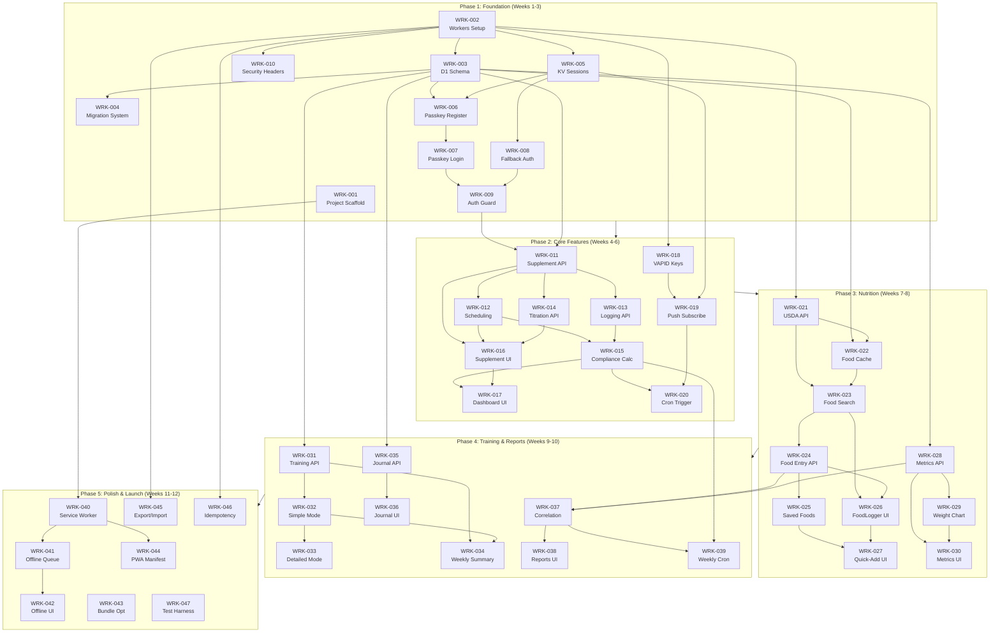

# Build Plan: PeakProtocol

## 1. Executive Summary

This build plan decomposes the 19 PRD requirements into 47 concrete work items across 5 phases, aligned with the 12-week timeline. Each work item includes agent assignment, dependency mapping, complexity estimation, and eval case traceability.

---

## 2. Agent Assignment Strategy

### Available Agents (from registry.json)

| Agent | Role | Assigned Domain |
|-------|------|-----------------|
| **Forge** | TypeScript/Node.js Developer | Frontend (SolidJS PWA), Backend (Cloudflare Workers + Hono) |
| **Sigma** | SQLite Database Specialist | D1 schema, migrations, queries |
| **Eval** | Eval Engineer | Test harnesses, validation scripts |
| **Pipeline** | CI/CD Specialist | GitHub Actions, deployment |
| **Sketch** | Diagram Specialist | Already complete - diagrams delivered |
| **Quill** | Technical Writer | API docs, user guides |

### Agent Capability Gap Analysis

| Stack Component | Required Skills | Agent | Gap? |
|-----------------|-----------------|-------|------|
| SolidJS + UnoCSS | Frontend, TypeScript, reactive | Forge | No - listed in domains |
| Cloudflare Workers + Hono | TypeScript, edge runtime | Forge | No - TypeScript specialist |
| D1 SQLite | SQL, migrations | Sigma | No - SQLite specialist |
| Service Worker / Workbox | Browser APIs, caching | Forge | Partial - may need research |
| WebAuthn / Passkeys | Security, browser APIs | Forge | Partial - may need research |
| Web Push | Push API, VAPID | Forge | Partial - may need research |

**Recommendation:** Forge can handle all TypeScript/frontend/backend work. For specialized browser APIs (Service Worker, WebAuthn, Web Push), Forge should research during implementation or Alpha can spawn Scout for targeted research if Forge hits blockers.

---

## 3. Work Item Decomposition

### Phase 1: Foundation (Weeks 1-3)

#### WRK-001: Project Scaffold Setup

| Attribute | Value |
|-----------|-------|
| **ID** | WRK-001 |
| **Description** | Initialize Vite + SolidJS project with UnoCSS (Tailwind preset). Configure TypeScript, ESLint, Prettier. Set up project structure per component.mmd. |
| **Agent** | Forge |
| **Traceability** | REQ-010 (foundation for performance) |
| **Dependencies** | None |
| **Complexity** | S |
| **Deliverables** | `packages/web/` scaffold with build working |

#### WRK-002: Cloudflare Workers Project Setup

| Attribute | Value |
|-----------|-------|
| **ID** | WRK-002 |
| **Description** | Initialize Cloudflare Workers project with Hono framework. Configure wrangler.toml, D1 binding, KV binding, R2 binding. Set up local dev environment with Miniflare. |
| **Agent** | Forge |
| **Traceability** | REQ-010, REQ-NFR-002 (backend foundation) |
| **Dependencies** | None |
| **Complexity** | S |
| **Deliverables** | `packages/api/` with "Hello World" deployed to staging |

#### WRK-003: D1 Database Schema Creation

| Attribute | Value |
|-----------|-------|
| **ID** | WRK-003 |
| **Description** | Create D1 database and apply initial schema from erd.mmd. Tables: supplements, dose_history, supplement_logs, food_cache, saved_foods, food_entries, daily_metrics, training_sessions, journal_entries, credentials, weekly_reports. Create indexes. |
| **Agent** | Sigma |
| **Traceability** | REQ-001, REQ-004, REQ-005, REQ-007, REQ-008, REQ-012 |
| **Dependencies** | WRK-002 |
| **Complexity** | M |
| **Deliverables** | `migrations/001_initial_schema.sql`, D1 database created |

#### WRK-004: Database Migration System

| Attribute | Value |
|-----------|-------|
| **ID** | WRK-004 |
| **Description** | Implement migration runner for D1. Track applied migrations in `_migrations` table. Support up/down migrations. Integrate with wrangler deploy. |
| **Agent** | Sigma |
| **Traceability** | REQ-NFR-001 (data integrity) |
| **Dependencies** | WRK-003 |
| **Complexity** | M |
| **Deliverables** | Migration CLI script, migration tracking table |

#### WRK-005: KV Session Store Setup

| Attribute | Value |
|-----------|-------|
| **ID** | WRK-005 |
| **Description** | Create KV namespace for sessions. Implement session token generation, storage with TTL (30 days), and validation middleware in Hono. |
| **Agent** | Forge |
| **Traceability** | REQ-011, REQ-NFR-002 |
| **Dependencies** | WRK-002 |
| **Complexity** | S |
| **Deliverables** | `packages/api/src/middleware/session.ts` |

#### WRK-006: WebAuthn Passkey Registration

| Attribute | Value |
|-----------|-------|
| **ID** | WRK-006 |
| **Description** | Implement passkey registration flow per DEC-peakprotocol-006. Generate challenge, verify attestation, store credential in D1 `credentials` table. Handle recovery code generation. |
| **Agent** | Forge |
| **Traceability** | REQ-011 |
| **Dependencies** | WRK-003, WRK-005 |
| **Complexity** | L |
| **Deliverables** | `/api/auth/register` endpoint, `AuthSetup` component |

#### WRK-007: WebAuthn Passkey Login

| Attribute | Value |
|-----------|-------|
| **ID** | WRK-007 |
| **Description** | Implement passkey authentication flow. Generate assertion challenge, verify signature against stored public key, issue session token to KV. |
| **Agent** | Forge |
| **Traceability** | REQ-011 |
| **Dependencies** | WRK-006 |
| **Complexity** | M |
| **Deliverables** | `/api/auth/login` endpoint, `AuthLogin` component |

#### WRK-008: Device-Bound Fallback Auth

| Attribute | Value |
|-----------|-------|
| **ID** | WRK-008 |
| **Description** | Implement fallback authentication for browsers without passkey support. Generate device-bound token, store in localStorage + httpOnly cookie. |
| **Agent** | Forge |
| **Traceability** | REQ-011 |
| **Dependencies** | WRK-005 |
| **Complexity** | S |
| **Deliverables** | Fallback auth flow in `AuthGuard` component |

#### WRK-009: Auth Guard Component

| Attribute | Value |
|-----------|-------|
| **ID** | WRK-009 |
| **Description** | Create SolidJS AuthGuard component that wraps protected routes. Check session validity, redirect to auth flow if needed, provide auth context to child components. |
| **Agent** | Forge |
| **Traceability** | REQ-011, REQ-NFR-002 |
| **Dependencies** | WRK-007, WRK-008 |
| **Complexity** | M |
| **Deliverables** | `packages/web/src/components/AuthGuard.tsx` |

#### WRK-010: Security Headers Middleware

| Attribute | Value |
|-----------|-------|
| **ID** | WRK-010 |
| **Description** | Implement Hono middleware that adds security headers per DEC-peakprotocol-006: HSTS, X-Content-Type-Options, X-Frame-Options, CSP. |
| **Agent** | Forge |
| **Traceability** | REQ-NFR-002 |
| **Dependencies** | WRK-002 |
| **Complexity** | S |
| **Deliverables** | `packages/api/src/middleware/security.ts` |

---

### Phase 2: Core Features (Weeks 4-6)

#### WRK-011: Supplement CRUD API

| Attribute | Value |
|-----------|-------|
| **ID** | WRK-011 |
| **Description** | Implement REST API for supplements: GET /supplements (list), POST /supplements (create), GET /supplements/:id, PUT /supplements/:id, DELETE /supplements/:id. Include tags JSON handling. |
| **Agent** | Forge |
| **Traceability** | REQ-001, REQ-014 |
| **Dependencies** | WRK-003, WRK-009 |
| **Complexity** | M |
| **Deliverables** | Supplement API routes in Hono |

#### WRK-012: Scheduling Engine

| Attribute | Value |
|-----------|-------|
| **ID** | WRK-012 |
| **Description** | Implement scheduling logic for supplements: daily, every_n_days, weekly, specific_days patterns. Calculate next N occurrences for calendar view. Handle start date, end date. |
| **Agent** | Forge |
| **Traceability** | REQ-001 |
| **Dependencies** | WRK-011 |
| **Complexity** | L |
| **Eval Cases** | EVL-03, EVL-03a |
| **Deliverables** | `packages/api/src/services/scheduler.ts` |

#### WRK-013: Supplement Logging API

| Attribute | Value |
|-----------|-------|
| **ID** | WRK-013 |
| **Description** | Implement supplement logging: POST /supplements/:id/log (mark taken), GET /supplements/logs?date= (daily logs). Track taken_at, actual_dose, skipped. |
| **Agent** | Forge |
| **Traceability** | REQ-004 |
| **Dependencies** | WRK-011 |
| **Complexity** | M |
| **Deliverables** | Supplement logging API routes |

#### WRK-014: Dose Titration API

| Attribute | Value |
|-----------|-------|
| **ID** | WRK-014 |
| **Description** | Implement dose history tracking: POST /supplements/:id/dose (change dose), GET /supplements/:id/dose-history. Immutable history with timestamps. |
| **Agent** | Forge |
| **Traceability** | REQ-004 |
| **Dependencies** | WRK-011 |
| **Complexity** | M |
| **Eval Cases** | EVL-04 |
| **Deliverables** | Dose history API routes |

#### WRK-015: Compliance Calculator

| Attribute | Value |
|-----------|-------|
| **ID** | WRK-015 |
| **Description** | Implement compliance calculation service: compare scheduled vs logged supplements for date range. Calculate completion rate, streak, identify missed items. Return status (green/yellow/red) per item. |
| **Agent** | Forge |
| **Traceability** | REQ-002 |
| **Dependencies** | WRK-012, WRK-013 |
| **Complexity** | M |
| **Eval Cases** | EVL-01, EVL-02a |
| **Deliverables** | `packages/api/src/services/compliance.ts` |

#### WRK-016: Supplement Tracker UI

| Attribute | Value |
|-----------|-------|
| **ID** | WRK-016 |
| **Description** | Build SupplementTracker component: list supplements, add/edit forms, schedule configuration UI, dose change form with history view. Tag filtering. |
| **Agent** | Forge |
| **Traceability** | REQ-001, REQ-004, REQ-014 |
| **Dependencies** | WRK-011, WRK-012, WRK-014 |
| **Complexity** | L |
| **Deliverables** | `packages/web/src/components/SupplementTracker/` |

#### WRK-017: Compliance Dashboard UI

| Attribute | Value |
|-----------|-------|
| **ID** | WRK-017 |
| **Description** | Build Dashboard component: today's scheduled items with status indicators (red/yellow/green), quick-log buttons, compliance percentage, streak display. Daily/weekly toggle. |
| **Agent** | Forge |
| **Traceability** | REQ-002 |
| **Dependencies** | WRK-015, WRK-016 |
| **Complexity** | L |
| **Eval Cases** | EVL-01 |
| **Deliverables** | `packages/web/src/components/Dashboard/` |

#### WRK-018: VAPID Key Generation

| Attribute | Value |
|-----------|-------|
| **ID** | WRK-018 |
| **Description** | Generate VAPID key pair for Web Push. Store public key in frontend config, private key in Workers secrets. Document key rotation procedure. |
| **Agent** | Forge |
| **Traceability** | REQ-003 |
| **Dependencies** | WRK-002 |
| **Complexity** | S |
| **Deliverables** | VAPID keys, documentation |

#### WRK-019: Web Push Subscription API

| Attribute | Value |
|-----------|-------|
| **ID** | WRK-019 |
| **Description** | Implement push subscription management: POST /push/subscribe (store subscription in KV), DELETE /push/unsubscribe. Request permission in frontend. |
| **Agent** | Forge |
| **Traceability** | REQ-003 |
| **Dependencies** | WRK-018, WRK-005 |
| **Complexity** | M |
| **Deliverables** | Push subscription API, `NotificationManager` component |

#### WRK-020: Cron Trigger for Missed Supplements

| Attribute | Value |
|-----------|-------|
| **ID** | WRK-020 |
| **Description** | Implement Workers Cron Trigger (every 15 minutes) that checks for missed supplements, sends Web Push notifications via VAPID. Include supplement name in notification. |
| **Agent** | Forge |
| **Traceability** | REQ-003 |
| **Dependencies** | WRK-015, WRK-019 |
| **Complexity** | L |
| **Eval Cases** | EVL-02, EVL-02b |
| **Deliverables** | Cron handler in Workers, notification template |

---

### Phase 3: Nutrition (Weeks 7-8)

#### WRK-021: USDA API Integration

| Attribute | Value |
|-----------|-------|
| **ID** | WRK-021 |
| **Description** | Integrate with USDA FoodData Central API per DEC-peakprotocol-001. Implement search endpoint, parse response, extract calories/macros. Handle rate limiting with retry. |
| **Agent** | Forge |
| **Traceability** | REQ-005 |
| **Dependencies** | WRK-002 |
| **Complexity** | M |
| **Deliverables** | `packages/api/src/services/usda.ts` |

#### WRK-022: Food Cache Layer

| Attribute | Value |
|-----------|-------|
| **ID** | WRK-022 |
| **Description** | Implement food caching in D1: check cache before API call, cache API results for 90 days, pre-populate with common foods seed data. |
| **Agent** | Sigma |
| **Traceability** | REQ-005 |
| **Dependencies** | WRK-003, WRK-021 |
| **Complexity** | M |
| **Deliverables** | Food cache service, seed data migration |

#### WRK-023: Food Search API

| Attribute | Value |
|-----------|-------|
| **ID** | WRK-023 |
| **Description** | Implement food search: GET /foods/search?q=. Search local cache first, fallback to USDA API. Support fractional quantities. Calculate macros per quantity. |
| **Agent** | Forge |
| **Traceability** | REQ-005 |
| **Dependencies** | WRK-021, WRK-022 |
| **Complexity** | M |
| **Eval Cases** | EVL-05, EVL-05a, EVL-05b |
| **Deliverables** | Food search API route |

#### WRK-024: Food Entry API

| Attribute | Value |
|-----------|-------|
| **ID** | WRK-024 |
| **Description** | Implement food logging: POST /food-entries, GET /food-entries?date=, DELETE /food-entries/:id. Store calculated macros with entry. |
| **Agent** | Forge |
| **Traceability** | REQ-005 |
| **Dependencies** | WRK-023 |
| **Complexity** | M |
| **Deliverables** | Food entry API routes |

#### WRK-025: Saved Foods API

| Attribute | Value |
|-----------|-------|
| **ID** | WRK-025 |
| **Description** | Implement saved foods library: POST /saved-foods, GET /saved-foods (sorted by usage_count), DELETE /saved-foods/:id. Support custom foods (is_custom=1). |
| **Agent** | Forge |
| **Traceability** | REQ-006 |
| **Dependencies** | WRK-024 |
| **Complexity** | S |
| **Deliverables** | Saved foods API routes |

#### WRK-026: FoodLogger UI

| Attribute | Value |
|-----------|-------|
| **ID** | WRK-026 |
| **Description** | Build FoodLogger component: food search with autocomplete, quantity input, meal selection, macro display. Show daily totals. |
| **Agent** | Forge |
| **Traceability** | REQ-005 |
| **Dependencies** | WRK-023, WRK-024 |
| **Complexity** | L |
| **Deliverables** | `packages/web/src/components/FoodLogger/` |

#### WRK-027: Quick-Add UI

| Attribute | Value |
|-----------|-------|
| **ID** | WRK-027 |
| **Description** | Build quick-add interface: saved foods grid on dashboard, one-tap add with default serving. Must complete in 3 taps from dashboard. |
| **Agent** | Forge |
| **Traceability** | REQ-006 |
| **Dependencies** | WRK-025, WRK-026 |
| **Complexity** | M |
| **Eval Cases** | EVL-06 |
| **Deliverables** | Quick-add component, dashboard integration |

#### WRK-028: Daily Metrics API

| Attribute | Value |
|-----------|-------|
| **ID** | WRK-028 |
| **Description** | Implement daily metrics: PUT /metrics/:date (upsert weight, hydration, notes, tags), GET /metrics?start=&end= (range query). |
| **Agent** | Forge |
| **Traceability** | REQ-007, REQ-013 |
| **Dependencies** | WRK-003 |
| **Complexity** | S |
| **Deliverables** | Daily metrics API routes |

#### WRK-029: Weight Trend Chart

| Attribute | Value |
|-----------|-------|
| **ID** | WRK-029 |
| **Description** | Implement weight visualization: fetch 14-90 days of weight data, render line chart with trend line, interactive data points. Use lightweight chart library (e.g., uPlot). |
| **Agent** | Forge |
| **Traceability** | REQ-007 |
| **Dependencies** | WRK-028 |
| **Complexity** | M |
| **Eval Cases** | EVL-07 |
| **Deliverables** | `packages/web/src/components/WeightChart/` |

#### WRK-030: DailyMetrics UI

| Attribute | Value |
|-----------|-------|
| **ID** | WRK-030 |
| **Description** | Build DailyMetrics component: weight entry with unit toggle (kg/lbs), hydration tracker with progress bar and target, integration with weight chart. |
| **Agent** | Forge |
| **Traceability** | REQ-007, REQ-013 |
| **Dependencies** | WRK-028, WRK-029 |
| **Complexity** | M |
| **Deliverables** | `packages/web/src/components/DailyMetrics/` |

---

### Phase 4: Training and Reporting (Weeks 9-10)

#### WRK-031: Training Session API

| Attribute | Value |
|-----------|-------|
| **ID** | WRK-031 |
| **Description** | Implement training logs: POST /training-sessions, GET /training-sessions?date=&type=, GET /training-sessions/weekly. Support all types (weights, bjj, cardio, walk) with type-specific details JSON. |
| **Agent** | Forge |
| **Traceability** | REQ-008 |
| **Dependencies** | WRK-003 |
| **Complexity** | M |
| **Deliverables** | Training session API routes |

#### WRK-032: TrainingLog UI - Simple Mode

| Attribute | Value |
|-----------|-------|
| **ID** | WRK-032 |
| **Description** | Build simple training log UI: type selector, duration slider, intensity picker (L/M/H), notes field. Quick entry for all modalities. |
| **Agent** | Forge |
| **Traceability** | REQ-008 |
| **Dependencies** | WRK-031 |
| **Complexity** | M |
| **Deliverables** | `packages/web/src/components/TrainingLog/SimpleMode.tsx` |

#### WRK-033: TrainingLog UI - Detailed Mode

| Attribute | Value |
|-----------|-------|
| **ID** | WRK-033 |
| **Description** | Build detailed weight training log: exercise picker from history, sets/reps/weight entry, RPE optional. Calculate volume per exercise. |
| **Agent** | Forge |
| **Traceability** | REQ-008, REQ-018 |
| **Dependencies** | WRK-032 |
| **Complexity** | L |
| **Eval Cases** | EVL-08 |
| **Deliverables** | `packages/web/src/components/TrainingLog/DetailedMode.tsx` |

#### WRK-034: Training Weekly Summary

| Attribute | Value |
|-----------|-------|
| **ID** | WRK-034 |
| **Description** | Build weekly training summary view: all sessions for week grouped by type, total duration, session count per type. Handle empty week gracefully. |
| **Agent** | Forge |
| **Traceability** | REQ-008 |
| **Dependencies** | WRK-031, WRK-032 |
| **Complexity** | M |
| **Eval Cases** | EVL-08a |
| **Deliverables** | Training weekly summary component |

#### WRK-035: Journal Entry API

| Attribute | Value |
|-----------|-------|
| **ID** | WRK-035 |
| **Description** | Implement journal entries: POST /journal, GET /journal?date=, GET /journal/search?tag=. Full-text search on content and tags. |
| **Agent** | Forge |
| **Traceability** | REQ-012 |
| **Dependencies** | WRK-003 |
| **Complexity** | M |
| **Deliverables** | Journal API routes |

#### WRK-036: Journal UI with Search

| Attribute | Value |
|-----------|-------|
| **ID** | WRK-036 |
| **Description** | Build journal component: rich text entry, tag input with suggestions, search by tag with results in <500ms. Display entry history. |
| **Agent** | Forge |
| **Traceability** | REQ-012 |
| **Dependencies** | WRK-035 |
| **Complexity** | M |
| **Eval Cases** | EVL-12 |
| **Deliverables** | `packages/web/src/components/Journal/` |

#### WRK-037: Correlation Analysis Service

| Attribute | Value |
|-----------|-------|
| **ID** | WRK-037 |
| **Description** | Implement correlation analysis per DEC-peakprotocol-005: Pearson correlation between protein/carbs/fat ratios and 7-day weight delta. Require minimum 14 days data. Rolling averages. |
| **Agent** | Forge |
| **Traceability** | REQ-015 |
| **Dependencies** | WRK-024, WRK-028 |
| **Complexity** | L |
| **Eval Cases** | EVL-09, EVL-09a |
| **Deliverables** | `packages/api/src/services/analysis.ts` |

#### WRK-038: Reports UI

| Attribute | Value |
|-----------|-------|
| **ID** | WRK-038 |
| **Description** | Build Reports component: macro vs weight correlation charts, training volume trends, compliance percentage over time. Plain-English interpretation of correlations. |
| **Agent** | Forge |
| **Traceability** | REQ-015 |
| **Dependencies** | WRK-037 |
| **Complexity** | L |
| **Deliverables** | `packages/web/src/components/Reports/` |

#### WRK-039: Weekly Report Cron

| Attribute | Value |
|-----------|-------|
| **ID** | WRK-039 |
| **Description** | Implement Sunday 9 PM cron job that generates weekly summary: compliance %, macro averages, weight trend, training volume. Store in weekly_reports table. |
| **Agent** | Forge |
| **Traceability** | REQ-017 |
| **Dependencies** | WRK-037, WRK-015 |
| **Complexity** | M |
| **Deliverables** | Weekly report cron handler |

---

### Phase 5: Polish and Launch (Weeks 11-12)

#### WRK-040: Service Worker Implementation

| Attribute | Value |
|-----------|-------|
| **ID** | WRK-040 |
| **Description** | Implement service worker with Workbox: cache-first for static assets, network-first for API, offline fallback page. Register background sync for queued requests. |
| **Agent** | Forge |
| **Traceability** | REQ-009 |
| **Dependencies** | WRK-001 |
| **Complexity** | L |
| **Deliverables** | `packages/web/src/sw.ts`, Workbox config |

#### WRK-041: IndexedDB Offline Queue

| Attribute | Value |
|-----------|-------|
| **ID** | WRK-041 |
| **Description** | Implement IndexedDB queue for offline mutations. Store pending create/update/delete operations. Replay on sync event. Handle conflicts with last-write-wins. |
| **Agent** | Forge |
| **Traceability** | REQ-009 |
| **Dependencies** | WRK-040 |
| **Complexity** | L |
| **Eval Cases** | EVL-10, EVL-10a |
| **Deliverables** | `packages/web/src/lib/offlineQueue.ts` |

#### WRK-042: Offline Connectivity UI

| Attribute | Value |
|-----------|-------|
| **ID** | WRK-042 |
| **Description** | Build OfflineManager component: detect connectivity state, show offline indicator, display pending sync count, trigger manual sync. |
| **Agent** | Forge |
| **Traceability** | REQ-009 |
| **Dependencies** | WRK-041 |
| **Complexity** | M |
| **Deliverables** | `packages/web/src/components/OfflineManager/` |

#### WRK-043: Bundle Optimization

| Attribute | Value |
|-----------|-------|
| **ID** | WRK-043 |
| **Description** | Optimize bundle size: code splitting by route, lazy load heavy components (charts), tree shake unused UnoCSS. Target <50KB gzipped initial. |
| **Agent** | Forge |
| **Traceability** | REQ-010 |
| **Dependencies** | All UI components complete |
| **Complexity** | M |
| **Eval Cases** | EVL-11 |
| **Deliverables** | Vite config updates, bundle analysis report |

#### WRK-044: PWA Manifest and Icons

| Attribute | Value |
|-----------|-------|
| **ID** | WRK-044 |
| **Description** | Create PWA manifest.json: display: standalone, theme colors, app icons (all sizes), shortcuts. Ensure Lighthouse PWA score >90. |
| **Agent** | Forge |
| **Traceability** | REQ-NFR-003 |
| **Dependencies** | WRK-040 |
| **Complexity** | S |
| **Deliverables** | `public/manifest.json`, icon set |

#### WRK-045: Data Export/Import

| Attribute | Value |
|-----------|-------|
| **ID** | WRK-045 |
| **Description** | Implement data export: GET /export (full JSON dump to R2), POST /import (restore from JSON). Validate data integrity on import. |
| **Agent** | Forge |
| **Traceability** | REQ-016 |
| **Dependencies** | WRK-002 |
| **Complexity** | M |
| **Eval Cases** | EVL-DI-03 |
| **Deliverables** | Export/import API routes, Settings UI integration |

#### WRK-046: Duplicate Prevention Middleware

| Attribute | Value |
|-----------|-------|
| **ID** | WRK-046 |
| **Description** | Implement idempotency middleware: accept client-generated request ID, check for duplicate submissions within 5-minute window, return cached response for duplicates. |
| **Agent** | Forge |
| **Traceability** | REQ-NFR-001 |
| **Dependencies** | WRK-002 |
| **Complexity** | M |
| **Eval Cases** | EVL-DI-01, EVL-DI-02 |
| **Deliverables** | `packages/api/src/middleware/idempotency.ts` |

#### WRK-047: Eval Test Harness

| Attribute | Value |
|-----------|-------|
| **ID** | WRK-047 |
| **Description** | Create automated test harness for all 24 eval cases. Use Playwright for UI tests, Vitest for unit tests, Workers test environment for API tests. CI integration. |
| **Agent** | Eval |
| **Traceability** | All EVL cases |
| **Dependencies** | All features complete |
| **Complexity** | L |
| **Deliverables** | `packages/tests/`, CI workflow |

---

## 4. Dependency Graph

---

## 5. Phase Breakdown with Milestones

### Phase 1: Foundation (Weeks 1-3)
**10 work items | 2 agents (Forge, Sigma)**

| Week | Milestone | Work Items | Success Gate |
|------|-----------|------------|--------------|
| 1 | M1.1: Project Setup | WRK-001, WRK-002, WRK-003 | Hello World deployed |
| 2 | M1.2: Auth System | WRK-004, WRK-005, WRK-006, WRK-007, WRK-008 | Passkey auth working |
| 3 | M1.3: Core Data Model | WRK-009, WRK-010 | Protected routes functional |

### Phase 2: Core Features (Weeks 4-6)
**10 work items | 1 agent (Forge)**

| Week | Milestone | Work Items | Success Gate |
|------|-----------|------------|--------------|
| 4 | M2.1: Supplement Tracking | WRK-011, WRK-012, WRK-013, WRK-014 | EVL-03, EVL-04 pass |
| 5 | M2.2: Compliance Dashboard | WRK-015, WRK-016, WRK-017 | EVL-01 passes |
| 6 | M2.3: Notifications | WRK-018, WRK-019, WRK-020 | EVL-02 passes |

### Phase 3: Nutrition (Weeks 7-8)
**10 work items | 2 agents (Forge, Sigma)**

| Week | Milestone | Work Items | Success Gate |
|------|-----------|------------|--------------|
| 7 | M3.1: Food Database | WRK-021, WRK-022, WRK-023 | EVL-05 passes |
| 8 | M3.2-3.3: Logging & Metrics | WRK-024 to WRK-030 | EVL-06, EVL-07 pass |

### Phase 4: Training and Reporting (Weeks 9-10)
**9 work items | 1 agent (Forge)**

| Week | Milestone | Work Items | Success Gate |
|------|-----------|------------|--------------|
| 9 | M4.1-4.2: Training & Journal | WRK-031 to WRK-036 | EVL-08, EVL-12 pass |
| 10 | M4.3: Pattern Reports | WRK-037, WRK-038, WRK-039 | EVL-09 passes |

### Phase 5: Polish and Launch (Weeks 11-12)
**8 work items | 2 agents (Forge, Eval)**

| Week | Milestone | Work Items | Success Gate |
|------|-----------|------------|--------------|
| 11 | M5.1-5.2: Offline & Performance | WRK-040 to WRK-044 | EVL-10, EVL-11 pass |
| 12 | M5.3-5.4: Data Integrity & Launch | WRK-045, WRK-046, WRK-047 | All EVL-DI pass, production deploy |

---

## 6. Validation Plan

### Eval Case to Work Item Mapping

| Eval Case | Work Item(s) | Phase | Priority |
|-----------|--------------|-------|----------|
| EVL-01 | WRK-017 | 2 | Critical |
| EVL-02 | WRK-020 | 2 | Critical |
| EVL-02a | WRK-015, WRK-017 | 2 | High |
| EVL-02b | WRK-020 | 2 | Medium |
| EVL-03 | WRK-012 | 2 | Critical |
| EVL-03a | WRK-012 | 2 | Medium |
| EVL-03b | WRK-012 | 2 | Medium |
| EVL-04 | WRK-014 | 2 | High |
| EVL-05 | WRK-023 | 3 | Critical |
| EVL-05a | WRK-023 | 3 | Medium |
| EVL-05b | WRK-023 | 3 | Medium |
| EVL-06 | WRK-027 | 3 | High |
| EVL-07 | WRK-029 | 3 | High |
| EVL-08 | WRK-033 | 4 | High |
| EVL-08a | WRK-034 | 4 | Low |
| EVL-09 | WRK-037 | 4 | High |
| EVL-09a | WRK-037 | 4 | Medium |
| EVL-10 | WRK-041 | 5 | Critical |
| EVL-10a | WRK-041 | 5 | High |
| EVL-11 | WRK-043 | 5 | High |
| EVL-12 | WRK-036 | 4 | Medium |
| EVL-DI-01 | WRK-046 | 5 | Critical |
| EVL-DI-02 | WRK-046 | 5 | High |
| EVL-DI-03 | WRK-045 | 5 | High |

### Validation Checkpoints

| Checkpoint | Week | Eval Cases Required | Pass Criteria |
|------------|------|---------------------|---------------|
| CP-1: Auth Working | 3 | N/A | Manual passkey test |
| CP-2: Core Supplement | 5 | EVL-01, EVL-03 | Automated pass |
| CP-3: Notifications | 6 | EVL-02 | Semi-automated pass |
| CP-4: Nutrition | 8 | EVL-05, EVL-06, EVL-07 | Automated pass |
| CP-5: Training/Reports | 10 | EVL-08, EVL-09, EVL-12 | Mixed pass |
| CP-6: Offline/Performance | 11 | EVL-10, EVL-11 | Automated pass |
| CP-7: Launch Ready | 12 | All 24 cases | All critical/high pass |

---

## 7. Risk Register

### Technical Risks

| Risk | Likelihood | Impact | Mitigation | Work Items Affected |
|------|------------|--------|------------|---------------------|
| Web Push unreliable on Android | High | High | Test on target device in Week 3; have Capacitor fallback ready | WRK-019, WRK-020 |
| USDA API rate limits | Medium | High | Aggressive caching; seed common foods; implement retry with backoff | WRK-021, WRK-022 |
| Service Worker complexity | Medium | Medium | Use Workbox abstractions; incremental implementation | WRK-040, WRK-041 |
| WebAuthn browser support | Low | Medium | Device-bound fallback already planned (WRK-008) | WRK-006, WRK-007 |
| Bundle size exceeds targets | Medium | Medium | Monitor with bundlesize; aggressive code splitting | WRK-043 |
| D1 query performance | Low | Medium | Profile early; indexes defined in schema | WRK-003, WRK-004 |

### Resource Risks

| Risk | Likelihood | Impact | Mitigation | Work Items Affected |
|------|------------|--------|------------|---------------------|
| Forge overloaded | Medium | High | Parallelize independent work; Sigma handles DB; scout for research if blocked | All Forge items |
| No Cloudflare Workers specialist | Low | Low | Forge has TypeScript expertise; Workers uses standard TS | WRK-002, all API work |
| Eval harness delayed | Low | Medium | Start eval setup in Phase 4; critical path is feature completion | WRK-047 |

### Schedule Risks

| Risk | Likelihood | Impact | Mitigation | Work Items Affected |
|------|------------|--------|------------|---------------------|
| Phase 1 auth complexity | Medium | High | Fallback auth (WRK-008) provides safety net; passkey can be enhanced later | WRK-006, WRK-007 |
| Pattern analysis scope creep | Low | Medium | Strict adherence to DEC-peakprotocol-005 (simple stats only) | WRK-037 |
| Offline sync conflicts | Low | Medium | Last-write-wins per DEC-peakprotocol-005; single user simplifies | WRK-041 |

---

## 8. Complexity Summary

| Complexity | Count | Work Items |
|------------|-------|------------|
| **Small (S)** | 8 | WRK-001, WRK-002, WRK-005, WRK-008, WRK-010, WRK-018, WRK-025, WRK-028, WRK-044 |
| **Medium (M)** | 23 | WRK-003, WRK-004, WRK-007, WRK-009, WRK-011, WRK-013, WRK-014, WRK-015, WRK-019, WRK-021, WRK-022, WRK-023, WRK-024, WRK-027, WRK-029, WRK-030, WRK-031, WRK-032, WRK-034, WRK-035, WRK-036, WRK-039, WRK-042, WRK-043, WRK-045, WRK-046 |
| **Large (L)** | 16 | WRK-006, WRK-012, WRK-016, WRK-017, WRK-020, WRK-026, WRK-033, WRK-037, WRK-038, WRK-040, WRK-041, WRK-047 |

---

## 9. Agent Workload Summary

| Agent | Work Items | Complexity Distribution | Phases |
|-------|------------|------------------------|--------|
| **Forge** | 42 | 8S, 20M, 14L | 1-5 |
| **Sigma** | 3 | 0S, 3M, 0L | 1, 3 |
| **Eval** | 1 | 0S, 0M, 1L | 5 |
| **Pipeline** | 0 | (CI integration in WRK-047) | 5 |
| **Quill** | 0 | (API docs can be added post-launch) | Post-MVP |

---

## 10. Next Steps

1. **Alpha:** Approve build plan, delegate Phase 1 work items to Forge and Sigma
2. **Forge:** Begin WRK-001, WRK-002 in parallel (no dependencies)
3. **Sigma:** Wait for WRK-002 completion, then begin WRK-003
4. **Eval:** Begin eval harness design in Week 9 (can start documenting test cases earlier)
5. **All agents:** Log progress via `squad/log.py` per Wolf Pack Protocol

---

*Document generated by Planner | Wolf Pack Protocol*
