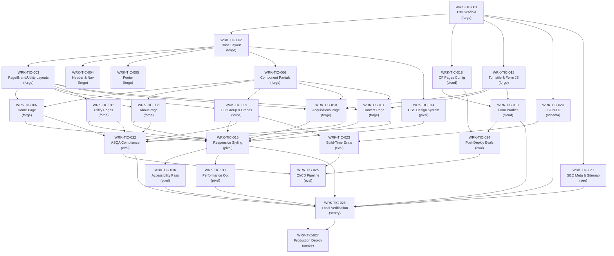

# TIC Group Website — Build Plan

## 1. Work Breakdown

### WRK-TIC-001: 11ty Project Scaffold & Dev Environment

- **Title:** 11ty Project Scaffold & Dev Environment
- **Description:** Initialize the 11ty project with the directory structure defined in the architecture doc. Create `package.json` with all dependencies (`@11ty/eleventy`, `@11ty/eleventy-img`, `@11ty/eleventy-navigation`, `@11ty/eleventy-plugin-rss`, `eleventy-plugin-bundle`). Create `.eleventy.js` with passthrough copy, custom collections (brands), filters (`dateFormat`, `excerpt`, `slugify`), shortcodes (`image`, `year`). Create `.nvmrc` pinned to Node 20. Create `src/_data/site.json`, `src/_data/navigation.json`, `src/_data/organisation.json`, `src/_data/env.js`. Create `src/brands/brands.json` collection defaults. Scaffold empty directories for `src/services/`, `src/insights/`, `src/case-studies/` with schema-only `.json` defaults (commented collections). Verify `npx eleventy --dryrun` passes with zero errors.
- **Agent:** forge
- **Traceability:** REQ: 11ty static site generator constraint, content model definition -> EVL: SC-1 (build succeeds)
- **Dependencies:** None
- **Complexity:** M

### WRK-TIC-002: Base Layout & HTML Shell

- **Title:** Base Layout (`base.njk`) & HTML Shell
- **Description:** Create `src/_includes/layouts/base.njk` with: DOCTYPE, `<html lang="en">`, `<head>` (charset, viewport, title from frontmatter, stylesheet links, font preloads), skip-to-content link, `` placeholder, `<main id="main-content"></main>`, `` placeholder, deferred script tags for `main.js`. Conditional Alpine.js and GSAP loading via frontmatter flags.
- **Agent:** forge
- **Traceability:** REQ: template architecture (Section 3.2 of architecture) -> EVL: SC-1 (pages render), SC-4 (skip-link, lang attr, heading hierarchy)
- **Dependencies:** WRK-TIC-001
- **Complexity:** M

### WRK-TIC-003: Page, Brand & Utility Layouts

- **Title:** Page, Brand & Utility Layout Templates
- **Description:** Create `src/_includes/layouts/page.njk` (extends base, optional breadcrumb, content block). Create `src/_includes/layouts/brand.njk` (extends base, breadcrumb Home > Our Group > Brand Name, hero with featured image/title/region, markdown body, metadata sidebar, back link). Create `src/_includes/layouts/utility.njk` (extends base, narrow column, no hero, last-updated date).
- **Agent:** forge
- **Traceability:** REQ: layout hierarchy (Section 3.1-3.5 of architecture) -> EVL: SC-1 (pages render), SC-6 (brand detail pages)
- **Dependencies:** WRK-TIC-002
- **Complexity:** S

### WRK-TIC-004: Header & Navigation Partial

- **Title:** Header & Navigation Partial
- **Description:** Create `src/_includes/partials/header.njk` rendering the site logo and primary navigation from `navigation.json`. Include mobile hamburger menu toggle. Mark current page with `aria-current="page"`. Ensure keyboard accessibility and focus management for mobile menu.
- **Agent:** forge
- **Traceability:** REQ: primary nav, responsive design -> EVL: SC-1 (navigation works), SC-4 (keyboard accessible, aria-current)
- **Dependencies:** WRK-TIC-001, WRK-TIC-002
- **Complexity:** S

### WRK-TIC-005: Footer Partial

- **Title:** Footer Partial
- **Description:** Create `src/_includes/partials/footer.njk` rendering footer navigation from `navigation.json` (footer array), legal links, copyright with dynamic year shortcode, social links from `site.json`.
- **Agent:** forge
- **Traceability:** REQ: footer nav, legal links -> EVL: SC-1 (footer renders on all pages)
- **Dependencies:** WRK-TIC-001, WRK-TIC-002
- **Complexity:** S

### WRK-TIC-006: Reusable Component Partials

- **Title:** Reusable Nunjucks Component Partials
- **Description:** Create all component partials defined in architecture Section 3.7: `hero.njk` (title, subtitle, CTA, image, dark/light variant), `proof-strip.njk` (number + label pairs), `brand-card.njk` (brand data card for directory grid), `pillar-block.njk` (Acquire/Operate/Support), `process-steps.njk` (numbered steps), `faq-accordion.njk` (expandable Q&A), `cta-section.njk` (CTA band), `form-field.njk` (reusable label + input + error), `section.njk` (dark/light/accent section wrapper).
- **Agent:** forge
- **Traceability:** REQ: component architecture -> EVL: SC-1 (components render), SC-6 (brand-card), SC-5 (form-field)
- **Dependencies:** WRK-TIC-002
- **Complexity:** M

### WRK-TIC-007: Home Page Template

- **Title:** Home Page (`index.njk`)
- **Description:** Create `src/pages/index.njk` using page layout with sections: hero (TIC Group positioning), proof strip (metrics), value creation model (Acquire/Operate/Support pillar blocks), group brands preview (first N brands from collection), services preview (static teaser for Phase 2), acquisition CTA section, insights preview (static teaser or omitted), contact CTA section. All content uses component partials.
- **Agent:** forge
- **Traceability:** REQ: Home page scope -> EVL: SC-1 (/ returns 200), SC-2 (zero VET language)
- **Dependencies:** WRK-TIC-003, WRK-TIC-006
- **Complexity:** M

### WRK-TIC-008: About Page Template

- **Title:** About Page (`about.njk`)
- **Description:** Create `src/pages/about.njk` with sections: who we are, story, leadership (placeholder for headshots/bios pending content — OQ-6), operating model, values, FAQ accordion. Uses page layout with breadcrumb.
- **Agent:** forge
- **Traceability:** REQ: About page scope -> EVL: SC-1 (/about/ returns 200), SC-2 (zero VET language)
- **Dependencies:** WRK-TIC-003, WRK-TIC-006
- **Complexity:** M

### WRK-TIC-009: Our Group Page & Brand Directory

- **Title:** Our Group Page & Brand Directory
- **Description:** Create `src/pages/our-group.njk` with overview section and brand directory grid. Iterate over `collections.brands` to render `brand-card.njk` for each published brand. Create 3 fixture brands in `src/brands/` with `status: published` and 1 with `status: draft` (per eval test data requirements). Ensure draft brands are excluded from rendered output. Each card links to `/our-group/:slug/`.
- **Agent:** forge
- **Traceability:** REQ: Our Group page, brand directory, content model -> EVL: SC-1 (/our-group/ returns 200), SC-6 (brand count matches, detail pages render, drafts excluded)
- **Dependencies:** WRK-TIC-003, WRK-TIC-006
- **Complexity:** M

### WRK-TIC-010: Acquisitions Page Template

- **Title:** Acquisitions Page (`acquisitions.njk`)
- **Description:** Create `src/pages/acquisitions.njk` with sections: why owners choose TIC, what we look for, what happens after sale, process steps (using `process-steps.njk`), seller FAQ (using `faq-accordion.njk`), confidential acquisition enquiry form with Turnstile widget. Form fields: name, email, phone, business_name, region, message, privacy_consent, hidden form_type="acquisition".
- **Agent:** forge
- **Traceability:** REQ: Acquisitions page scope -> EVL: SC-1 (/acquisitions/ returns 200), SC-2 (zero VET language), SC-5 (form presence, fields, Turnstile)
- **Dependencies:** WRK-TIC-003, WRK-TIC-006, WRK-TIC-013
- **Complexity:** M

### WRK-TIC-011: Contact Page Template

- **Title:** Contact Page (`contact.njk`)
- **Description:** Create `src/pages/contact.njk` with sections for four form types: general enquiry, acquisition enquiry, service enquiry, media/partnerships. Each form uses `form-field.njk` and includes Turnstile widget and hidden `form_type` field. Tab or section-based UI to switch between form types.
- **Agent:** forge
- **Traceability:** REQ: Contact page scope -> EVL: SC-1 (/contact/ returns 200), SC-5 (all four form types functional)
- **Dependencies:** WRK-TIC-003, WRK-TIC-006, WRK-TIC-013
- **Complexity:** M

### WRK-TIC-012: Utility Pages

- **Title:** Utility & Legal Pages
- **Description:** Create all utility pages using utility layout: `privacy-policy.md`, `terms.md`, `cookie-policy.md`, `accessibility.md` (markdown with utility layout), `sitemap.njk` (HTML sitemap listing all Phase 1 routes), `404.njk` (custom 404 with nav and helpful links), `thank-you.njk` (confirmation page with dynamic message based on `form` query param). Create `robots.txt.njk` with environment-aware rules (noindex for preview deploys). Generate `_headers` and `_redirects` files via 11ty passthrough or template.
- **Agent:** forge
- **Traceability:** REQ: utility pages, sitemap, 404, thank-you -> EVL: SC-1 (all utility routes return 200, 404 returns 404), SC-2 (zero VET language in all pages)
- **Dependencies:** WRK-TIC-003
- **Complexity:** M

### WRK-TIC-013: Turnstile Partial & Form Client-Side Validation

- **Title:** Turnstile Widget Partial & Form Validation JS
- **Description:** Create `src/_includes/partials/turnstile.njk` for Cloudflare Turnstile widget (invisible/managed mode). Site key injected from `env.js`. Create client-side form validation in `src/assets/js/main.js`: required field checks, email format validation, Turnstile token presence check before submit. Create `src/assets/js/faq.js` for FAQ accordion interaction (vanilla JS or Alpine.js).
- **Agent:** forge
- **Traceability:** REQ: form spam protection, client-side interaction -> EVL: SC-5 (Turnstile renders, validation blocks empty fields)
- **Dependencies:** WRK-TIC-001, WRK-TIC-002
- **Complexity:** S

### WRK-TIC-014: CSS Design System & Global Styles

- **Title:** CSS Design System, Tokens & Global Styles
- **Description:** Create the CSS architecture from architecture Appendix B: `reset.css`, `tokens.css` (design tokens for colours, spacing, typography, breakpoints — dark/light layered sections), `typography.css` (base type styles, heading scale), `layout.css` (grid, container, section utilities), `components.css` (hero, card, accordion, form, proof-strip, pillar-block, process-steps, CTA styles), `utilities.css` (visually-hidden, skip-link, focus-visible). `main.css` imports all partials. Self-host Inter font in `src/assets/fonts/`.
- **Agent:** pixel
- **Traceability:** REQ: dark/light layered sections, strong typography, editorial layouts, mobile-first responsive -> EVL: SC-3 (minimal CLS, fast LCP), SC-4 (colour contrast AA, focus indicators)
- **Dependencies:** WRK-TIC-002, WRK-TIC-006
- **Complexity:** L

### WRK-TIC-015: Responsive Layout & Component Styling

- **Title:** Responsive Layout & Component Styling
- **Description:** Implement responsive breakpoints across all components and page templates. Mobile-first approach: single-column mobile, multi-column desktop. Brand directory grid responsive (1-col mobile, 2-col tablet, 3-col desktop). Navigation responsive (hamburger on mobile, horizontal on desktop). Hero responsive image sizing. Form layouts responsive. Section padding responsive. Test across common viewport widths (320, 375, 768, 1024, 1280, 1440).
- **Agent:** pixel
- **Traceability:** REQ: responsive mobile-first design -> EVL: SC-3 (CWV on mobile), SC-4 (touch targets, zoom)
- **Dependencies:** WRK-TIC-014, WRK-TIC-007, WRK-TIC-008, WRK-TIC-009, WRK-TIC-010, WRK-TIC-011, WRK-TIC-012
- **Complexity:** L

### WRK-TIC-016: Accessibility Compliance Pass

- **Title:** WCAG 2.2 AA Accessibility Compliance
- **Description:** Audit and fix all pages for WCAG 2.2 AA: colour contrast ratios (4.5:1 normal, 3:1 large), alt text on all images, keyboard navigation on all interactive elements, visible focus indicators, form labels associated with inputs, valid ARIA attributes, single h1 per page with correct heading hierarchy, skip-to-content link functional, touch targets minimum 44x44px. Run axe-core locally and fix all critical/serious violations.
- **Agent:** pixel
- **Traceability:** REQ: WCAG 2.2 AA -> EVL: SC-4 (zero critical/serious axe-core violations)
- **Dependencies:** WRK-TIC-015
- **Complexity:** M

### WRK-TIC-017: Performance Optimization

- **Title:** Core Web Vitals & Performance Optimization
- **Description:** Optimize for LCP < 2.5s, CLS < 0.1, INP < 200ms on all pages. Actions: configure `@11ty/eleventy-img` for responsive images (WebP/AVIF, widths 300/600/900/1200), preload hero images, inline critical CSS via `eleventy-plugin-bundle`, defer non-critical CSS/JS, font-display: swap for web fonts, minimize layout shifts (explicit image dimensions, font fallback matching). Run Lighthouse locally and iterate until all pages score >= 90 performance.
- **Agent:** pixel
- **Traceability:** REQ: Core Web Vitals compliance -> EVL: SC-3 (LCP < 2.5s, CLS < 0.1, INP < 200ms, Lighthouse >= 90)
- **Dependencies:** WRK-TIC-015
- **Complexity:** M

### WRK-TIC-018: Cloudflare Pages Deployment Configuration

- **Title:** Cloudflare Pages Project & Deployment Config
- **Description:** Create `wrangler.toml` with Cloudflare Pages settings. Configure build command (`npx eleventy`), output directory (`_site`), Node.js version. Set up environment variables (`ELEVENTY_ENV`, `TURNSTILE_SITE_KEY`, `TURNSTILE_SECRET_KEY`, `FORM_SUBMISSION_EMAIL`). Configure branch deploy strategy: `main` -> production, `develop` -> staging, feature branches -> preview. Set up custom domain `ticgroup.com.au` with CNAME. Configure `www` redirect. Generate `_headers` file with security headers (X-Frame-Options, CSP, etc.). Generate `_redirects` file (placeholder for old URL redirects).
- **Agent:** cloud
- **Traceability:** REQ: Cloudflare Pages hosting, security headers -> EVL: SC-1 (deploy succeeds, routes respond)
- **Dependencies:** WRK-TIC-001
- **Complexity:** M

### WRK-TIC-019: Form Submission Worker Function

- **Title:** Cloudflare Pages Function for Form Submission
- **Description:** Create `functions/api/submit.js` as a Cloudflare Pages Function. Responsibilities: parse POST body, verify Turnstile token via Cloudflare API, validate required fields server-side, determine form type from hidden `form_type` field, route submission to appropriate email recipient (via MailChannels or email relay), return 302 redirect to `/thank-you/?form=<type>`, return 400 with JSON error on failure. Handle all four form types (acquisition, general, service, media).
- **Agent:** cloud
- **Traceability:** REQ: form handling, Turnstile validation -> EVL: SC-5 (form submits end-to-end, Turnstile validates, redirect to thank-you)
- **Dependencies:** WRK-TIC-018, WRK-TIC-013
- **Complexity:** M

### WRK-TIC-020: Organisation & Breadcrumb JSON-LD

- **Title:** JSON-LD Structured Data (Organisation + Breadcrumb)
- **Description:** Create `src/_includes/partials/json-ld.njk` that outputs: Organisation JSON-LD on the home page (reading from `organisation.json` data file with `@type: Organization`, name, url, logo, description, contactPoint), BreadcrumbList JSON-LD on all pages (auto-generated from page permalink hierarchy using `@11ty/eleventy-navigation` data). Ensure valid JSON output, proper `@context`, and correct breadcrumb position/name/item values.
- **Agent:** schema
- **Traceability:** REQ: structured data, Organisation and breadcrumb JSON-LD -> EVL: SC-7 (valid JSON-LD, required fields present, zero errors from validation)
- **Dependencies:** WRK-TIC-001, WRK-TIC-002
- **Complexity:** M

### WRK-TIC-021: SEO Meta Tags, Sitemap & Robots

- **Title:** SEO Meta Tags, `sitemap.xml`, Analytics Partial
- **Description:** Create `src/_includes/partials/seo.njk` with `<title>`, meta description, canonical URL, OG tags (og:title, og:description, og:url, og:image, og:type), Twitter card meta. Values driven by page frontmatter `seo` object with fallback to page `title`/`description`. Create `sitemap.xml` template listing all Phase 1 canonical URLs with lastmod dates. Create `src/_includes/partials/analytics.njk` for Cloudflare Web Analytics beacon (conditional on production env).
- **Agent:** seo
- **Traceability:** REQ: meta tags, sitemap, analytics -> EVL: SC-1 (sitemap.xml contains all Phase 1 URLs), SC-7 (meta tags present)
- **Dependencies:** WRK-TIC-001, WRK-TIC-002
- **Complexity:** M

### WRK-TIC-022: ASQA Compliance Content Audit

- **Title:** ASQA Compliance Content Audit & Blocklist Gate
- **Description:** Create `evals/compliance-blocklist.txt` with all blocked terms/phrases from eval spec SC-2 (nationally recognised, RTO, VET, TLI codes, Certificate IV, we train, training provider, etc.). Create `evals/compliance-check.sh` script that greps all built HTML files against the blocklist. Audit all page content for compliance. Ensure zero matches. Integrate as a pre-deploy gate.
- **Agent:** eval
- **Traceability:** REQ: ASQA compliance, zero VET language -> EVL: SC-2 (zero blocklist matches in built HTML)
- **Dependencies:** WRK-TIC-007, WRK-TIC-008, WRK-TIC-009, WRK-TIC-010, WRK-TIC-011, WRK-TIC-012
- **Complexity:** S

### WRK-TIC-023: Eval Test Suite (Build-Time)

- **Title:** Build-Time Eval Scripts
- **Description:** Create all build-time eval scripts defined in eval-spec.md: `evals/brand-check.sh` (SC-6 — count source brands vs rendered, verify detail pages exist, verify draft exclusion), `evals/structured-data-check.js` (SC-7 — extract and validate JSON-LD from all built HTML, check Organisation fields, check BreadcrumbList items). Ensure all scripts exit non-zero on failure for CI integration.
- **Agent:** eval
- **Traceability:** REQ: eval-first validation -> EVL: SC-6 (brand directory validation), SC-7 (structured data validation)
- **Dependencies:** WRK-TIC-009, WRK-TIC-020
- **Complexity:** M

### WRK-TIC-024: Eval Test Suite (Post-Deploy)

- **Title:** Post-Deploy Eval Scripts & Playwright Tests
- **Description:** Create post-deploy eval suite: route checker script (curl all Phase 1 routes, verify HTTP status codes — SC-1), Lighthouse CI config `evals/lighthouserc.js` (SC-3 — LCP, CLS, INP, performance score thresholds), `evals/a11y-check.sh` or Playwright + axe-core test (SC-4 — WCAG scan all routes), Playwright form tests `evals/forms.spec.ts` (SC-5 — form presence, field validation, Turnstile widget, submission flow with test keys, redirect to thank-you). Install dev dependencies: `@lhci/cli`, `@axe-core/playwright`, `playwright`, `jsdom`, `glob`.
- **Agent:** eval
- **Traceability:** REQ: eval-first validation -> EVL: SC-1 (route checks), SC-3 (Lighthouse CI), SC-4 (axe-core), SC-5 (Playwright form tests)
- **Dependencies:** WRK-TIC-018, WRK-TIC-019
- **Complexity:** L

### WRK-TIC-025: CI/CD Pipeline (GitHub Actions)

- **Title:** GitHub Actions CI/CD Workflows
- **Description:** Create `.github/workflows/build.yml`: on push/PR, install deps, run `npx eleventy`, run compliance check, run brand check, run structured data check, run axe-core on locally-served build. Create `.github/workflows/deploy.yml`: on push to main/develop, deploy to Cloudflare Pages, run post-deploy route checks, run Lighthouse CI against preview URL, run Playwright form tests with Turnstile test keys. Gate production promotion on all evals passing.
- **Agent:** eval
- **Traceability:** REQ: CI validation pipeline -> EVL: all SC cases automated in CI
- **Dependencies:** WRK-TIC-022, WRK-TIC-023, WRK-TIC-024
- **Complexity:** M

### WRK-TIC-026: Local Verification & Integration Testing

- **Title:** Local Verification Gate & Integration Testing
- **Description:** Run full local verification: build succeeds, dev server starts, all pages render, navigation works between pages, forms display correctly, brand directory renders fixture brands, 404 page works, accessibility audit passes, compliance audit passes, structured data validates. Document any issues found and verify fixes. This is the final gate before declaring build-ready.
- **Agent:** sentry
- **Traceability:** REQ: all success criteria -> EVL: SC-1 through SC-7 (local verification of all)
- **Dependencies:** WRK-TIC-015, WRK-TIC-016, WRK-TIC-017, WRK-TIC-019, WRK-TIC-020, WRK-TIC-021, WRK-TIC-022
- **Complexity:** M

### WRK-TIC-027: Production Deploy & Post-Deploy Validation

- **Title:** Cloudflare Pages Production Deploy & Validation
- **Description:** Deploy to Cloudflare Pages production. Run full post-deploy eval suite against production URL: route checks (SC-1), Lighthouse CI (SC-3), axe-core (SC-4), form smoke test (SC-5), brand directory verification (SC-6), structured data validation (SC-7). Verify custom domain, SSL, www redirect, security headers. Manual smoke test of form email delivery.
- **Agent:** sentry
- **Traceability:** REQ: production deployment -> EVL: SC-1 through SC-7 (production validation)
- **Dependencies:** WRK-TIC-025, WRK-TIC-026
- **Complexity:** M

---

## 2. Execution Phases

### Phase 0: Project Setup

**Goal:** Working 11ty project that builds and has all infrastructure in place.

| Work Item | Title | Agent | Complexity |
|-----------|-------|-------|------------|
| WRK-TIC-001 | 11ty Project Scaffold & Dev Environment | forge | M |
| WRK-TIC-018 | Cloudflare Pages Deployment Configuration | cloud | M |

**Exit criteria:** `npx eleventy --dryrun` passes. Cloudflare Pages project exists with correct build config.

---

### Phase 1A: Foundation

**Goal:** Base layouts, partials, navigation, footer — the structural skeleton that all pages depend on.

| Work Item | Title | Agent | Complexity |
|-----------|-------|-------|------------|
| WRK-TIC-002 | Base Layout & HTML Shell | forge | M |
| WRK-TIC-003 | Page, Brand & Utility Layouts | forge | S |
| WRK-TIC-004 | Header & Navigation Partial | forge | S |
| WRK-TIC-005 | Footer Partial | forge | S |
| WRK-TIC-006 | Reusable Component Partials | forge | M |
| WRK-TIC-013 | Turnstile Partial & Form Validation JS | forge | S |
| WRK-TIC-020 | Organisation & Breadcrumb JSON-LD | schema | M |
| WRK-TIC-021 | SEO Meta Tags, Sitemap & Analytics | seo | M |

**Exit criteria:** Base layout renders a page with header, footer, SEO meta, JSON-LD, and skip-link. All component partials exist and render without error.

---

### Phase 1B: Core Pages

**Goal:** All five core page templates built and rendering with placeholder/fixture content.

| Work Item | Title | Agent | Complexity |
|-----------|-------|-------|------------|
| WRK-TIC-007 | Home Page Template | forge | M |
| WRK-TIC-008 | About Page Template | forge | M |
| WRK-TIC-009 | Our Group Page & Brand Directory | forge | M |
| WRK-TIC-010 | Acquisitions Page Template | forge | M |
| WRK-TIC-011 | Contact Page Template | forge | M |
| WRK-TIC-012 | Utility & Legal Pages | forge | M |

**Exit criteria:** All Phase 1 routes return 200. Brand directory renders fixture brands. Forms display with all fields and Turnstile widget.

---

### Phase 1C: Compliance & Forms

**Goal:** ASQA compliance verified, form backend operational, content audited.

| Work Item | Title | Agent | Complexity |
|-----------|-------|-------|------------|
| WRK-TIC-019 | Form Submission Worker Function | cloud | M |
| WRK-TIC-022 | ASQA Compliance Content Audit | eval | S |

**Exit criteria:** Compliance blocklist scan returns zero matches. Form submission handler works end-to-end with Turnstile verification.

---

### Phase 1D: Polish & Standards

**Goal:** Design system applied, responsive across breakpoints, accessible, performant.

| Work Item | Title | Agent | Complexity |
|-----------|-------|-------|------------|
| WRK-TIC-014 | CSS Design System & Global Styles | pixel | L |
| WRK-TIC-015 | Responsive Layout & Component Styling | pixel | L |
| WRK-TIC-016 | Accessibility Compliance Pass | pixel | M |
| WRK-TIC-017 | Performance Optimization | pixel | M |

**Exit criteria:** All pages pass axe-core with zero critical/serious violations. Lighthouse performance >= 90 on all pages. LCP < 2.5s, CLS < 0.1, INP < 200ms.

**Note:** Phase 1D starts alongside Phase 1B — `pixel` begins CSS work as soon as the base layout and components exist from Phase 1A. Full responsive QA happens after all pages are built.

---

### Phase 1E: Deployment & Validation

**Goal:** Eval suite complete, CI/CD pipeline running, production deploy validated.

| Work Item | Title | Agent | Complexity |
|-----------|-------|-------|------------|
| WRK-TIC-023 | Build-Time Eval Scripts | eval | M |
| WRK-TIC-024 | Post-Deploy Eval Scripts & Playwright Tests | eval | L |
| WRK-TIC-025 | CI/CD Pipeline (GitHub Actions) | eval | M |
| WRK-TIC-026 | Local Verification & Integration Testing | sentry | M |
| WRK-TIC-027 | Production Deploy & Post-Deploy Validation | sentry | M |

**Exit criteria:** All SC-1 through SC-7 evals pass in CI and against production. Local verification gate passed. Form email delivery confirmed manually.

---

## 3. Dependency Graph



---

## 4. Validation Plan

| Work Item | Eval Case(s) | Validation Method |
|-----------|-------------|-------------------|
| WRK-TIC-001 | SC-1 | `npx eleventy --dryrun` passes with zero errors |
| WRK-TIC-002 | SC-1, SC-4 | Page renders with skip-link, lang attr, valid HTML shell |
| WRK-TIC-003 | SC-1, SC-6 | All three layouts render; brand detail page generates from markdown |
| WRK-TIC-004 | SC-1, SC-4 | Nav renders from data, aria-current on active page, keyboard accessible |
| WRK-TIC-005 | SC-1 | Footer renders on all pages with legal links and copyright |
| WRK-TIC-006 | SC-1, SC-5, SC-6 | Components render without error; brand-card displays data; form-field has labels |
| WRK-TIC-007 | SC-1, SC-2 | `/` returns 200; zero blocklist matches; all sections render |
| WRK-TIC-008 | SC-1, SC-2 | `/about/` returns 200; zero blocklist matches |
| WRK-TIC-009 | SC-1, SC-2, SC-6 | `/our-group/` returns 200; brand count matches; detail pages return 200; drafts excluded |
| WRK-TIC-010 | SC-1, SC-2, SC-5 | `/acquisitions/` returns 200; form has all fields; Turnstile renders |
| WRK-TIC-011 | SC-1, SC-5 | `/contact/` returns 200; all four form types present with correct fields |
| WRK-TIC-012 | SC-1, SC-2 | All utility routes return 200; 404 returns 404; sitemap lists all routes |
| WRK-TIC-013 | SC-5 | Turnstile widget loads; client validation blocks empty required fields |
| WRK-TIC-014 | SC-3, SC-4 | Design tokens applied; colour contrast meets AA; focus indicators visible |
| WRK-TIC-015 | SC-3, SC-4 | Pages render correctly at 320px through 1440px; no horizontal scroll |
| WRK-TIC-016 | SC-4 | axe-core: zero critical/serious violations on all Phase 1 routes |
| WRK-TIC-017 | SC-3 | Lighthouse >= 90 performance; LCP < 2.5s, CLS < 0.1, INP < 200ms |
| WRK-TIC-018 | SC-1 | Cloudflare Pages deploys successfully; preview URL responds |
| WRK-TIC-019 | SC-5 | Form POST with valid data returns 302 to /thank-you/; Turnstile verification works |
| WRK-TIC-020 | SC-7 | Organisation JSON-LD on home with all required fields; BreadcrumbList on all pages; valid JSON |
| WRK-TIC-021 | SC-1, SC-7 | `sitemap.xml` contains all Phase 1 URLs; meta tags present on all pages |
| WRK-TIC-022 | SC-2 | `compliance-check.sh` returns zero matches across all built HTML |
| WRK-TIC-023 | SC-6, SC-7 | `brand-check.sh` and `structured-data-check.js` pass |
| WRK-TIC-024 | SC-1, SC-3, SC-4, SC-5 | Post-deploy scripts pass against preview URL |
| WRK-TIC-025 | All | GitHub Actions workflows run on PR and pass all gates |
| WRK-TIC-026 | SC-1–SC-7 | Full local verification gate passes (all evals green locally) |
| WRK-TIC-027 | SC-1–SC-7 | Full post-deploy validation against production URL; manual form delivery confirmed |

---

## 5. Risk Register

| # | Risk | Likelihood | Impact | Mitigation |
|---|------|-----------|--------|------------|
| R-1 | **Brand content not ready from TIC** — logos, descriptions, regions incomplete for group brands | High | High | Build with 3 fixture brands (WRK-TIC-009). Architecture supports adding brands as markdown files post-launch. Brand directory works with 1+ brands. Flag to TIC early that content is needed. |
| R-2 | **Photography assets missing** — documentary-style photography not available at launch | High | Medium | Design system (WRK-TIC-014) must work with and without hero images. Use solid-colour hero variants as fallback. Define image specs early so TIC can commission photography in parallel. |
| R-3 | **ASQA legal review pending** — TIC's legal team has not signed off on content compliance | Medium | Critical | Automated blocklist gate (WRK-TIC-022) catches technical violations. But legal sign-off on positioning language is TIC's responsibility (Assumption A-8). Flag as a blocker for production launch. |
| R-4 | **Form backend complexity** — email delivery via MailChannels may require DNS configuration or alternative provider | Medium | Medium | WRK-TIC-019 scopes a simple Workers function. If MailChannels is unavailable, fall back to a webhook (e.g., Zapier, Make) or direct SMTP relay. Test email delivery in staging before production. |
| R-5 | **DNS migration delay** — domain `ticgroup.com.au` not on Cloudflare yet | Medium | Medium | Deploy to `*.pages.dev` first (Assumption A-2). Custom domain can be added post-launch. All evals run against pages.dev URL. |
| R-6 | **Turnstile test key limitations in CI** — Playwright form tests may not fully validate Turnstile flow | Low | Low | Use Cloudflare's official test site keys (`1x00000000000000000000AA`). Accept that full Turnstile validation requires manual smoke test (eval spec acknowledges this). |
| R-7 | **Leadership content unavailable** — About page needs headshots, bios, titles (OQ-6) | Medium | Low | About page (WRK-TIC-008) built with placeholder content structure. Leadership section renders from data that can be populated later. Does not block launch. |
| R-8 | **Old URL redirect map not defined** — SEO impact of replacing existing site without 301s (OQ-8) | Medium | Medium | `_redirects` file scaffolded in WRK-TIC-012. Redirect map requires content audit of existing site URLs. Flag to TIC as a pre-launch task. |
| R-9 | **Scope creep on services/insights teasers** — Home page teasers may be expected to have real content | Low | Medium | Architecture explicitly states Phase 1 teasers are static or "coming soon" (Phase Boundary Rule 2). Confirm with TIC that static teasers are acceptable. |

---

## 6. Agent Assignment Summary

| Agent | Role | Work Items | Total Items |
|-------|------|-----------|-------------|
| **forge** | 11ty config, templates, data, JS | WRK-TIC-001, 002, 003, 004, 005, 006, 007, 008, 009, 010, 011, 012, 013 | 13 |
| **pixel** | CSS design system, responsive, a11y, performance | WRK-TIC-014, 015, 016, 017 | 4 |
| **cloud** | Cloudflare Pages deploy, Workers function | WRK-TIC-018, 019 | 2 |
| **schema** | JSON-LD structured data | WRK-TIC-020 | 1 |
| **seo** | Meta tags, sitemap, analytics | WRK-TIC-021 | 1 |
| **eval** | Eval scripts, CI/CD pipeline | WRK-TIC-022, 023, 024, 025 | 4 |
| **sentry** | Local verification, production validation | WRK-TIC-026, 027 | 2 |

### Parallelism Notes

- **forge** has the most work items but they are sequential (each depends on the previous). Phases 0 through 1B are forge-heavy.
- **pixel** work starts in Phase 1A (CSS tokens/design system can begin once base layout exists) and runs in parallel with forge's Phase 1B page work.
- **cloud** (WRK-TIC-018) runs in parallel with Phase 1A. WRK-TIC-019 (form worker) can start once forge delivers form templates.
- **schema** and **seo** run in parallel during Phase 1A alongside forge's layout work.
- **eval** work starts in Phase 1C (compliance check) and runs through Phase 1E.
- **sentry** is the final gate in Phase 1E.

### Critical Path

```
WRK-001 -> WRK-002 -> WRK-003 -> WRK-009 -> WRK-015 -> WRK-016 -> WRK-026 -> WRK-027
                                  (+ WRK-006)   (+ WRK-014)
```

The critical path runs through project scaffold, base layout, layouts, page templates (especially brand directory as the most complex), responsive styling, accessibility pass, and final verification. Any delay on forge or pixel work directly impacts the timeline.
