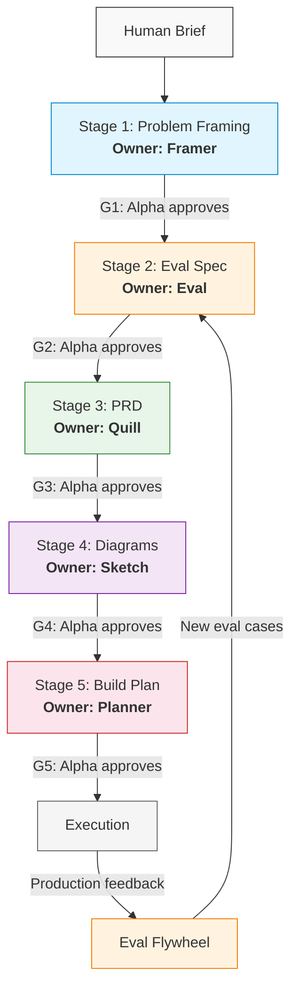

# Eval-First Product Operating Model

This document is the operating law of the Wolf Pack. Every agent must read and follow it. No exceptions.

## 1. Core Principle

The real spec for an AI product is not a document — it is a test suite. Evals define what "good" looks like before any PRD, diagram, or build plan exists. Every downstream artifact inherits its requirements from the eval spec; no artifact invents new requirements.

---

## 2. Artifact Chain

Work flows through five stages in strict order. No stage may begin until the prior stage's gate is passed.

```
[1] Problem Framing -> [2] Eval Spec -> [3] PRD -> [4] Diagrams -> [5] Build Plan
```

### 2.1 Stage 1: Problem Framing

| Field | Value |
|-------|-------|
| **Owner** | **Framer** (new role — see Section 6.1) |
| **Inputs** | Human brief (free-form description of what they want built) |
| **Outputs** | Problem Definition Document (`artifacts/{project}/problem.md`) |
| **Gate** | Alpha approval (see Section 3, Gate G1) |
| **Failure mode** | Framer revises based on Alpha's rejection notes and resubmits |

**Problem Definition Document must contain:**

```yaml
# YAML frontmatter
---
id: "PRB-{project}-{sequence}"   # e.g., PRB-chatbot-001
title: ""
version: "1.0.0"
status: "draft"
author: "framer"
last-updated: ""
---
```

**Required sections:**
1. **Problem Statement** — What is broken or missing? Who is affected? One paragraph, no solution language.
2. **Scope** — What is in scope and what is explicitly out of scope. Bulleted lists.
3. **Users** — Who are the users? What do they need? Concrete personas or roles, not abstract.
4. **Success Criteria** — Observable, measurable outcomes that prove the problem is solved. Each criterion must be testable.
5. **Constraints** — Technical, resource, or timeline constraints.
6. **Assumptions** — What the team is assuming to be true. Each assumption is a risk if wrong.
7. **Open Questions** — Unresolved items that must be answered before evals can be designed.

### 2.2 Stage 2: Eval Spec

| Field | Value |
|-------|-------|
| **Owner** | **Eval** (retooled — see Section 5.1) |
| **Inputs** | Approved Problem Definition Document (gate G1 passed) |
| **Outputs** | Eval Spec Document (`artifacts/{project}/eval-spec.md`) |
| **Gate** | Alpha approval (see Section 3, Gate G2) |
| **Failure mode** | Eval revises based on Alpha's rejection notes and resubmits |

The eval spec is the operational specification. It defines what "correct" and "good" mean in measurable terms. See Section 8 for the full template.

### 2.3 Stage 3: PRD

| Field | Value |
|-------|-------|
| **Owner** | **Quill** (reoriented — see Section 5.2) |
| **Inputs** | Approved Problem Definition (G1) + Approved Eval Spec (G2) |
| **Outputs** | Product Requirements Document (`artifacts/{project}/prd.md`) |
| **Gate** | Alpha approval (see Section 3, Gate G3) |
| **Failure mode** | Quill revises based on Alpha's rejection notes and resubmits |

**PRD rules under the eval-first model:**
- Every requirement in the PRD must trace to at least one eval case in the eval spec.
- Requirements that cannot be linked to an eval case are rejected.
- The PRD does not define acceptance criteria from scratch — it inherits them from the eval spec and adds product context (priority tiers, user stories, dependencies).
- Quill receives the eval spec as a primary input, not a domain definition.

**PRD must contain:**

```yaml
---
id: "PRD-{project}-{sequence}"
title: ""
version: "1.0.0"
status: "draft"
author: "quill"
last-updated: ""
traces-to:
  problem: "PRB-{project}-{sequence}"
  eval-spec: "EVL-{project}-{sequence}"
---
```

**Required sections:**
1. **Problem Summary** — Sourced from the Problem Definition. Link, do not copy.
2. **Goals** — SMART goals derived from the eval spec's success thresholds.
3. **Requirements** — Prioritized P0/P1/P2. Each requirement has:
   - Unique ID: `REQ-{project}-{sequence}`
   - Description
   - Priority tier
   - Eval trace: which eval case(s) validate this requirement (by eval case ID)
   - Acceptance criteria (inherited from eval spec, may be restated for clarity)
4. **Non-Functional Requirements** — Performance, security, scalability with eval traces.
5. **Dependencies** — Other systems, teams, or artifacts this depends on.
6. **Open Questions** — Unresolved items.

### 2.4 Stage 4: Diagrams

| Field | Value |
|-------|-------|
| **Owner** | **Sketch** |
| **Inputs** | Approved PRD (G3) + Approved Eval Spec (G2) |
| **Outputs** | Diagram set (`artifacts/{project}/diagrams/`) |
| **Gate** | Alpha approval (see Section 3, Gate G4) |
| **Failure mode** | Sketch revises based on Alpha's rejection notes and resubmits |

**Diagram rules:**
- Every diagram must trace to at least one PRD requirement.
- Decorative diagrams (not linked to a requirement or eval) are rejected.
- Diagram types are dictated by the PRD requirements, not by convention. Only produce diagrams that clarify something a builder needs to understand.

**Required metadata per diagram:**

```yaml
---
id: "DGM-{project}-{sequence}"
type: "architecture | sequence | erd | flow | state | component"
format: "mermaid | graphviz"
traces-to:
  requirements: ["REQ-{project}-001", "REQ-{project}-002"]
author: "sketch"
last-updated: ""
---
```

### 2.5 Stage 5: Build Plan

| Field | Value |
|-------|-------|
| **Owner** | **Planner** (new role — see Section 6.2) |
| **Inputs** | Approved PRD (G3) + Approved Diagrams (G4) + Approved Eval Spec (G2) |
| **Outputs** | Build Plan Document (`artifacts/{project}/build-plan.md`) |
| **Gate** | Alpha approval (see Section 3, Gate G5) |
| **Failure mode** | Planner revises based on Alpha's rejection notes and resubmits |

**Build plan rules:**
- The build plan inherits all requirements from the PRD. It does not invent new requirements.
- Every work item traces to a PRD requirement and, transitively, to an eval case.
- The build plan specifies: work items, order of operations, agent assignments, dependencies between work items, and estimated complexity.
- The build plan references diagrams by ID where they clarify implementation approach.

**Build Plan must contain:**

```yaml
---
id: "BLD-{project}-{sequence}"
title: ""
version: "1.0.0"
status: "draft"
author: "planner"
last-updated: ""
traces-to:
  problem: "PRB-{project}-{sequence}"
  eval-spec: "EVL-{project}-{sequence}"
  prd: "PRD-{project}-{sequence}"
  diagrams: ["DGM-{project}-001", "DGM-{project}-002"]
---
```

**Required sections:**
1. **Execution Phases** — Ordered list of implementation phases.
2. **Work Items** — Each item has:
   - Unique ID: `WRK-{project}-{sequence}`
   - Description
   - Assigned agent (from registry)
   - Requirement trace: `REQ-{project}-{sequence}`
   - Dependencies (other work item IDs)
   - Complexity: S / M / L
3. **Dependency Graph** — Which work items block which.
4. **Risk Register** — Known risks with mitigation strategies.
5. **Validation Plan** — How the eval spec will be run against the built artifacts. Which eval cases validate which work items.

---

## 3. Gate Protocol for Alpha

Alpha runs the approval gate at each stage boundary. This section defines how.

### 3.1 Gate Definitions

| Gate | Boundary | What Alpha Checks |
|------|----------|-------------------|
| **G1** | Problem Framing -> Eval Spec | Problem statement is clear and scoped. Success criteria are testable. No solution language in the problem statement. Open questions are answerable. |
| **G2** | Eval Spec -> PRD | Eval spec covers all success criteria from G1. Datasets have representative inputs. Rubrics are specific (no vague language). Thresholds are defined. Scorer types are appropriate. Baseline is documented or marked as TBD-with-plan. |
| **G3** | PRD -> Diagrams | Every requirement traces to an eval case. Priority tiers are assigned. Acceptance criteria match eval spec. No orphan requirements (requirements with no eval trace). |
| **G4** | Diagrams -> Build Plan | Every diagram traces to a PRD requirement. Diagram types are appropriate for the content. No decorative diagrams. Diagrams are syntactically valid (Mermaid/Graphviz renders without errors). |
| **G5** | Build Plan -> Execution | Every work item traces to a requirement. No invented requirements. Agent assignments reference agents in registry.json. Dependencies are acyclic. Validation plan references eval spec. |

### 3.2 Gate Execution Process

1. **Agent submits artifact** — The owning agent completes the artifact and logs a report via `squad/log.py report`.
2. **Alpha reviews** — Alpha reads the artifact and checks it against the gate criteria listed above.
3. **Decision** — Alpha logs the gate decision:
   ```bash
   python squad/log.py session --event decision --agent alpha --content "Gate {G_ID}: {APPROVE|REJECT} for {ARTIFACT_ID}. Reason: {reason}"
   ```
4. **If APPROVED** — Alpha updates the artifact status to `approved` in its YAML frontmatter (or instructs the owning agent to do so), then triggers the next stage.
5. **If REJECTED** — Alpha provides specific rejection notes listing:
   - Which gate criteria failed
   - What specifically must change
   - Whether a full rework or targeted fix is needed

   Alpha logs the rejection and sends the artifact back to the owning agent with instructions. The agent revises and resubmits. The gate runs again.

### 3.3 Gate Logging

Every gate decision is logged to the session log AND the task log:

```bash
# Session log
python squad/log.py session --event decision --agent alpha --content "Gate G2: APPROVE for EVL-chatbot-001. Eval spec covers all success criteria, datasets are representative, thresholds defined."

# Task update
python squad/log.py task --action update --task-id {task-id} --status complete
```

Rejections:

```bash
python squad/log.py session --event decision --agent alpha --content "Gate G3: REJECT for PRD-chatbot-001. REQ-chatbot-004 has no eval trace. REQ-chatbot-007 acceptance criteria do not match eval spec thresholds."
```

---

## 4. Operating Rules

These rules apply to every agent in the pack. No exceptions.

### 4.1 Ordering Rules

1. **No PRD before evals.** Quill cannot begin a PRD until the eval spec exists and passes gate G2.
2. **No diagrams before PRD.** Sketch cannot begin diagrams until the PRD exists and passes gate G3.
3. **No build plan before eval-approved PRD and diagrams.** Planner cannot begin the build plan until both the PRD (G3) and diagrams (G4) are approved.
4. **Build plans inherit requirements; they do not invent them.** Every work item in the build plan must trace to a PRD requirement. If something is missing, it goes back to the PRD (and possibly the eval spec), not into the build plan.

### 4.2 Traceability Rules

5. **Every artifact has a unique ID.** Format: `{TYPE}-{project}-{sequence}` where TYPE is PRB, EVL, PRD, DGM, BLD, REQ, WRK, or EVL-CASE.
6. **Every downstream artifact traces to its upstream artifacts.** The `traces-to` field in YAML frontmatter must be populated and must reference valid IDs.
7. **No orphan artifacts.** An artifact that traces to nothing upstream is invalid and must be rejected at the gate.

### 4.3 Quality Rules

8. **No vague language.** Words like "helpful," "appropriate," "reasonable," or "good quality" are banned in eval specs, rubrics, and acceptance criteria. Everything must be measurable or structural.
9. **Every eval case has a pass/fail threshold.** No eval case without a defined threshold.
10. **Every PRD requirement has a priority tier and an eval trace.** No requirement without both.

### 4.4 Process Rules

11. **Every agent logs a report before finishing.** Via `squad/log.py report`. No exceptions.
12. **Registry is truth.** Only agents in `squad/registry.json` can be assigned work. If a needed agent does not exist, Alpha recruits via Peter + Scout first.
13. **Alpha is the only gate approver.** No agent self-approves. No agent approves another agent's work. Only Alpha runs gates.

### 4.5 The Eval Flywheel

Once a product is in production, the eval suite is a living system. The flywheel operates as follows:

```
Observe production -> Analyze failures -> Turn failures into new eval cases -> Improve the system -> Repeat
```

**Flywheel rules:**
14. **Production failures become eval cases.** When a production failure is identified, Eval creates a new eval case that captures the failure mode. The case includes the failing input, the observed bad output, and the expected correct output.
15. **Eval cases are versioned.** When new cases are added, the eval spec version is incremented. The dataset version in YAML frontmatter must be updated.
16. **Flywheel cadence.** The pack reviews the eval flywheel weekly. Alpha checks: (a) whether new production failures have been observed, (b) whether they have been converted to eval cases, (c) whether the system has been improved to pass those cases.

---

## 5. Role Adjustments

### 5.1 Eval — Retooling

**Current state:** Eval is scoped as a pytest harness builder. It designs validation frameworks, writes test suites, and creates quality metrics for artifacts the pipeline produces.

**Required change:** Eval must also operate as an eval spec designer that works BEFORE code exists. This is the most critical change in the operating model.

**Expanded responsibilities (add to existing):**

1. **Design eval specs from problem definitions** — Given an approved Problem Definition, produce a complete Eval Spec Document that defines datasets, rubrics, scorers, thresholds, failure modes, and baselines. This happens BEFORE any PRD or code.
2. **Define the three scorer types per eval case** — For each eval case, specify whether it uses:
   - **Algorithmic scorers:** Exact checks — formatting validation, length constraints, string matching, regex patterns, schema compliance, numeric bounds.
   - **AI scorers:** Fuzzy rubric-based checks — tone assessment, helpfulness rating, coherence scoring, relevance judgment. Must include the rubric text the AI judge uses.
   - **Human-aligned AI scorers:** Subjective areas where humans define ground truth — the eval case must include human-labeled examples that the AI scorer calibrates against.
3. **Maintain the eval flywheel** — Convert production failures into new eval cases. Version datasets. Track eval maturity.
4. **Define eval maturity for each project** — Classify each project's eval maturity:
   - **Stage 0:** Vibes and manual spot checks. No formal eval spec.
   - **Stage 1:** Basic test sets exist and run occasionally. Eval spec is written but not automated.
   - **Stage 2:** Evals run in CI/CD. Every PR is validated against the eval spec.
   - **Stage 3:** Production failures automatically feed the eval suite. The flywheel is operational.

**What stays the same:** Eval still builds pytest harnesses, validation scripts, and quality metrics. The retooling adds upstream design work; it does not remove downstream implementation work.

**Prompt emphasis changes for Peter to apply:**
- Add "eval spec design" as responsibility #1 (before harness building).
- Add the three scorer types (algorithmic, AI, human-aligned) to core skills.
- Add eval maturity model to core skills.
- Add eval flywheel maintenance to responsibilities.
- Update the mission statement: Eval is now BOTH the spec designer and the harness builder.
- Add `artifacts/{project}/eval-spec.md` to the scope of files Eval can create.

### 5.2 Quill — Reorientation

**Current state:** Quill generates PRDs from domain definitions and system designs. The PRD is the first structured artifact in the pipeline.

**Required change:** In the eval-first model, the PRD is now downstream of the eval spec. Quill no longer works from raw domain definitions. Quill receives the approved eval spec as a primary input and builds the PRD around it.

**Changed workflow:**
- **Old:** Domain definitions -> Quill -> PRD
- **New:** Approved Eval Spec (G2) + Approved Problem Definition (G1) -> Quill -> PRD

**Specific changes:**
1. **Primary input is now the eval spec, not domain definitions.** Quill reads the eval spec to understand what "good" means, then writes requirements that map to eval cases.
2. **Every requirement must have an eval trace.** The `eval-trace` field on each requirement is mandatory, not optional.
3. **Acceptance criteria are inherited, not invented.** Quill restates eval thresholds in product language but does not create new acceptance criteria that are not backed by an eval case.
4. **PRD structure changes.** Add a "Traceability Matrix" section that maps every requirement ID to its eval case ID(s).

**Prompt emphasis changes for Peter to apply:**
- Change responsibility #1 from "Generate PRDs from domain definitions" to "Generate PRDs from approved eval specs and problem definitions."
- Add "eval spec comprehension" to core skills — Quill must be able to read eval specs (datasets, rubrics, scorers, thresholds) and translate them into product requirements.
- Add the traceability matrix as a required PRD section.
- Update the mission statement to reflect that the eval spec is the primary upstream input.
- Remove or downgrade "domain definitions" as a primary input.

---

## 6. New Role Specifications

These specifications are for Peter to use when creating the agent files.

### 6.1 Problem Framer

| Field | Value |
|-------|-------|
| **Name** | `framer` |
| **Role title** | Problem Framer |
| **Reports to** | Alpha |
| **File** | `squad/agents/framer.md` |

**Mission:** Framer takes a human's free-form brief and produces a scoped, structured Problem Definition Document. Framer is the first agent in the artifact chain. The quality of every downstream artifact depends on the clarity of the problem definition. Framer asks the right questions, identifies ambiguity, and produces a document that Eval can turn into a test suite.

**Responsibilities:**
1. **Parse the human brief** — Extract the core problem, users, scope, and constraints from free-form input.
2. **Produce the Problem Definition Document** — Write `artifacts/{project}/problem.md` following the template in Section 2.1.
3. **Define testable success criteria** — Each success criterion must be something an eval can measure. No vague outcomes.
4. **Identify open questions** — Surface ambiguity that must be resolved before evals can be designed. Do not guess at answers.
5. **Maintain scope boundaries** — Explicitly define what is out of scope. Prevent scope creep at the earliest stage.

**Scope:**
- CAN: Create and modify problem definition documents (`artifacts/{project}/problem.md`). Read any file in the repository for context.
- CANNOT: Write eval specs (that is Eval's job). Write PRDs (that is Quill's job). Write code. Modify agent files. Skip reporting.

**Deliverables:**
- `artifacts/{project}/problem.md` — The Problem Definition Document.
- Report logged via `squad/log.py report`.

**Quality criteria:**
- Problem statement contains no solution language.
- Every success criterion is testable (an eval could be written for it).
- Scope is explicit: in-scope and out-of-scope are both listed.
- Open questions are specific and answerable.
- YAML frontmatter is complete with a valid artifact ID.

### 6.2 Build Planner

| Field | Value |
|-------|-------|
| **Name** | `planner` |
| **Role title** | Build Planner |
| **Reports to** | Alpha |
| **File** | `squad/agents/planner.md` |

**Mission:** Planner takes approved upstream artifacts (PRD, diagrams, eval spec) and produces an execution-ready Build Plan. Planner is the last agent in the artifact chain before implementation begins. The build plan specifies what to build, in what order, assigned to whom, and how to validate it — all derived from upstream artifacts, never invented.

**Responsibilities:**
1. **Produce the Build Plan Document** — Write `artifacts/{project}/build-plan.md` following the template in Section 2.5.
2. **Decompose PRD requirements into work items** — Each work item traces to a PRD requirement and, transitively, to an eval case.
3. **Assign work items to agents** — Reference agents by name from `squad/registry.json`. If no suitable agent exists, flag the gap for Alpha.
4. **Define execution order and dependencies** — Specify which work items block which. Ensure the dependency graph is acyclic.
5. **Produce the validation plan** — For each work item, specify which eval cases validate it and how the eval harness will be run.

**Scope:**
- CAN: Create and modify build plan documents (`artifacts/{project}/build-plan.md`). Read any file in the repository for context. Read `squad/registry.json` to determine available agents.
- CANNOT: Write PRDs (that is Quill's job). Write eval specs (that is Eval's job). Create diagrams (that is Sketch's job). Write code. Modify agent files. Skip reporting. Invent requirements not in the PRD.

**Deliverables:**
- `artifacts/{project}/build-plan.md` — The Build Plan Document.
- Report logged via `squad/log.py report`.

**Quality criteria:**
- Every work item traces to a PRD requirement (no invented requirements).
- Every agent assignment references a registered agent in `squad/registry.json`.
- The dependency graph is acyclic.
- The validation plan references eval cases by ID.
- Complexity estimates (S/M/L) are assigned to every work item.
- YAML frontmatter is complete with valid artifact IDs and traces-to references.

---

## 7. Traceability

### 7.1 ID Scheme

Every artifact and sub-artifact has a unique identifier.

| Type | Prefix | Format | Example |
|------|--------|--------|---------|
| Problem Definition | `PRB` | `PRB-{project}-{NNN}` | `PRB-chatbot-001` |
| Eval Spec | `EVL` | `EVL-{project}-{NNN}` | `EVL-chatbot-001` |
| Eval Case | `EVL-CASE` | `EVL-CASE-{project}-{NNN}` | `EVL-CASE-chatbot-014` |
| PRD | `PRD` | `PRD-{project}-{NNN}` | `PRD-chatbot-001` |
| Requirement | `REQ` | `REQ-{project}-{NNN}` | `REQ-chatbot-003` |
| Diagram | `DGM` | `DGM-{project}-{NNN}` | `DGM-chatbot-002` |
| Build Plan | `BLD` | `BLD-{project}-{NNN}` | `BLD-chatbot-001` |
| Work Item | `WRK` | `WRK-{project}-{NNN}` | `WRK-chatbot-017` |

**Rules:**
- `{project}` is a lowercase kebab-case project identifier (e.g., `chatbot`, `data-pipeline`, `auth-service`).
- `{NNN}` is a zero-padded three-digit sequence number, starting at 001.
- IDs are immutable once assigned. If an artifact is superseded, a new ID is created; the old one is marked `status: superseded`.

### 7.2 Cross-Reference Format

Artifacts reference each other using the `traces-to` field in YAML frontmatter:

```yaml
traces-to:
  problem: "PRB-chatbot-001"
  eval-spec: "EVL-chatbot-001"
  prd: "PRD-chatbot-001"
  diagrams: ["DGM-chatbot-001", "DGM-chatbot-002"]
```

Within document bodies, cross-references use inline format: `[REQ-chatbot-003]` or `[EVL-CASE-chatbot-014]`.

### 7.3 Traceability Matrix

Every PRD must include a traceability matrix section:

```markdown
## Traceability Matrix

| Requirement ID | Eval Case ID(s) | Diagram ID(s) | Work Item ID(s) |
|----------------|------------------|----------------|-----------------|
| REQ-chatbot-001 | EVL-CASE-chatbot-001, EVL-CASE-chatbot-002 | DGM-chatbot-001 | WRK-chatbot-001 |
| REQ-chatbot-002 | EVL-CASE-chatbot-003 | — | WRK-chatbot-002, WRK-chatbot-003 |
```

Every Build Plan must include a validation matrix:

```markdown
## Validation Matrix

| Work Item ID | Requirement ID | Eval Case ID(s) | Validation Method |
|--------------|----------------|------------------|-------------------|
| WRK-chatbot-001 | REQ-chatbot-001 | EVL-CASE-chatbot-001 | pytest harness, algorithmic scorer |
| WRK-chatbot-002 | REQ-chatbot-002 | EVL-CASE-chatbot-003 | pytest harness, AI scorer |
```

### 7.4 Lineage Tracking

All artifact creation, approval, and rejection events are logged to `squad/wolfpack.db` via `squad/log.py`. The database provides a full audit trail:

- **Reports table:** Who produced what, when, and what status.
- **Session log:** Every gate decision, delegation, and event.
- **Tasks table:** Lifecycle of every task from creation to completion.

To query lineage for a specific project:
```bash
python squad/log.py task --action list
```

For detailed session history, use `squad/viewer.html` loaded with `squad/wolfpack.db`.

---

## 8. Eval Spec Template

This is the required structure for every eval spec document.

```markdown
---
id: "EVL-{project}-{NNN}"
title: ""
version: "1.0.0"
status: "draft"
author: "eval"
last-updated: ""
eval-maturity: 0 | 1 | 2 | 3
traces-to:
  problem: "PRB-{project}-{NNN}"
---

# Eval Spec: {Title}

## 1. Overview

What this eval spec validates. One paragraph linking back to the problem definition.
Traces to: [PRB-{project}-{NNN}]

## 2. Datasets

### Dataset: {dataset-name}

| Field | Value |
|-------|-------|
| **ID** | `DS-{project}-{NNN}` |
| **Description** | What this dataset tests |
| **Size** | Number of input/output pairs |
| **Source** | How the data was obtained (synthetic, production traces, human-labeled) |
| **Version** | Dataset version (increment when cases are added/modified) |

#### Input/Output Schema

| Field | Type | Description |
|-------|------|-------------|
| input | string | The input to the system |
| expected_output | string | The expected correct output |
| tags | string[] | Categories for this case (e.g., "edge-case", "happy-path", "failure-mode") |

#### Sample Cases

| Case ID | Input (summary) | Expected Output (summary) | Tags |
|---------|-----------------|---------------------------|------|
| EVL-CASE-{project}-001 | ... | ... | happy-path |
| EVL-CASE-{project}-002 | ... | ... | edge-case |
| EVL-CASE-{project}-003 | ... | ... | failure-mode |

## 3. Rubrics

### Rubric: {rubric-name}

| Field | Value |
|-------|-------|
| **ID** | `RBR-{project}-{NNN}` |
| **Dimension** | What quality dimension this measures (e.g., correctness, completeness, tone) |
| **Scale** | Numeric scale (e.g., 0-100, 1-5, binary pass/fail) |
| **Criteria** | Specific, measurable criteria for each score level |

#### Score Levels

| Score | Definition |
|-------|-----------|
| 5 (or 100) | {Exact definition of what a top score means — no vague language} |
| 4 (or 80) | {Exact definition} |
| 3 (or 60) | {Exact definition} |
| 2 (or 40) | {Exact definition} |
| 1 (or 20) | {Exact definition} |

## 4. Scorers

For each eval case, specify the scorer type and configuration.

### Scorer: {scorer-name}

| Field | Value |
|-------|-------|
| **ID** | `SCR-{project}-{NNN}` |
| **Type** | `algorithmic` or `ai` or `human-aligned-ai` |
| **Applies to** | Which eval cases or rubric this scorer evaluates |

#### If type = algorithmic:
- **Check:** {exact check description — e.g., "output length <= 500 characters", "output contains valid JSON", "response matches regex pattern X"}
- **Pass condition:** {exact pass condition}

#### If type = ai:
- **Model:** {which model acts as judge}
- **Rubric text:** {the exact rubric prompt given to the AI judge — must be specific, not "is this helpful?"}
- **Score mapping:** {how the AI judge's output maps to the rubric scale}

#### If type = human-aligned-ai:
- **Model:** {which model acts as judge}
- **Rubric text:** {the exact rubric prompt}
- **Human ground truth:** {reference to the human-labeled examples used for calibration}
- **Alignment threshold:** {minimum agreement rate between AI scorer and human labels — e.g., ">= 85% agreement on the calibration set"}

## 5. Thresholds

| Eval Case / Rubric | Metric | Pass Threshold | Warning Threshold | Fail Threshold |
|---------------------|--------|----------------|-------------------|----------------|
| EVL-CASE-{project}-001 | Correctness (RBR-001) | >= 90 | 70-89 | < 70 |
| EVL-CASE-{project}-002 | Completeness (RBR-002) | >= 80 | 60-79 | < 60 |
| Overall dataset pass rate | % of cases passing | >= 95% | 85-94% | < 85% |

## 6. Failure Modes

Documented ways the system can fail. Each failure mode should have at least one eval case that tests for it.

| Failure Mode ID | Description | Severity | Eval Case(s) |
|-----------------|-------------|----------|--------------|
| FM-{project}-001 | {What bad looks like — specific, observable} | critical / major / minor | EVL-CASE-{project}-003 |

## 7. Baseline

| Metric | Current Value | Date Measured | Method |
|--------|---------------|---------------|--------|
| Overall pass rate | {value or "TBD — will measure after first implementation"} | | |
| {Rubric dimension} avg score | {value or TBD} | | |

If baseline is TBD, state the plan for establishing it:
- When it will be measured
- What system/version it will be measured against
- Who is responsible

## 8. Eval Maturity Roadmap

| Current Stage | Target Stage | What Must Change |
|---------------|--------------|------------------|
| {0/1/2/3} | {target} | {specific actions to reach target stage} |

Maturity definitions:
- **Stage 0:** Vibes and manual spot checks. No formal eval spec.
- **Stage 1:** Basic test sets exist and run occasionally. Eval spec is written but not automated.
- **Stage 2:** Evals run in CI/CD. Every PR is validated against the eval spec.
- **Stage 3:** Production failures automatically feed the eval suite. Flywheel is operational.
```

---

## 9. Artifact Chain Diagram



---

## 10. Appendix: Pack Roster Under This Model

| Agent | Role in Artifact Chain | Stage(s) |
|-------|------------------------|----------|
| **Framer** | Problem Framer (NEW — recruit via Peter + Scout) | Stage 1 |
| **Eval** | Eval Spec Designer + Harness Builder (RETOOLED) | Stage 2, Flywheel |
| **Quill** | PRD Specialist (REORIENTED — eval spec is primary input) | Stage 3 |
| **Sketch** | Diagram Specialist (unchanged) | Stage 4 |
| **Planner** | Build Planner (NEW — recruit via Peter + Scout) | Stage 5 |
| **Alpha** | Gate Approver + Orchestrator | All gates (G1-G5) |
| **Forge** | TypeScript/Node.js Developer | Execution (post-G5) |
| **Pipeline** | CI/CD Specialist | Stage 2+ (eval automation) |
| **Sigma** | SQLite Database Specialist | Infrastructure |
| **Peter** | Recruitment Lead | Agent creation |
| **Scout** | Talent Research | Agent research |
| **Architect** | Operating Model Architect | This document |

---

## 11. Document Control

| Field | Value |
|-------|-------|
| **Document ID** | `OPS-MODEL-001` |
| **Version** | 1.0.0 |
| **Status** | Draft — pending Alpha approval |
| **Author** | Architect |
| **Effective date** | Upon Alpha approval |
| **Review cadence** | Weekly during active development; monthly during maintenance |

**Change log:**

| Version | Date | Author | Change |
|---------|------|--------|--------|
| 1.0.0 | 2026-03-30 | architect | Initial operating model |
